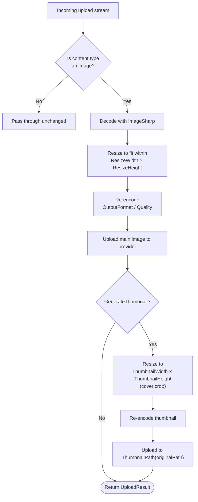

# Image Processing

`ValiBlob.ImageSharp` integrates [SixLabors ImageSharp](https://github.com/SixLabors/ImageSharp) into ValiBlob's upload pipeline, enabling automatic resize, format conversion, quality adjustment, and thumbnail generation at upload time. Non-image files pass through untouched.

---

## Installation

```bash
dotnet add package ValiBlob.Core
dotnet add package ValiBlob.ImageSharp
```

---

## Registration

```csharp
using ValiBlob.Core;
using ValiBlob.ImageSharp;

builder.Services
    .AddValiBlob(o => o.DefaultProvider = "aws")
    .AddProvider<AWSS3Provider>("aws", opts => { /* ... */ })
    .WithPipeline(p => p
        .UseValidation(v =>
        {
            v.MaxFileSizeBytes    = 20_000_000;   // 20 MB
            v.AllowedExtensions   = [".jpg", ".jpeg", ".png", ".gif", ".webp"];
            v.AllowedContentTypes = ["image/jpeg", "image/png", "image/gif", "image/webp"];
        })
        .UseContentTypeDetection()
        .UseImageProcessing(img =>
        {
            img.ResizeWidth         = 1920;
            img.ResizeHeight        = 1080;
            img.MaintainAspectRatio = true;
            img.OutputFormat        = ImageFormat.WebP;
            img.Quality             = 85;
            img.GenerateThumbnail   = true;
            img.ThumbnailWidth      = 300;
            img.ThumbnailHeight     = 300;
            img.ThumbnailPath       = path => path.WithSuffix("_thumb");
        })
    );
```

---

## ImageProcessingOptions Reference

| Option | Type | Default | Description |
|---|---|---|---|
| `ResizeWidth` | `int?` | `null` | Maximum output width in pixels. `null` = no constraint. |
| `ResizeHeight` | `int?` | `null` | Maximum output height in pixels. `null` = no constraint. |
| `MaintainAspectRatio` | `bool` | `true` | Scale proportionally to fit within the specified dimensions. |
| `OutputFormat` | `ImageFormat?` | `null` | Convert to this format on upload. `null` = preserve original format. |
| `Quality` | `int` | `80` | Encoder quality 1–100 for lossy formats (JPEG, WebP, AVIF). |
| `GenerateThumbnail` | `bool` | `false` | Also produce a smaller thumbnail and upload it to a derived path. |
| `ThumbnailWidth` | `int` | `150` | Thumbnail maximum width in pixels. |
| `ThumbnailHeight` | `int` | `150` | Thumbnail maximum height in pixels. |
| `ThumbnailPath` | `Func<StoragePath, StoragePath>?` | `null` | Derives the thumbnail storage path from the main image path. |

---

## How It Works



Processing is entirely upload-side. Downloads are not affected — no decompression or re-encoding occurs on `DownloadAsync`.

---

## Supported Image Formats

| Format | Extension | Encode | Decode | Notes |
|---|---|---|---|---|
| JPEG | `.jpg`, `.jpeg` | Yes | Yes | Best for photographs. Lossy. |
| PNG | `.png` | Yes | Yes | Lossless. Best for logos, screenshots. |
| GIF | `.gif` | Yes | Yes | Animated GIFs are preserved. |
| WebP | `.webp` | Yes | Yes | Recommended for web. 25–35% smaller than JPEG. |
| AVIF | `.avif` | Yes | Yes | Excellent compression. Limited older browser support. |
| BMP | `.bmp` | Yes | Yes | Uncompressed. Avoid for web delivery. |
| TIFF | `.tiff` | Yes | Yes | High quality. For print or archival. |

---

## User Avatar Pipeline

Resize to 800×800, convert to WebP, generate a 150×150 thumbnail:

```csharp
.UseImageProcessing(img =>
{
    img.ResizeWidth         = 800;
    img.ResizeHeight        = 800;
    img.MaintainAspectRatio = true;
    img.OutputFormat        = ImageFormat.WebP;
    img.Quality             = 82;
    img.GenerateThumbnail   = true;
    img.ThumbnailWidth      = 150;
    img.ThumbnailHeight     = 150;
    img.ThumbnailPath       = path => path.WithSuffix("_thumb");
})
```

Uploading `avatars/user-42.jpg` produces:
- `avatars/user-42.webp` — resized to fit 800×800, WebP quality 82
- `avatars/user-42_thumb.webp` — 150×150 cover crop, WebP quality 82

Access both paths from the upload result:

```csharp
var result = await provider.UploadAsync(new UploadRequest
{
    Path        = StoragePath.From("avatars", $"user-{userId}.jpg"),
    Content     = imageStream,
    ContentType = "image/jpeg"
});

if (result.IsSuccess)
{
    Console.WriteLine($"Main image : {result.Value.Url}");
    Console.WriteLine($"Thumbnail  : {result.Value.Thumbnail?.Url}");
}
```

---

## Multi-Size Product Images

Generate full-size, medium, and thumbnail variants in one upload request:

```csharp
.WithPipeline(p => p
    .UseImageProcessing(img =>
    {
        // Full size (2000×2000 max)
        img.ResizeWidth         = 2000;
        img.ResizeHeight        = 2000;
        img.MaintainAspectRatio = true;
        img.OutputFormat        = ImageFormat.WebP;
        img.Quality             = 90;
    })
    .UseImageProcessing(img =>
    {
        // Medium (600×600 max) saved alongside as _medium
        img.ResizeWidth         = 600;
        img.ResizeHeight        = 600;
        img.MaintainAspectRatio = true;
        img.OutputFormat        = ImageFormat.WebP;
        img.Quality             = 85;
        img.GenerateThumbnail   = true;
        img.ThumbnailWidth      = 600;
        img.ThumbnailHeight     = 600;
        img.ThumbnailPath       = path => path.WithSuffix("_medium");
    })
    .UseImageProcessing(img =>
    {
        // Thumbnail (120×120 max) saved as _thumb
        img.GenerateThumbnail   = true;
        img.ThumbnailWidth      = 120;
        img.ThumbnailHeight     = 120;
        img.OutputFormat        = ImageFormat.WebP;
        img.Quality             = 75;
        img.ThumbnailPath       = path => path.WithSuffix("_thumb");
    })
)
```

A single upload of `products/sku-1234.png` produces:
- `products/sku-1234.webp` (full size)
- `products/sku-1234_medium.webp` (medium)
- `products/sku-1234_thumb.webp` (thumbnail)

---

## ThumbnailPath Helpers

`ThumbnailPath` accepts a `Func<StoragePath, StoragePath>` delegate. `StoragePath` provides helpers for common path transformations:

```csharp
// Original: uploads/images/photo.jpg

img.ThumbnailPath = path => path.WithSuffix("_thumb");
// → uploads/images/photo_thumb.jpg

img.ThumbnailPath = path => path.WithDirectory("thumbs");
// → thumbs/photo.jpg

img.ThumbnailPath = path => path.WithExtension(".webp").WithSuffix("_sm");
// → uploads/images/photo_sm.webp

img.ThumbnailPath = path => StoragePath.From("cdn", "thumbs", path.FileName);
// → cdn/thumbs/photo.jpg
```

---

## Format Conversion Without Resize

Convert format while preserving original dimensions:

```csharp
.UseImageProcessing(img =>
{
    // No ResizeWidth / ResizeHeight — original dimensions preserved
    img.OutputFormat = ImageFormat.WebP;
    img.Quality      = 85;
})
```

This is useful when you want to normalize all incoming images to WebP for efficient CDN delivery without imposing size limits.

---

## Quality Guidelines

| Format | Recommended Quality | Notes |
|---|---|---|
| JPEG | 75–85 | 85 is visually lossless for most photographs |
| WebP | 80–85 | Produces ~30% smaller files than JPEG at the same quality |
| AVIF | 60–75 | Excellent at low quality values; very small output |
| PNG | N/A | Lossless — the `Quality` setting does not apply |

---

## Pipeline Placement

Place `UseImageProcessing` after `UseContentTypeDetection` and before `UseCompression`:

```csharp
.WithPipeline(p => p
    .UseValidation(v =>
    {
        v.AllowedContentTypes = ["image/jpeg", "image/png", "image/webp"];
    })
    .UseContentTypeDetection()         // detect real MIME type from magic bytes
    .UseImageProcessing(img =>         // resize / convert — operates on detected type
    {
        img.ResizeWidth  = 1920;
        img.OutputFormat = ImageFormat.WebP;
        img.Quality      = 85;
    })
    .UseConflictResolution(ConflictResolution.ReplaceExisting)
)
```

Placing `UseContentTypeDetection` first ensures that the image middleware receives the real MIME type, not the client-provided header.

:::info Image processing and compression
WebP and AVIF are already highly compressed formats. Do not add `UseCompression()` after `UseImageProcessing()` for image-only pipelines — compressing already-compressed image data produces no savings (or increases file size). If your pipeline handles both images and text files, apply `UseCompression` with `SkipContentTypes` set to all image MIME types.
:::

---

## Memory Considerations

ImageSharp decodes images fully into memory during processing:

| Image Resolution | Approximate Memory (RGBA) |
|---|---|
| 4K (3840×2160) | ~32 MB |
| 8K (7680×4320) | ~128 MB |
| 50 MP (8192×6144) | ~192 MB |

Set `ResizeWidth` and `ResizeHeight` to cap the effective working resolution. Also limit maximum upload size in the validation middleware and in ASP.NET Core request limits:

```csharp
// Limit request body size
builder.Services.Configure<FormOptions>(o => o.MultipartBodyLengthLimit = 20_000_000);
app.UseRequestSizeLimit(20_000_000);

// Validation middleware
.UseValidation(v => v.MaxFileSizeBytes = 20_000_000)
```

---

## Bypassing Processing for Specific Uploads

Pass `SkipImageProcessing = true` on a per-request basis to store the original image without any transformations:

```csharp
var result = await provider.UploadAsync(new UploadRequest
{
    Path              = StoragePath.From("originals", "raw-photo.tiff"),
    Content           = fileStream,
    ContentType       = "image/tiff",
    SkipImageProcessing = true   // store as-is
});
```

This is useful when you want to archive originals alongside processed variants.

---

## Related

- [Compression](../pipeline/compression.md) — Do not compress already-compressed image formats
- [Content-Type Detection](../pipeline/content-type-detection.md) — Detect real MIME type before processing
- [Validation](../pipeline/validation.md) — Restrict allowed image types and sizes
- [Pipeline Overview](../pipeline/overview.md) — Middleware ordering
- [StoragePath](../core/storage-path.md) — Path helpers for `ThumbnailPath`
