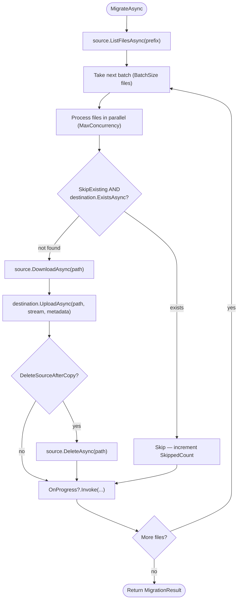

# Cross-Provider Migration

`IStorageMigrator` moves files from one storage provider to another. It handles listing, downloading, re-uploading, and optionally deleting source files — in parallel, in resumable batches, with per-file error collection.

Common use cases:
- Moving from a local filesystem to S3 as an application scales
- Migrating between cloud providers (S3 → Azure Blob, GCS → S3)
- Splitting a single bucket into region-specific buckets
- Consolidating multiple old buckets into one normalized structure

---

## Basic Migration

```csharp
using ValiBlob.Core;

var source      = factory.Create("local");
var destination = factory.Create("aws");
var migrator    = app.Services.GetRequiredService<IStorageMigrator>();

var result = await migrator.MigrateAsync(source, destination, new MigrationOptions
{
    Prefix                = "uploads/",
    DryRun                = false,
    SkipExisting          = true,
    DeleteSourceAfterCopy = false,
    BatchSize             = 100,
    MaxConcurrency        = 4,
    OnProgress            = p => Console.WriteLine(
        $"[{p.Copied + p.Skipped + p.Failed}/{p.Total}] " +
        $"Copied: {p.Copied}  Skipped: {p.Skipped}  Failed: {p.Failed}")
});

Console.WriteLine($"\nMigration complete.");
Console.WriteLine($"  Copied  : {result.CopiedCount}");
Console.WriteLine($"  Skipped : {result.SkippedCount}");
Console.WriteLine($"  Failed  : {result.FailedCount}");
Console.WriteLine($"  Duration: {result.ElapsedTime:g}");
```

---

## MigrationOptions Reference

| Option | Type | Default | Description |
|---|---|---|---|
| `Prefix` | `string?` | `null` | Only migrate objects whose path starts with this prefix. `null` migrates everything. |
| `DryRun` | `bool` | `false` | When `true`, lists what would be migrated without copying any data. |
| `SkipExisting` | `bool` | `true` | Skip files that already exist at the destination (by path). Makes the migration idempotent. |
| `DeleteSourceAfterCopy` | `bool` | `false` | Delete the source file after successfully copying it to the destination. |
| `BatchSize` | `int` | `100` | Number of files processed per batch. |
| `MaxConcurrency` | `int` | `4` | Maximum parallel copy operations within a batch. |
| `OnProgress` | `Action<MigrationProgress>?` | `null` | Callback invoked after each file is processed. |
| `CancellationToken` | `CancellationToken` | `default` | Cancels the migration gracefully after the current batch. |

---

## MigrationResult Reference

| Property | Type | Description |
|---|---|---|
| `CopiedCount` | `int` | Files successfully copied. |
| `SkippedCount` | `int` | Files skipped because they already existed at the destination. |
| `FailedCount` | `int` | Files that failed to copy. |
| `Errors` | `IReadOnlyList<MigrationError>` | Details for each failed file (path, message, exception type). |
| `DryRun` | `bool` | Whether this was a dry run. |
| `ElapsedTime` | `TimeSpan` | Total wall-clock time. |

---

## Migration Flow



Individual file failures do not abort the migration. They are collected in `result.Errors` and the migration continues.

---

## DryRun Mode

Use `DryRun = true` to audit what a migration would do before committing:

```csharp
var dryResult = await migrator.MigrateAsync(source, destination, new MigrationOptions
{
    Prefix       = "uploads/",
    DryRun       = true,
    SkipExisting = true,
    BatchSize    = 1000,
    OnProgress   = p => Console.WriteLine($"Would copy: {p.CurrentPath}")
});

Console.WriteLine($"Dry run summary:");
Console.WriteLine($"  Would copy  : {dryResult.CopiedCount} files");
Console.WriteLine($"  Would skip  : {dryResult.SkippedCount} files (already at destination)");
Console.WriteLine($"  Total found : {dryResult.CopiedCount + dryResult.SkippedCount} files");
```

A dry run still calls `source.ListFilesAsync` and optionally `destination.ExistsAsync` to produce accurate counts — it skips only the download and upload steps.

---

## Resuming an Interrupted Migration

If a migration is cancelled or crashes midway, resume it safely. With `SkipExisting = true`, already-copied files are detected and skipped — the migration is idempotent:

```csharp
var options = new MigrationOptions
{
    Prefix       = "uploads/",
    SkipExisting = true,
    BatchSize    = 100,
    MaxConcurrency = 4
};

// Run 1 — interrupted partway through
try
{
    var cts = new CancellationTokenSource(TimeSpan.FromMinutes(30));
    options.CancellationToken = cts.Token;
    await migrator.MigrateAsync(source, destination, options);
}
catch (OperationCanceledException)
{
    Console.WriteLine("Migration cancelled. Safe to resume.");
}

// Run 2 — picks up where the previous run left off
var resumeResult = await migrator.MigrateAsync(source, destination, options);
Console.WriteLine($"Newly copied: {resumeResult.CopiedCount}");
Console.WriteLine($"Already done: {resumeResult.SkippedCount}");
```

---

## Error Handling

Collect failed paths and retry them:

```csharp
var result = await migrator.MigrateAsync(source, destination, options);

if (result.FailedCount > 0)
{
    Console.WriteLine($"{result.FailedCount} files failed:");
    foreach (var err in result.Errors)
        Console.WriteLine($"  {err.Path}: {err.Message}");

    // Save failed paths for manual inspection or retry
    await File.WriteAllLinesAsync(
        "failed-migration.txt",
        result.Errors.Select(e => e.Path));

    // Retry only the failed files
    var failedOptions = new MigrationOptions
    {
        SkipExisting   = false,  // force retry even if file partially exists
        MaxConcurrency = 1       // slow down to reduce risk of transient errors
    };

    foreach (var err in result.Errors)
    {
        await using var stream = await source.DownloadAsync(err.Path);
        if (stream.IsSuccess)
            await destination.UploadAsync(new UploadRequest
            {
                Path    = StoragePath.From(err.Path),
                Content = stream.Value
            });
    }
}
```

---

## Migrating a Subset of Files

Combine `Prefix` filtering with post-listing queries for precise control:

```csharp
// Migrate only PDFs in the documents/ folder
var allDocs = await source.ListFilesAsync("documents/");
if (!allDocs.IsSuccess) return;

var pdfFiles = allDocs.Value
    .Where(f => f.Extension.Equals(".pdf", StringComparison.OrdinalIgnoreCase))
    .ToList();

foreach (var file in pdfFiles)
{
    var download = await source.DownloadAsync(file.Path);
    if (!download.IsSuccess) continue;

    await destination.UploadAsync(new UploadRequest
    {
        Path        = StoragePath.From(file.Path),
        Content     = download.Value,
        ContentType = file.ContentType
    });

    Console.WriteLine($"Migrated: {file.Path}");
}
```

---

## Large-Scale Migration (Background Job)

For buckets with millions of files, run the migration as a background job with progress persisted to a database:

```csharp
// Controller: start a migration job
app.MapPost("/admin/migrate", async (
    MigrationJobRequest req,
    IStorageMigrator migrator,
    IStorageFactory factory,
    MigrationJobRepository jobs) =>
{
    var jobId = Guid.NewGuid().ToString("N");
    await jobs.CreateAsync(jobId, req.SourceKey, req.DestinationKey, req.Prefix);

    // Fire and forget — runs in background
    _ = Task.Run(async () =>
    {
        var source      = factory.Create(req.SourceKey);
        var destination = factory.Create(req.DestinationKey);

        var result = await migrator.MigrateAsync(source, destination, new MigrationOptions
        {
            Prefix         = req.Prefix,
            SkipExisting   = true,
            BatchSize      = 500,
            MaxConcurrency = 8,
            OnProgress     = p =>
                jobs.UpdateProgressAsync(jobId, p.Copied, p.Skipped, p.Failed, p.Total)
                    .GetAwaiter().GetResult()
        });

        await jobs.CompleteAsync(jobId, result);
    });

    return Results.Accepted($"/admin/migrate/{jobId}/status", new { jobId });
}).RequireAuthorization("Admin");

// Controller: poll migration status
app.MapGet("/admin/migrate/{jobId}/status", async (
    string jobId,
    MigrationJobRepository jobs) =>
{
    var job = await jobs.GetAsync(jobId);
    return job is null ? Results.NotFound() : Results.Ok(job);
}).RequireAuthorization("Admin");
```

---

## Move Mode (DeleteSourceAfterCopy)

To move files rather than copy them, set `DeleteSourceAfterCopy = true`. The source file is deleted only after the destination upload succeeds:

```csharp
var result = await migrator.MigrateAsync(source, destination, new MigrationOptions
{
    Prefix                = "temp-uploads/",
    DeleteSourceAfterCopy = true,   // true move operation
    SkipExisting          = true,
    BatchSize             = 100
});

Console.WriteLine($"Moved: {result.CopiedCount} files from temp-uploads/ to destination.");
```

:::warning Verify before enabling move mode
Run a `DryRun = true` migration first to confirm the scope and count. Only enable `DeleteSourceAfterCopy = true` after confirming the destination is correct and accessible.
:::

---

## Metadata Preservation

ValiBlob's migrator copies all file metadata from source to destination. This includes:

- `ContentType`
- `SizeBytes`
- All `CustomMetadata` keys (including `x-vali-compressed`, `x-vali-iv`, `x-vali-hash`)

When migrating encrypted or compressed files, the raw bytes and metadata keys are preserved exactly. If the source files were encrypted with ValiBlob's `EncryptionMiddleware`, they will arrive at the destination still encrypted — and your pipeline's decryption middleware will continue to work transparently.

:::info Re-processing during migration
The migrator moves raw bytes from source to destination using `DownloadAsync` (with `AutoDecompress = false`, `AutoDecrypt = false`) and `UploadAsync` directly — bypassing the pipeline. This preserves the stored byte representation and metadata exactly. If you need to re-process files (e.g., change compression or encryption), implement a manual loop using `DownloadAsync` (with pipeline decompression/decryption) and `UploadAsync` (with pipeline re-compression/re-encryption).
:::

---

## Cost Considerations

Cross-region or cross-provider transfers incur egress fees on most cloud platforms:

| Scenario | Cost Notes |
|---|---|
| S3 → S3 (same region) | Free — in-region data transfer has no egress charge |
| S3 → Azure (cross-cloud) | S3 egress: ~$0.09/GB for the first 10 TB |
| GCP → GCP (same region) | Free |
| GCP → AWS (cross-cloud) | GCP egress: ~$0.12/GB |
| Local → Any cloud | Network upload cost depends on your ISP |

Run a dry run first to count total bytes, then estimate egress cost before starting a large migration.

---

## Related

- [Packages](../packages.md) — Package reference
- [AWS S3 Provider](../providers/aws.md) — S3 configuration
- [Azure Blob Provider](../providers/azure.md) — Azure configuration
- [Listing](../core/listing.md) — `ListFilesAsync` and `ListFoldersAsync`
- [Metadata](../core/metadata.md) — Metadata preservation during migration
