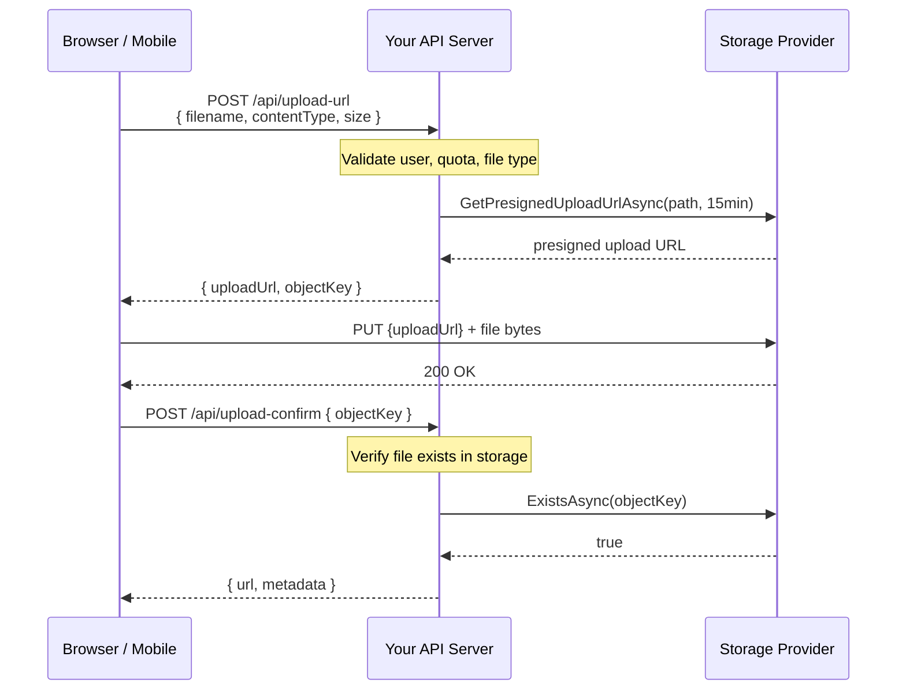

# Presigned URLs

Presigned URLs are time-limited URLs that grant temporary, scoped access to a specific storage object — without requiring the recipient to have credentials. ValiBlob exposes presigned URL generation through `IPresignedUrlProvider`.

---

## Interface

```csharp
public interface IPresignedUrlProvider
{
    /// <summary>
    /// Generates a URL that grants an HTTP client direct upload access
    /// to the specified storage path for the given duration.
    /// </summary>
    Task<StorageResult<string>> GetPresignedUploadUrlAsync(
        StoragePath path,
        TimeSpan expiresIn,
        CancellationToken ct = default);

    /// <summary>
    /// Generates a URL that grants an HTTP client direct download access
    /// to the specified storage path for the given duration.
    /// </summary>
    Task<StorageResult<string>> GetPresignedDownloadUrlAsync(
        StoragePath path,
        TimeSpan expiresIn,
        CancellationToken ct = default);
}
```

---

## Provider Support

| Provider | Upload URL | Download URL | Mechanism |
|---|---|---|---|
| AWS S3 | Yes | Yes | SigV4 HMAC-SHA256 signature in URL |
| Azure Blob | Yes | Yes | SAS token appended to blob URL |
| GCP Storage | Yes | Yes | V4 signed URL (requires service account key) |
| OCI Object Storage | Yes | Yes | Pre-Authenticated Request (PAR) |
| Supabase | Yes | Yes | Signed JWT-backed URL |
| Local Filesystem | Yes | Yes | HMAC-signed token, verified by `app.MapValiBlob()` endpoint |
| InMemory | No | No | Not applicable in test environments |

---

## Checking Support at Runtime

Not all providers implement `IPresignedUrlProvider`. Cast at runtime before calling:

```csharp
var provider = factory.Create("aws");

if (provider is IPresignedUrlProvider presigned)
{
    var upload   = await presigned.GetPresignedUploadUrlAsync(path, TimeSpan.FromMinutes(15));
    var download = await presigned.GetPresignedDownloadUrlAsync(path, TimeSpan.FromHours(1));

    if (upload.IsSuccess)
        return Results.Ok(new { uploadUrl = upload.Value, downloadUrl = download.Value });
}
else
{
    return Results.StatusCode(StatusCodes.Status501NotImplemented);
}
```

---

## Direct Client Upload Pattern

The most valuable use of presigned upload URLs is letting browsers or mobile apps upload files **directly to the storage provider** — bypassing your application server entirely for the file bytes. This eliminates your server as a bandwidth and CPU bottleneck for large file uploads.



Your server handles authorization and URL generation, but never touches the file bytes.

### Server: Upload URL Endpoint

```csharp
app.MapPost("/api/upload-url", async (
    UploadUrlRequest req,
    IStorageFactory factory,
    ClaimsPrincipal user) =>
{
    // Server-side validation before generating URL
    if (req.FileSizeBytes > 500_000_000)
        return Results.BadRequest("File size exceeds the 500 MB limit.");

    string[] allowed = ["image/jpeg", "image/png", "application/pdf", "video/mp4"];
    if (!allowed.Contains(req.ContentType))
        return Results.BadRequest("File type not permitted.");

    // Build server-controlled path (never trust client-provided paths)
    var userId = user.FindFirstValue(ClaimTypes.NameIdentifier)!;
    var ext    = MimeUtility.GetExtensions(req.ContentType).FirstOrDefault() ?? "";
    var path   = StoragePath.From("uploads", userId, $"{Guid.NewGuid()}{ext}");

    var provider = factory.Create("aws");
    if (provider is not IPresignedUrlProvider presigned)
        return Results.StatusCode(501);

    var result = await presigned.GetPresignedUploadUrlAsync(path, TimeSpan.FromMinutes(15));

    return result.IsSuccess
        ? Results.Ok(new { uploadUrl = result.Value, objectKey = path.Value })
        : Results.Problem(result.ErrorMessage);
}).RequireAuthorization();
```

### Server: Confirm Upload Endpoint

```csharp
app.MapPost("/api/upload-confirm", async (
    ConfirmUploadRequest req,
    IStorageFactory factory,
    IDbContext db,
    ClaimsPrincipal user) =>
{
    var provider = factory.Create("aws");

    // Verify the file actually landed in storage (client could claim anything)
    var exists = await provider.ExistsAsync(req.ObjectKey);
    if (!exists.IsSuccess || !exists.Value)
        return Results.BadRequest("File not found in storage.");

    var meta = await provider.GetMetadataAsync(req.ObjectKey);
    if (!meta.IsSuccess)
        return Results.Problem("Could not retrieve file metadata.");

    // Persist to database
    var file = new UserFile
    {
        UserId      = user.FindFirstValue(ClaimTypes.NameIdentifier)!,
        StoragePath = req.ObjectKey,
        ContentType = meta.Value.ContentType,
        SizeBytes   = meta.Value.SizeBytes
    };
    db.Files.Add(file);
    await db.SaveChangesAsync();

    return Results.Ok(new { fileId = file.Id, url = meta.Value.Url });
}).RequireAuthorization();
```

### Client: JavaScript Upload

```javascript
// Step 1: Get upload URL from your server
const tokenRes = await fetch('/api/upload-url', {
    method: 'POST',
    headers: {
        'Content-Type': 'application/json',
        'Authorization': `Bearer ${jwt}`
    },
    body: JSON.stringify({
        contentType: file.type,
        fileSizeBytes: file.size
    })
});
const { uploadUrl, objectKey } = await tokenRes.json();

// Step 2: Upload directly to the storage provider
await fetch(uploadUrl, {
    method: 'PUT',
    headers: { 'Content-Type': file.type },
    body: file
});

// Step 3: Confirm upload with your server
const confirmRes = await fetch('/api/upload-confirm', {
    method: 'POST',
    headers: {
        'Content-Type': 'application/json',
        'Authorization': `Bearer ${jwt}`
    },
    body: JSON.stringify({ objectKey })
});
const { fileId, url } = await confirmRes.json();
```

---

## Secure Download Links

Presigned download URLs let authenticated users download private files without exposing your bucket publicly. Your server verifies authorization, generates the URL, and redirects the user:

```csharp
app.MapGet("/files/{fileId:int}/download", async (
    int fileId,
    IStorageFactory factory,
    IDbContext db,
    ClaimsPrincipal user) =>
{
    var file = await db.Files.FindAsync(fileId);

    if (file is null)
        return Results.NotFound();

    // Verify ownership
    if (file.UserId != user.FindFirstValue(ClaimTypes.NameIdentifier))
        return Results.Forbid();

    var provider = factory.Create("aws");
    if (provider is not IPresignedUrlProvider presigned)
        return Results.StatusCode(501);

    var result = await presigned.GetPresignedDownloadUrlAsync(
        file.StoragePath,
        expiresIn: TimeSpan.FromHours(1));

    return result.IsSuccess
        ? Results.Redirect(result.Value)           // direct redirect to storage
        : Results.Problem(result.ErrorMessage);
}).RequireAuthorization();
```

---

## Expiry Guidelines

| Use Case | Recommended Expiry | Reason |
|---|---|---|
| Browser file upload | 5–15 minutes | Short window prevents URL reuse after cancellation |
| Large file upload (> 100 MB) | 30–60 minutes | Account for slow connections |
| One-time download link | 1–24 hours | Depends on sensitivity of the file |
| Email download link | 3–7 days | User may not open email immediately |
| Shared access (internal tools) | Up to 7 days | Many providers cap at 7 days |

---

## CORS Configuration for Direct Uploads

When clients upload directly, configure CORS on your storage bucket to allow requests from your application's origin:

### AWS S3

```json
[
  {
    "AllowedHeaders": ["*"],
    "AllowedMethods": ["PUT", "GET", "HEAD"],
    "AllowedOrigins": ["https://myapp.com"],
    "ExposeHeaders": ["ETag"],
    "MaxAgeSeconds": 3600
  }
]
```

### Azure Blob

```bash
az storage cors add \
    --services b \
    --methods PUT GET HEAD \
    --origins "https://myapp.com" \
    --allowed-headers "*" \
    --exposed-headers "ETag,x-ms-request-id" \
    --max-age 3600 \
    --account-name mystorageaccount
```

### GCP

```bash
gcloud storage buckets update gs://my-bucket --cors-file=cors.json
# cors.json: [{"origin":["https://myapp.com"],"method":["PUT","GET"],"maxAgeSeconds":3600}]
```

---

## Security Considerations

- **Never log presigned URLs.** They grant unauthenticated access to the file for their lifetime. Treat them like bearer tokens.
- **Use HTTPS exclusively.** Presigned URLs transmitted over plain HTTP can be intercepted.
- **Generate a fresh URL per upload.** Do not reuse upload URLs across attempts.
- **Validate uploads server-side.** After a client confirms an upload, call `ExistsAsync` and `GetMetadataAsync` to verify the file landed with the expected size and content type. A client can claim to have uploaded anything.
- **Set strict CORS rules.** Restrict `AllowedOrigins` to your application's domain — do not use `*` for storage buckets that hold sensitive data.
- **Keep expiry windows short for uploads.** A 15-minute upload URL is sufficient for most files. Shorter windows reduce the window of exposure if a URL is leaked.

---

## Related

- [AWS S3 Provider](../providers/aws.md) — SigV4-signed presigned URLs
- [Azure Blob Provider](../providers/azure.md) — SAS token presigned URLs
- [GCP Provider](../providers/gcp.md) — V4 signed URLs
- [OCI Provider](../providers/oci.md) — Pre-Authenticated Requests
- [Resumable Uploads](../resumable/overview.md) — Large file uploads
