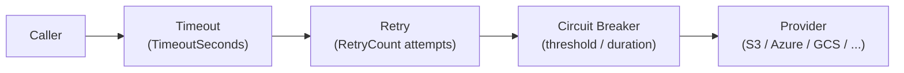
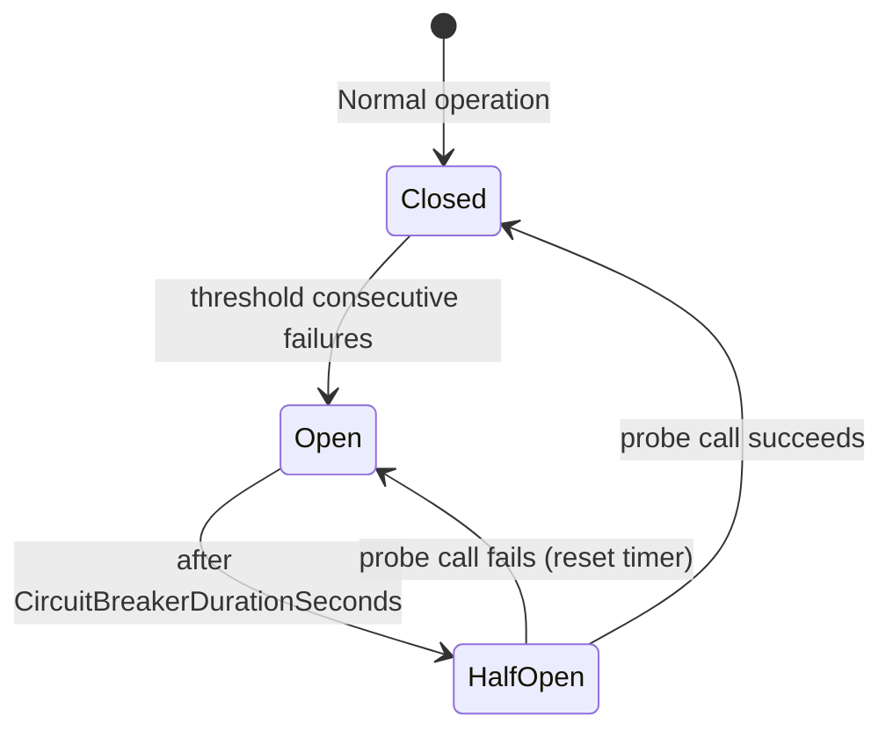

# Resilience

ValiBlob wraps all provider operations in a resilience pipeline powered by [Polly v8](https://github.com/App-vNext/Polly). The pipeline provides automatic retries on transient failures, a circuit breaker to prevent cascade failures, and per-operation timeouts to prevent indefinitely hanging requests.

---

## Configuration

Resilience options are configured per provider via `.WithResilience()`:

```csharp
using ValiBlob.Core;
using ValiBlob.AWS;

builder.Services
    .AddValiBlob(o => o.DefaultProvider = "aws")
    .AddProvider<AWSS3Provider>("aws", opts =>
    {
        opts.BucketName = config["AWS:BucketName"]!;
        opts.Region     = config["AWS:Region"]!;
    })
    .WithResilience(r =>
    {
        r.RetryCount                    = 3;
        r.RetryDelayMs                  = 500;
        r.UseExponentialBackoff         = true;
        r.AddJitter                     = true;
        r.CircuitBreakerThreshold       = 5;
        r.CircuitBreakerDurationSeconds = 30;
        r.TimeoutSeconds                = 30;
    });
```

---

## ResilienceOptions Reference

| Option | Type | Default | Description |
|---|---|---|---|
| `RetryCount` | `int` | `3` | Number of retry attempts on transient failure. |
| `RetryDelayMs` | `int` | `500` | Base delay in milliseconds between retries. |
| `UseExponentialBackoff` | `bool` | `true` | Multiply delay by 2^attempt: 500ms → 1s → 2s. |
| `AddJitter` | `bool` | `false` | Add ±20% random variation to each retry delay. Recommended for multi-instance deployments. |
| `CircuitBreakerThreshold` | `int` | `5` | Consecutive failures before the circuit opens. |
| `CircuitBreakerDurationSeconds` | `int` | `30` | Seconds the circuit stays open before allowing a probe. |
| `TimeoutSeconds` | `int` | `30` | Maximum seconds for a single operation before `TimeoutRejectedException` is thrown. |

---

## Pipeline Execution Order

Every provider call passes through three Polly strategies in this order:



1. **Timeout** — wraps the entire operation. If it does not complete within `TimeoutSeconds`, throws `TimeoutRejectedException`.
2. **Retry** — on a transient exception, waits for the configured delay and retries. Up to `RetryCount` attempts.
3. **Circuit Breaker** — if `CircuitBreakerThreshold` consecutive failures occur, the circuit opens. For `CircuitBreakerDurationSeconds`, all calls fail immediately with `BrokenCircuitException`. After the duration, one probe is allowed (half-open).

---

## Retry Behavior

### Linear Retry

```csharp
r.RetryCount            = 3;
r.RetryDelayMs          = 500;
r.UseExponentialBackoff = false;
```

Retries at: 500 ms, 500 ms, 500 ms

### Exponential Backoff (Default)

```csharp
r.RetryCount            = 3;
r.RetryDelayMs          = 500;
r.UseExponentialBackoff = true;
r.AddJitter             = false;
```

Retries at: 500 ms, 1,000 ms, 2,000 ms

### Exponential Backoff with Jitter (Recommended for Production)

When multiple instances retry simultaneously after a blip, they can create a thundering-herd effect that overwhelms a recovering provider. Jitter randomizes delays to spread the load:

```csharp
r.RetryCount            = 3;
r.RetryDelayMs          = 500;
r.UseExponentialBackoff = true;
r.AddJitter             = true;  // ±20% random variation
```

Retries at approximately: ~450–550 ms, ~900–1,100 ms, ~1,800–2,200 ms

---

## Transient vs Non-Transient Errors

Retries only apply to transient errors. Permanent errors surface immediately:

| Error | Retried | Reason |
|---|---|---|
| `HttpRequestException` (network) | Yes | DNS failure, connection reset, TCP timeout |
| HTTP 429 Too Many Requests | Yes | Rate limited — respects `Retry-After` header if present |
| HTTP 500 / 502 / 503 / 504 | Yes | Transient server errors |
| `TimeoutRejectedException` | Yes | Operation exceeded the timeout budget |
| HTTP 400 Bad Request | No | Client error — retrying will not help |
| HTTP 401 Unauthorized | No | Credentials are invalid — will not change on retry |
| HTTP 403 Forbidden | No | Authorization failure |
| HTTP 404 Not Found | No | Object does not exist |
| `BrokenCircuitException` | No | Circuit is open — surfaces immediately to caller |
| `StorageErrorCode.ValidationFailed` | No | ValiBlob pipeline rejection |

---

## Circuit Breaker States



| State | Behavior |
|---|---|
| **Closed** | All calls reach the provider normally. |
| **Open** | All calls fail immediately with `BrokenCircuitException`. No calls reach the provider. |
| **Half-Open** | One probe call is allowed. Success → Closed. Failure → Open (timer reset). |

The circuit breaker prevents your application from hammering an unavailable provider — each failed call would otherwise wait for the full `TimeoutSeconds` before failing, which under load creates request queues that can exhaust thread pools.

---

## Timeout Configuration

Set `TimeoutSeconds` to match your SLA expectations per operation type. Uploads of large files take longer than metadata reads:

```csharp
// For an API that only reads metadata
.WithResilience(r => r.TimeoutSeconds = 5)

// For an API that uploads large files
.WithResilience(r => r.TimeoutSeconds = 120)
```

:::warning Timeout budget covers all retries
`TimeoutSeconds` wraps the entire operation including all retry attempts. With `TimeoutSeconds = 30`, `RetryCount = 3`, and `RetryDelayMs = 500` (exponential), the total wall-clock budget for all retries combined is 30 seconds.
:::

---

## Per-Provider Configuration

Each provider can have independent resilience settings:

```csharp
builder.Services
    .AddValiBlob(o => o.DefaultProvider = "aws")
    .AddProvider<AWSS3Provider>("aws", opts => { /* ... */ })
    .WithResilience("aws", r =>
    {
        r.RetryCount            = 3;
        r.UseExponentialBackoff = true;
        r.AddJitter             = true;
        r.TimeoutSeconds        = 60;
        r.CircuitBreakerThreshold       = 5;
        r.CircuitBreakerDurationSeconds = 30;
    })
    .AddProvider<LocalStorageProvider>("local", opts => { /* ... */ })
    .WithResilience("local", r =>
    {
        r.RetryCount    = 1;   // local filesystem rarely has transient errors
        r.TimeoutSeconds = 5;
        r.CircuitBreakerThreshold = 20;
    });
```

---

## Custom Polly Pipeline

For advanced scenarios (bulkhead isolation, hedging, rate limiting), provide a fully custom Polly `ResiliencePipeline`:

```csharp
builder.Services
    .AddValiBlob(o => o.DefaultProvider = "aws")
    .AddProvider<AWSS3Provider>("aws", opts => { /* ... */ })
    .WithCustomResiliencePipeline("aws", pipeline =>
    {
        pipeline
            .AddRetry(new RetryStrategyOptions
            {
                ShouldHandle     = new PredicateBuilder()
                    .Handle<HttpRequestException>()
                    .Handle<TimeoutRejectedException>(),
                MaxRetryAttempts = 5,
                Delay            = TimeSpan.FromMilliseconds(250),
                BackoffType      = DelayBackoffType.Exponential,
                UseJitter        = true
            })
            .AddCircuitBreaker(new CircuitBreakerStrategyOptions
            {
                FailureRatio      = 0.5,          // open when 50% of calls fail
                SamplingDuration  = TimeSpan.FromSeconds(30),
                MinimumThroughput = 10,            // need at least 10 calls before tripping
                BreakDuration     = TimeSpan.FromSeconds(60)
            })
            .AddTimeout(TimeSpan.FromSeconds(30));
    });
```

---

## Disabling Resilience (Testing)

In tests where you want errors to propagate immediately without retries:

```csharp
.WithResilience(r =>
{
    r.RetryCount                    = 0;
    r.CircuitBreakerThreshold       = int.MaxValue;
    r.TimeoutSeconds                = 300;  // effectively no timeout
})
```

Alternatively, use `InMemoryStorageProvider` in tests — it does not use the Polly pipeline:

```csharp
builder.Services
    .AddValiBlob()
    .AddInMemoryProvider("test");
```

---

## Best Practices

| Concern | Recommendation |
|---|---|
| Retry count | 3 is a safe default. Increase only for high-value, idempotent operations. |
| Exponential backoff | Always enable in production to reduce provider load during failures. |
| Jitter | Enable when running multiple instances — prevents thundering-herd retries. |
| Circuit breaker threshold | 3–5 in production. Lower = faster fail-fast behavior on real outages. |
| Circuit breaker duration | 30–60 seconds for cloud providers. They typically recover in this window. |
| Timeout | Set to 2× your observed P99 operation duration in production. |
| Non-idempotent operations | Monitor delete and copy operations carefully — retrying a delete that partially succeeded is safe (404 on second attempt is expected), but verify your error classification handles this. |
| Observability | Monitor circuit breaker state changes via structured logs and OpenTelemetry spans. |

---

## Related

- [Observability](./observability.md) — Trace retry attempts and circuit breaker events
- [Health Checks](./health-checks.md) — Expose circuit breaker state in health endpoints
- [Packages](../packages.md) — ValiBlob package reference
