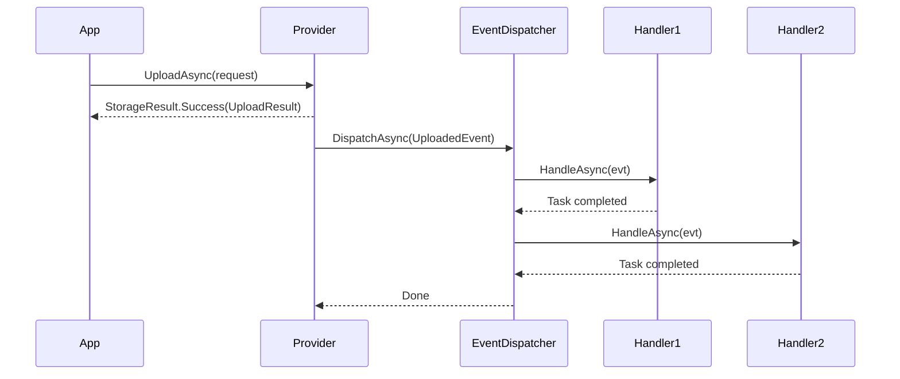

# Storage Events

ValiBlob emits typed events after every significant storage operation. You can subscribe to these events by implementing `IStorageEventHandler<TEvent>` and registering your handlers in the DI container. Events are dispatched after the operation completes successfully, giving you a hook for audit logging, analytics, cache invalidation, search indexing, and more.

---

## Why Use Events?

The event system gives you a clean separation of concerns:

- **Your provider code** handles storing and retrieving files.
- **Your event handlers** handle what happens *after* a storage operation succeeds — without coupling these concerns to the same class.

This keeps your storage service thin and lets you add cross-cutting behaviors (auditing, metrics, notifications) without modifying the core upload/download logic.

---

## Available Events

| Event | Triggered after | Key fields |
|---|---|---|
| `UploadedEvent` | Successful `UploadAsync` | `Path`, `SizeBytes`, `ContentType`, `Url`, `ETag` |
| `DownloadedEvent` | Successful `DownloadAsync` | `Path`, `SizeBytes` |
| `DeletedEvent` | Successful `DeleteAsync` | `Path` |
| `FolderDeletedEvent` | Successful `DeleteFolderAsync` | `Prefix`, `FilesDeleted` |
| `CopiedEvent` | Successful `CopyAsync` | `SourcePath`, `DestinationPath` |
| `MetadataUpdatedEvent` | Successful `SetMetadataAsync` | `Path`, `Metadata` |
| `ResumableStartedEvent` | Resumable upload initialized | `UploadId`, `Path`, `TotalBytes` |
| `ResumableCompletedEvent` | Resumable upload finalized | `UploadId`, `Path`, `Url`, `SizeBytes` |
| `ResumableAbortedEvent` | Resumable upload aborted | `UploadId`, `Path` |
| `ChunkUploadedEvent` | Individual chunk uploaded | `UploadId`, `ChunkIndex`, `BytesReceived`, `NextOffset` |

All event types implement `IStorageEvent` and carry a `StorageEventContext` via an `evt.Context` property.

---

## IStorageEventHandler

```csharp
public interface IStorageEventHandler<TEvent>
    where TEvent : IStorageEvent
{
    Task HandleAsync(TEvent evt, CancellationToken ct = default);
}
```

Implement this interface once per event type you want to handle. You may register multiple handlers for the same event type — all will be invoked in registration order.

---

## StorageEventContext

Every event carries a `StorageEventContext` with cross-cutting context:

```csharp
public sealed class StorageEventContext
{
    public string                         ProviderId  { get; init; }  // Named provider key, e.g. "aws"
    public string?                        RequestId   { get; init; }  // HTTP trace identifier
    public DateTimeOffset                 Timestamp   { get; init; }  // When the operation completed
    public IDictionary<string, object?>   Extensions  { get; init; }  // Custom extension data
}
```

Access context from any handler via `evt.Context`:

```csharp
public Task HandleAsync(UploadedEvent evt, CancellationToken ct)
{
    _logger.LogInformation(
        "Upload completed on {Provider} at {Time}: {Path} ({Size} bytes)",
        evt.Context.ProviderId,
        evt.Context.Timestamp,
        evt.Path,
        evt.SizeBytes);

    return Task.CompletedTask;
}
```

---

## Implementing Event Handlers

### Audit log on upload

```csharp
public class UploadAuditHandler : IStorageEventHandler<UploadedEvent>
{
    private readonly IAuditService _audit;

    public UploadAuditHandler(IAuditService audit) => _audit = audit;

    public async Task HandleAsync(UploadedEvent evt, CancellationToken ct)
    {
        await _audit.LogAsync(new AuditEntry
        {
            Action     = "storage.file.uploaded",
            Resource   = evt.Path,
            ProviderId = evt.Context.ProviderId,
            SizeBytes  = evt.SizeBytes,
            ContentType = evt.ContentType,
            Url        = evt.Url,
            Timestamp  = evt.Context.Timestamp,
            RequestId  = evt.Context.RequestId
        }, ct);
    }
}
```

### Emit metrics on every upload

```csharp
public class UploadMetricsHandler : IStorageEventHandler<UploadedEvent>
{
    private readonly IMeterFactory _meterFactory;
    private readonly Counter<long>  _uploadCount;
    private readonly Histogram<long> _uploadBytes;

    public UploadMetricsHandler(IMeterFactory meterFactory)
    {
        var meter    = meterFactory.Create("ValiBlob");
        _uploadCount = meter.CreateCounter<long>("storage.uploads.total");
        _uploadBytes = meter.CreateHistogram<long>("storage.upload.bytes");
    }

    public Task HandleAsync(UploadedEvent evt, CancellationToken ct)
    {
        _uploadCount.Add(1, new TagList { { "provider", evt.Context.ProviderId } });
        _uploadBytes.Record(evt.SizeBytes, new TagList { { "content_type", evt.ContentType } });
        return Task.CompletedTask;
    }
}
```

### Send a notification when a file is deleted

```csharp
public class DeletionNotificationHandler : IStorageEventHandler<DeletedEvent>
{
    private readonly INotificationService _notify;
    private readonly ILogger<DeletionNotificationHandler> _logger;

    public DeletionNotificationHandler(
        INotificationService notify,
        ILogger<DeletionNotificationHandler> logger)
    {
        _notify = notify;
        _logger = logger;
    }

    public async Task HandleAsync(DeletedEvent evt, CancellationToken ct)
    {
        _logger.LogInformation("File deleted: {Path} (provider: {Provider})",
            evt.Path, evt.Context.ProviderId);

        await _notify.SendAsync(
            $"File deleted: {evt.Path}",
            channel: "storage-alerts",
            ct: ct);
    }
}
```

### Search index on upload

```csharp
public class UploadSearchIndexer : IStorageEventHandler<UploadedEvent>
{
    private readonly ISearchIndex _index;

    public UploadSearchIndexer(ISearchIndex index) => _index = index;

    public async Task HandleAsync(UploadedEvent evt, CancellationToken ct)
    {
        await _index.IndexAsync(new SearchDocument
        {
            Id          = evt.Path,
            Title       = Path.GetFileName(evt.Path),
            Url         = evt.Url,
            ContentType = evt.ContentType,
            SizeBytes   = evt.SizeBytes,
            IndexedAt   = evt.Context.Timestamp
        }, ct);
    }
}
```

### Webhook dispatcher on upload

```csharp
public class UploadWebhookHandler : IStorageEventHandler<UploadedEvent>
{
    private readonly IWebhookDispatcher _webhooks;

    public UploadWebhookHandler(IWebhookDispatcher webhooks) => _webhooks = webhooks;

    public async Task HandleAsync(UploadedEvent evt, CancellationToken ct)
    {
        await _webhooks.FireAsync("file.uploaded", new
        {
            path        = evt.Path,
            url         = evt.Url,
            size        = evt.SizeBytes,
            contentType = evt.ContentType,
            timestamp   = evt.Context.Timestamp
        }, ct);
    }
}
```

### Handle resumable upload completion

```csharp
public class ResumableCompletedHandler : IStorageEventHandler<ResumableCompletedEvent>
{
    private readonly IJobQueue _jobs;

    public ResumableCompletedHandler(IJobQueue jobs) => _jobs = jobs;

    public async Task HandleAsync(ResumableCompletedEvent evt, CancellationToken ct)
    {
        // Queue video transcoding job now that the upload is fully received
        if (evt.Url.EndsWith(".mp4") || evt.Url.EndsWith(".mov"))
        {
            await _jobs.EnqueueAsync(new TranscodeVideoJob
            {
                SourcePath = evt.Path,
                UploadId   = evt.UploadId
            }, ct);
        }
    }
}
```

---

## Registering Event Handlers

Register handlers as scoped or singleton services in your DI setup:

```csharp
builder.Services
    .AddValiBlob(o => o.DefaultProvider = "aws")
    .AddProvider<AWSS3Provider>("aws", o => { /* ... */ });

// Multiple handlers for UploadedEvent — all will be called
builder.Services.AddScoped<IStorageEventHandler<UploadedEvent>, UploadAuditHandler>();
builder.Services.AddScoped<IStorageEventHandler<UploadedEvent>, UploadMetricsHandler>();
builder.Services.AddScoped<IStorageEventHandler<UploadedEvent>, UploadSearchIndexer>();
builder.Services.AddScoped<IStorageEventHandler<UploadedEvent>, UploadWebhookHandler>();

// Delete notifications
builder.Services.AddScoped<IStorageEventHandler<DeletedEvent>, DeletionNotificationHandler>();

// Resumable upload lifecycle
builder.Services.AddScoped<IStorageEventHandler<ResumableCompletedEvent>, ResumableCompletedHandler>();
```

ValiBlob resolves all registered handlers for each event type and calls them in registration order.

---

## Event Dispatch Behavior



Key behaviors:

- Events fire **only on success** — if `UploadAsync` returns `StorageResult.Failure`, no event is dispatched.
- Events are dispatched **within the same request scope** — no external message bus is required.
- If a handler throws an unhandled exception, the exception is **logged but does not propagate** to the caller. The operation already completed successfully.
- Handlers are called **sequentially** in registration order (not in parallel). If you need parallel dispatch, implement it inside a single handler.

:::tip Outbox pattern for reliable delivery
For guaranteed delivery of events to external systems (webhooks, message queues, email), use the transactional outbox pattern: in your event handler, write an outbox record to your database inside the same transaction as your business logic. A background job then delivers the event to the external system with retry.

This prevents the common pitfall of the handler failing after the file is already stored but before the event is delivered.
:::

---

## Related

- [Upload](./upload.md) — What triggers `UploadedEvent`
- [Pipeline Overview](../pipeline/overview.md) — How pipeline stages interact with event dispatch
