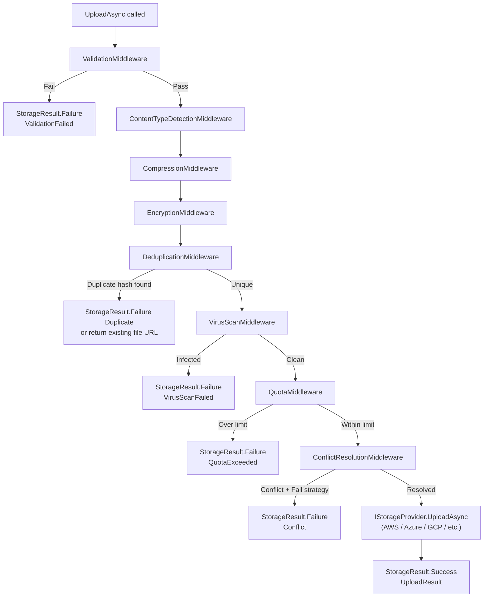

# Uploading Files

`UploadAsync` is the primary method for storing files. It accepts an `UploadRequest` describing the file and its metadata, passes the request through all configured pipeline middlewares, and delegates to the underlying provider.

---

## Method Signature

```csharp
Task<StorageResult<UploadResult>> UploadAsync(
    UploadRequest request,
    CancellationToken ct = default);
```

---

## UploadRequest Fields

| Field | Type | Required | Description |
|---|---|---|---|
| `Path` | `StoragePath` | Yes | Destination path in the storage backend |
| `Content` | `Stream` | Yes | File content stream (seekable or non-seekable) |
| `ContentType` | `string?` | No | MIME type. Auto-detected by `ContentTypeDetectionMiddleware` if omitted |
| `ContentLength` | `long?` | No | File size in bytes. Required by some providers for multipart upload optimization |
| `Metadata` | `Dictionary<string, string>?` | No | Arbitrary key-value metadata stored alongside the file |
| `Tags` | `Dictionary<string, string>?` | No | Provider-level tags (S3 object tags, Azure blob tags) |
| `OverrideConflictResolution` | `ConflictResolution?` | No | Override the pipeline's conflict resolution for this specific upload |

### Full example

```csharp
var request = new UploadRequest
{
    Path          = StoragePath.From("documents", "2026", "annual-report.pdf"),
    Content       = pdfStream,
    ContentType   = "application/pdf",
    ContentLength = pdfStream.Length,
    Metadata = new Dictionary<string, string>
    {
        ["author"]       = "finance-team",
        ["fiscal-year"]  = "2026",
        ["department"]   = "finance",
        ["confidential"] = "true"
    },
    Tags = new Dictionary<string, string>
    {
        ["environment"] = "production",
        ["project"]     = "annual-reports"
    }
};

var result = await provider.UploadAsync(request);
```

:::info Tags vs Metadata
`Tags` are stored as provider-level object tags on AWS S3 and Azure Blob Storage. They are indexed by the provider and can be used for billing allocation, lifecycle policies, and cross-account access. `Metadata` is stored as object metadata headers and is visible on the object itself. On providers that do not support native tagging, tags are merged into metadata.
:::

---

## UploadResult Fields

| Field | Type | Description |
|---|---|---|
| `Path` | `string` | Final storage path — may differ from the request path when `RenameWithSuffix` conflict resolution renames the file |
| `Url` | `string` | Public URL to access the file (format depends on provider and bucket permissions) |
| `SizeBytes` | `long` | Size of the stored file in bytes (after compression and/or encryption if those middlewares ran) |
| `ContentType` | `string` | Detected or provided MIME type |
| `ETag` | `string?` | Entity tag from the provider (S3 MD5, Azure MD5, GCS CRC32C, etc.) |
| `ThumbnailUrl` | `string?` | URL of the generated thumbnail, populated when `ValiBlob.ImageSharp` is configured with `GenerateThumbnail = true` |

```csharp
var result = await provider.UploadAsync(request);

if (result.IsSuccess)
{
    Console.WriteLine($"Path:          {result.Value.Path}");
    Console.WriteLine($"URL:           {result.Value.Url}");
    Console.WriteLine($"Size:          {result.Value.SizeBytes:N0} bytes");
    Console.WriteLine($"Content-Type:  {result.Value.ContentType}");
    Console.WriteLine($"ETag:          {result.Value.ETag ?? "n/a"}");
    Console.WriteLine($"Thumbnail URL: {result.Value.ThumbnailUrl ?? "n/a"}");
}
```

---

## Upload Flow

The following diagram shows how an upload request passes through the pipeline:



The exact middlewares in the chain depend on what you register with `WithPipeline`. Unregistered middlewares are skipped entirely — if you do not register `UseVirusScan()`, that step does not exist in the pipeline.

---

## Basic Upload Examples

### From IFormFile (ASP.NET Core)

```csharp
app.MapPost("/upload", async (IFormFile file, IStorageFactory factory) =>
{
    var provider = factory.Create();
    await using var stream = file.OpenReadStream();

    var result = await provider.UploadAsync(new UploadRequest
    {
        Path          = StoragePath.From("uploads", StoragePath.Sanitize(file.FileName)),
        Content       = stream,
        ContentType   = file.ContentType,
        ContentLength = file.Length
    });

    return result.IsSuccess
        ? Results.Ok(new { result.Value.Url, result.Value.Path })
        : Results.Problem(result.ErrorMessage);
}).DisableAntiforgery();
```

### From a byte array

```csharp
var bytes = await File.ReadAllBytesAsync("/tmp/report.pdf");

var result = await provider.UploadAsync(new UploadRequest
{
    Path          = StoragePath.From("reports", "q1-2026.pdf"),
    Content       = new MemoryStream(bytes),
    ContentType   = "application/pdf",
    ContentLength = bytes.Length
});
```

### From a URL (download-then-upload)

```csharp
using var http   = httpClientFactory.CreateClient();
await using var stream = await http.GetStreamAsync("https://example.com/source-file.pdf");

var result = await provider.UploadAsync(new UploadRequest
{
    Path    = StoragePath.From("mirror", "source-file.pdf"),
    Content = stream
    // ContentLength omitted — pipeline will buffer internally if required by the provider
});
```

### With custom metadata for tagging

```csharp
var result = await provider.UploadAsync(new UploadRequest
{
    Path        = StoragePath.From("user-files", userId, StoragePath.Sanitize(file.FileName)),
    Content     = file.OpenReadStream(),
    ContentType = file.ContentType,
    Metadata    = new Dictionary<string, string>
    {
        ["user-id"]     = userId,
        ["uploaded-at"] = DateTimeOffset.UtcNow.ToString("O"),
        ["ip-address"]  = httpContext.Connection.RemoteIpAddress?.ToString() ?? "unknown",
        ["tenant"]      = tenantId
    }
});
```

---

## Multi-File Upload Patterns

ValiBlob does not have a dedicated bulk upload method, but parallel uploads with `Task.WhenAll` are straightforward:

```csharp
public async Task<IReadOnlyList<UploadResult>> UploadManyAsync(
    IReadOnlyList<IFormFile> files,
    string userId,
    CancellationToken ct)
{
    var tasks = files.Select(async file =>
    {
        await using var stream = file.OpenReadStream();

        return await provider.UploadAsync(new UploadRequest
        {
            Path          = StoragePath.From("users", userId, StoragePath.Sanitize(file.FileName))
                                .WithRandomSuffix(),
            Content       = stream,
            ContentType   = file.ContentType,
            ContentLength = file.Length
        }, ct);
    });

    var results = await Task.WhenAll(tasks);

    // Log failures, return successful uploads
    foreach (var r in results.Where(r => r.IsFailure))
        _logger.LogWarning("Upload failed [{Code}]: {Msg}", r.ErrorCode, r.ErrorMessage);

    return results
        .Where(r => r.IsSuccess)
        .Select(r => r.Value!)
        .ToList();
}
```

:::warning Unbounded parallelism
Avoid uploading hundreds of files simultaneously. Each upload opens a TCP connection to your cloud provider. Use `SemaphoreSlim` to limit concurrency:

```csharp
var semaphore = new SemaphoreSlim(4); // max 4 concurrent uploads

var tasks = files.Select(async file =>
{
    await semaphore.WaitAsync(ct);
    try
    {
        await using var stream = file.OpenReadStream();
        return await provider.UploadAsync(new UploadRequest
        {
            Path    = StoragePath.From("uploads", StoragePath.Sanitize(file.FileName)),
            Content = stream
        }, ct);
    }
    finally
    {
        semaphore.Release();
    }
});

var results = await Task.WhenAll(tasks);
```
:::

---

## Progress Reporting

For large uploads, you can track progress by wrapping the content stream with a progress-reporting stream:

```csharp
public class ProgressStream(Stream inner, Action<long> onProgress) : Stream
{
    private long _totalRead;

    public override bool  CanRead  => inner.CanRead;
    public override bool  CanSeek  => inner.CanSeek;
    public override bool  CanWrite => false;
    public override long  Length   => inner.Length;
    public override long  Position
    {
        get => inner.Position;
        set => inner.Position = value;
    }

    public override int Read(byte[] buffer, int offset, int count)
    {
        var bytesRead = inner.Read(buffer, offset, count);
        _totalRead += bytesRead;
        onProgress(_totalRead);
        return bytesRead;
    }

    public override async ValueTask<int> ReadAsync(
        Memory<byte> buffer, CancellationToken ct = default)
    {
        var bytesRead = await inner.ReadAsync(buffer, ct);
        _totalRead += bytesRead;
        onProgress(_totalRead);
        return bytesRead;
    }

    // Delegate remaining Stream members to inner...
    public override void  Flush()                          => inner.Flush();
    public override long  Seek(long offset, SeekOrigin o)  => inner.Seek(offset, o);
    public override void  SetLength(long value)            => inner.SetLength(value);
    public override void  Write(byte[] buffer, int offset, int count) =>
        throw new NotSupportedException();
}
```

Usage:

```csharp
await using var fileStream = File.OpenRead(localFilePath);
var totalBytes = new FileInfo(localFilePath).Length;

var progressStream = new ProgressStream(fileStream, bytesRead =>
{
    var percent = (double)bytesRead / totalBytes * 100;
    Console.Write($"\rUploading: {percent:F1}%");
});

var result = await provider.UploadAsync(new UploadRequest
{
    Path          = StoragePath.From("backups", Path.GetFileName(localFilePath)),
    Content       = progressStream,
    ContentLength = totalBytes
});

Console.WriteLine();
Console.WriteLine(result.IsSuccess ? "Done." : $"Failed: {result.ErrorMessage}");
```

---

## Uploading with Full Pipeline

```csharp
// Full pipeline configuration
builder.Services
    .AddValiBlob(o => o.DefaultProvider = "aws")
    .AddProvider<AWSS3Provider>("aws", o =>
    {
        o.BucketName = config["AWS:BucketName"]!;
        o.Region     = config["AWS:Region"]!;
    })
    .WithPipeline(p => p
        .UseValidation(v =>
        {
            v.MaxFileSizeBytes  = 100_000_000;
            v.AllowedExtensions = [".jpg", ".png", ".pdf"];
        })
        .UseContentTypeDetection()
        .UseCompression()
        .UseEncryption(e => e.Key = config["Storage:EncryptionKey"]!)
        .UseDeduplication()
        .UseVirusScan()
        .UseQuota(q => q.MaxTotalBytes = 10L * 1024 * 1024 * 1024)
        .UseConflictResolution(ConflictResolution.RenameWithSuffix)
    );
```

With this configuration, every upload automatically:
1. Rejects files larger than 100 MB or with disallowed extensions
2. Detects content type from file bytes if not provided
3. GZip-compresses the content
4. AES-256-CBC-encrypts the compressed bytes
5. Checks if identical content was already uploaded (skips re-upload if so)
6. Scans for viruses or malware
7. Verifies the total quota is not exceeded
8. Renames the file with a numeric suffix if the path already exists

---

## Related

- [StoragePath](./storage-path.md) — Build safe file paths
- [StorageResult](./storage-result.md) — Handle errors
- [Download](./download.md) — Retrieve uploaded files with transparent decryption/decompression
- [Metadata](./metadata.md) — Read and update file metadata after upload
- [Resumable Uploads](../resumable/overview.md) — Upload large files reliably in chunks
