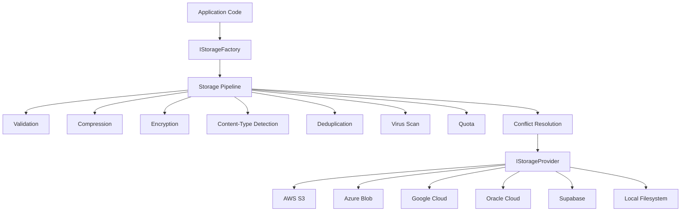

# Introduction to ValiBlob

ValiBlob is a **provider-agnostic cloud storage abstraction library** for .NET 8 and .NET 9. It gives you a single, unified API to work with Amazon S3, Azure Blob Storage, Google Cloud Storage, Oracle Cloud Infrastructure, Supabase, and even the local filesystem — without locking your application code to any specific vendor.

Whether you are building a multi-tenant SaaS platform that needs per-tenant storage isolation, a media pipeline that must compress and encrypt every upload, or a simple web API that just needs to store user avatars, ValiBlob handles the complexity so you can focus on your business logic.

---

## Why ValiBlob?

### Provider Agnostic

Your application code depends on `IStorageProvider`, not on AWS SDK or Azure SDK types. Swapping from S3 to Azure Blob is a one-line change in your DI configuration. This is invaluable for:

- **Portability** — move between clouds without rewriting business logic.
- **Testing** — use `ValiBlob.Testing` (in-memory provider) in unit tests with zero infrastructure.
- **Multi-cloud** — route uploads to different providers based on tenant, region, or content type.
- **Local development** — use `ValiBlob.Local` on a developer's machine, cloud provider in staging and production.

### Pipeline Architecture

Every upload and download flows through a composable middleware pipeline. You can enable and combine:

| Middleware | What it does |
|---|---|
| Validation | Reject files by size, extension, or content type before any bytes are processed |
| Compression | GZip on upload, transparent decompression on download |
| Encryption | AES-256-CBC on upload, transparent decryption on download |
| Content-Type Detection | Detect MIME type from magic bytes when content-type is missing |
| Deduplication | SHA-256 hashing — avoid storing the same file twice |
| Virus Scan | Pluggable `IVirusScanner` interface (ClamAV, VirusTotal, etc.) |
| Quota | Per-account or global storage limits with pluggable backend |
| Conflict Resolution | Replace, keep, rename, or fail on duplicate paths |

The pipeline is entirely opt-in. Start with just validation and add features incrementally.

### Resumable Uploads (TUS Protocol)

Large file uploads fail. Networks drop. Users close browser tabs. ValiBlob implements the [TUS resumable upload protocol](https://tus.io) so interrupted uploads resume from where they left off, not from the beginning.

Session state can be stored in Redis (`ValiBlob.Redis`) or EF Core (`ValiBlob.EFCore`), making resumable uploads production-ready in clustered deployments.

### Encryption at the Application Layer

Unlike server-side encryption managed by the cloud provider, ValiBlob encrypts file content in your application before bytes ever leave your process. Your cloud provider sees only ciphertext. AES-256-CBC with a random per-file IV is used, and the IV is stored in object metadata so transparent decryption works automatically on download.

### Image Processing

`ValiBlob.ImageSharp` adds upload-time image processing: resize, format conversion (JPEG, PNG, WebP, AVIF), and thumbnail generation. Images are transformed before they reach the storage provider, so you never store oversized originals unless you want to.

### Observability

ValiBlob emits structured events (`UploadedEvent`, `DownloadedEvent`, `DeletedEvent`, etc.) that you can subscribe to via `IStorageEventHandler<T>`. Build audit logs, analytics, or alerting without touching provider code. OpenTelemetry `ActivitySource` integration is also included for distributed tracing.

### Health Checks

`ValiBlob.HealthChecks` integrates with ASP.NET Core's `IHealthCheck` system so your `/health` endpoint reports the real-time status of every configured storage provider. This is essential for Kubernetes liveness and readiness probes.

---

## Architecture Overview

The following diagram shows how a request flows from your application code through the pipeline and into the chosen storage provider.



:::info
The pipeline runs in the order you register middleware. Validation should always come first to reject bad files early. Encryption should come last (before the provider) so the compressed, deduplicated bytes are what gets encrypted — not the raw originals.
:::

The `IStorageFactory` resolves named providers, allowing multiple providers to coexist in the same application. You can have a primary AWS provider and a secondary Azure provider for backups, each with their own pipeline configuration.

---

## Package Ecosystem

ValiBlob is distributed as 12 focused NuGet packages. Install only what you need.

| Package | Description | NuGet |
|---|---|---|
| `ValiBlob.Core` | Core abstractions, pipeline, DI, `StorageResult<T>`, `StoragePath` | [](https://www.nuget.org/packages/ValiBlob.Core) |
| `ValiBlob.AWS` | Amazon S3 provider | [](https://www.nuget.org/packages/ValiBlob.AWS) |
| `ValiBlob.Azure` | Azure Blob Storage provider | [](https://www.nuget.org/packages/ValiBlob.Azure) |
| `ValiBlob.GCP` | Google Cloud Storage provider | [](https://www.nuget.org/packages/ValiBlob.GCP) |
| `ValiBlob.OCI` | Oracle Cloud Infrastructure Object Storage | [](https://www.nuget.org/packages/ValiBlob.OCI) |
| `ValiBlob.Supabase` | Supabase Storage provider | [](https://www.nuget.org/packages/ValiBlob.Supabase) |
| `ValiBlob.Local` | Local filesystem provider (dev/testing/on-premise) | [](https://www.nuget.org/packages/ValiBlob.Local) |
| `ValiBlob.Redis` | Redis-backed resumable upload session store | [](https://www.nuget.org/packages/ValiBlob.Redis) |
| `ValiBlob.EFCore` | EF Core resumable upload session store | [](https://www.nuget.org/packages/ValiBlob.EFCore) |
| `ValiBlob.Testing` | In-memory provider for unit testing | [](https://www.nuget.org/packages/ValiBlob.Testing) |
| `ValiBlob.HealthChecks` | ASP.NET Core health checks for storage providers | [](https://www.nuget.org/packages/ValiBlob.HealthChecks) |
| `ValiBlob.ImageSharp` | Image processing middleware (resize, convert, watermark) | [](https://www.nuget.org/packages/ValiBlob.ImageSharp) |

All packages target **net8.0** and **net9.0**.

---

## Key Features at a Glance

### Unified Result Type

Every operation returns `StorageResult<T>` — a discriminated union that forces you to handle both success and failure paths. No uncaught exceptions from network calls in production.

```csharp
var result = await provider.UploadAsync(request);

if (result.IsSuccess)
    return Ok(result.Value.Url);

return result.ErrorCode switch
{
    StorageErrorCode.ValidationFailed => BadRequest(result.ErrorMessage),
    StorageErrorCode.QuotaExceeded    => StatusCode(429, result.ErrorMessage),
    StorageErrorCode.VirusScanFailed  => UnprocessableEntity(result.ErrorMessage),
    _                                 => StatusCode(500, result.ErrorMessage)
};
```

### Composable Path Builder

`StoragePath` builds cloud-safe storage paths from segments, with built-in helpers for date prefixes, hash suffixes, and sanitization.

```csharp
var path = StoragePath
    .From("users", userId, "avatars", fileName)
    .WithDatePrefix()     // 2026/03/18/users/42/avatars/photo.jpg
    .WithHashSuffix();    // 2026/03/18/users/42/avatars/photo_a3f7b2.jpg
```

### First-Class Cancellation

Every method on `IStorageProvider` accepts an optional `CancellationToken`, ensuring long-running uploads and downloads respect request timeouts and user cancellations.

### Full IStorageProvider Interface

```csharp
Task<StorageResult<UploadResult>>             UploadAsync(UploadRequest request, CancellationToken ct = default);
Task<StorageResult<Stream>>                   DownloadAsync(DownloadRequest request, CancellationToken ct = default);
Task<StorageResult>                           DeleteAsync(string path, CancellationToken ct = default);
Task<StorageResult>                           DeleteFolderAsync(string prefix, CancellationToken ct = default);
Task<StorageResult<bool>>                     ExistsAsync(string path, CancellationToken ct = default);
Task<StorageResult>                           CopyAsync(string src, string dst, CancellationToken ct = default);
Task<StorageResult<FileMetadata>>             GetMetadataAsync(string path, CancellationToken ct = default);
Task<StorageResult>                           SetMetadataAsync(string path, Dictionary<string,string> metadata, CancellationToken ct = default);
Task<StorageResult<IReadOnlyList<FileEntry>>> ListFilesAsync(string prefix, CancellationToken ct = default);
Task<StorageResult<IReadOnlyList<string>>>    ListFoldersAsync(string prefix, CancellationToken ct = default);
Task<StorageResult<string>>                   GetUrlAsync(string path, CancellationToken ct = default);
```

---

## Typical DI Setup

```csharp
builder.Services.AddValiBlob(o => { o.DefaultProvider = "aws"; })
    .AddProvider<AWSS3Provider>("aws", opts => {
        opts.BucketName = "my-bucket";
        opts.Region     = "us-east-1";
    })
    .WithPipeline(p => p
        .UseValidation(v => {
            v.MaxFileSizeBytes  = 100_000_000;
            v.AllowedExtensions = [".jpg", ".png", ".pdf"];
        })
        .UseCompression()
        .UseEncryption(e => { e.Key = config["Storage:EncryptionKey"]; })
        .UseContentTypeDetection()
        .UseDeduplication()
        .UseVirusScan()
        .UseQuota(q => { q.MaxTotalBytes = 10L * 1024 * 1024 * 1024; })
        .UseConflictResolution(ConflictResolution.ReplaceExisting));
```

---

## Target Frameworks

| Version | .NET Targets | Notes |
|---|---|---|
| 1.0.0 | net8.0; net9.0 | Current stable release |

All packages in the ValiBlob ecosystem are versioned together. When you upgrade, upgrade all packages to the same version to avoid compatibility issues.

---

## Next Steps

- [Quick Start](./quick-start.md) — Get your first upload working in 5 minutes.
- [Packages Reference](./packages.md) — Full table of every package and its dependencies.
- [Pipeline Overview](./pipeline/overview.md) — Understand how the middleware pipeline works.
- [StorageResult](./core/storage-result.md) — Master the result type used by every operation.
- [StoragePath](./core/storage-path.md) — Learn the path-building utilities.
