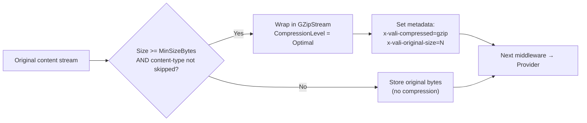

# Compression Middleware

`CompressionMiddleware` applies GZip compression to file content at upload time and automatically decompresses it at download time. Compression is fully transparent to the caller — you upload and download the original, uncompressed bytes. The storage backend holds the compressed representation.

---

## Registration

```csharp
.WithPipeline(p => p
    .UseValidation(v => { /* ... */ })
    .UseCompression()                    // default options
    // --- or with explicit options ---
    .UseCompression(c =>
    {
        c.CompressionLevel  = CompressionLevel.Optimal;
        c.MinSizeBytes      = 1024;      // do not compress files smaller than 1 KB
        c.SkipContentTypes  = [
            "image/jpeg", "image/png", "video/mp4", "application/zip"
        ];
    })
)
```

---

## CompressionOptions

| Option | Type | Default | Description |
|---|---|---|---|
| `CompressionLevel` | `CompressionLevel` | `Optimal` | `Fastest`, `Optimal`, or `SmallestSize` |
| `MinSizeBytes` | `long` | `0` | Files smaller than this threshold are stored uncompressed |
| `SkipContentTypes` | `string[]` | `[]` | MIME types to skip — already-compressed formats should be listed here |

---

## How It Works

### On Upload



1. The middleware checks whether the file meets the `MinSizeBytes` threshold and whether its content-type is in `SkipContentTypes`.
2. If eligible, the `Content` stream is wrapped in a `GZipStream` compression transform.
3. `x-vali-compressed: gzip` is added to the upload metadata.
4. `x-vali-original-size: <bytes>` is added (when `ContentLength` is known).
5. The compressed stream replaces `UploadRequest.Content` and continues down the pipeline.

### On Download

1. The file metadata is read to check for `x-vali-compressed: gzip`.
2. If present and `AutoDecompress = true` on the `DownloadRequest` (the default), the downloaded stream is wrapped in a `GZipStream` decompression transform.
3. The caller receives the original, uncompressed bytes.

---

## When to Use Compression

Compression yields significant size savings for text-based and structured formats. It adds CPU cost but reduces storage cost and transfer bandwidth.

| Content Type | Size Reduction | Recommendation |
|---|---|---|
| Plain text (`.txt`, `.log`, `.csv`) | 60–90% | Highly recommended |
| JSON / XML | 70–85% | Highly recommended |
| HTML / CSS / JavaScript | 65–80% | Recommended |
| Office documents (`.docx`, `.xlsx`) | 5–20% (already ZIP-based internally) | Marginal benefit |
| SVG images | 50–80% | Recommended |
| PDF | 5–30% (depends on content) | Marginal |
| JPEG images | Near 0% or negative (already compressed) | Not recommended |
| PNG images | 0–5% (already uses DEFLATE) | Not recommended |
| WebP / AVIF | 0% or negative | Not recommended |
| MP4 / WebM video | 0% or negative | Not recommended |
| MP3 / AAC audio | 0% or negative | Not recommended |
| ZIP / GZip / 7-Zip | Negative (re-compressing compressed data makes it larger) | Not recommended |

### Skip already-compressed formats

Always configure `SkipContentTypes` for binary media and archive formats:

```csharp
.UseCompression(c =>
{
    c.CompressionLevel  = CompressionLevel.Optimal;
    c.MinSizeBytes      = 1024;  // no gain compressing tiny files
    c.SkipContentTypes  = [
        // Images
        "image/jpeg", "image/png", "image/gif",
        "image/webp", "image/avif", "image/heic",
        // Video
        "video/mp4", "video/webm", "video/quicktime",
        "video/x-msvideo", "video/x-matroska",
        // Audio
        "audio/mpeg", "audio/ogg", "audio/aac", "audio/flac",
        // Archives
        "application/zip", "application/gzip",
        "application/x-7z-compressed", "application/x-rar-compressed",
        // Office (internally zipped)
        "application/vnd.openxmlformats-officedocument.wordprocessingml.document",
        "application/vnd.openxmlformats-officedocument.spreadsheetml.sheet",
        "application/vnd.openxmlformats-officedocument.presentationml.presentation"
    ];
})
```

---

## Interaction with Encryption

When both compression and encryption are enabled, you must **compress before encrypting**:

```csharp
.WithPipeline(p => p
    .UseCompression()                            // step 1: compress
    .UseEncryption(e => e.Key = encryptionKey)   // step 2: encrypt the compressed bytes
)
```

**Why compress before encrypting?**

- Encrypted data is pseudo-random. Compressing ciphertext produces no meaningful size reduction.
- Compressing before encrypting is also more secure: it prevents compression oracle attacks (CRIME/BREACH) where an attacker could infer information about plaintext by observing compressed ciphertext size.

On download, the reverse applies: **decrypt first, then decompress**.

---

## Storage Metadata Written

When compression is applied, ValiBlob writes the following metadata keys:

| Key | Value | Description |
|---|---|---|
| `x-vali-compressed` | `gzip` | Signals that the stored content is GZip-compressed |
| `x-vali-original-size` | Numeric string (bytes) | Original uncompressed file size before GZip |

Inspect these via `GetMetadataAsync`:

```csharp
var meta = await provider.GetMetadataAsync("data/large-export.json");

if (meta.IsSuccess && meta.Value.CustomMetadata.TryGetValue("x-vali-compressed", out _))
{
    var originalSize = long.Parse(meta.Value.CustomMetadata["x-vali-original-size"]);
    var storedSize   = meta.Value.SizeBytes;
    var ratio        = 1.0 - (double)storedSize / originalSize;

    Console.WriteLine($"Original size: {originalSize:N0} bytes");
    Console.WriteLine($"Stored size:   {storedSize:N0} bytes");
    Console.WriteLine($"Compression ratio: {ratio:P1} reduction");
}
```

---

## Opt Out of Decompression for a Specific Download

To retrieve the raw compressed bytes (for example, to forward them to a client that supports `Content-Encoding: gzip`):

```csharp
var result = await provider.DownloadAsync(new DownloadRequest
{
    Path           = "data/large-dataset.json",
    AutoDecompress = false   // receive raw GZip bytes
});

// Client supports gzip encoding — let the browser decompress
ctx.Response.Headers.ContentEncoding = "gzip";
ctx.Response.Headers.ContentType     = "application/json";
return Results.Stream(result.Value);
```

This avoids the CPU cost of decompressing server-side only to have the bytes re-compressed for HTTP transport.

---

## Compression and ContentLength

When compression is active, the stored file size is different from `UploadRequest.ContentLength`. The relationship:

| Field | Value |
|---|---|
| `UploadRequest.ContentLength` | Original, uncompressed size |
| `UploadResult.SizeBytes` | Compressed size actually stored in the cloud |
| `x-vali-original-size` metadata | Same as `UploadRequest.ContentLength` |
| `FileMetadata.SizeBytes` | Compressed size (same as `UploadResult.SizeBytes`) |

:::info ContentLength and Azure Blob
Some providers (notably Azure Blob Storage) use `Content-Length` during upload for internal optimization and require a known length upfront. When compression is active, the final compressed size is not known until compression completes. ValiBlob handles this by streaming without a `Content-Length` header (chunked transfer encoding) when Azure Blob is the provider and compression is enabled.
:::

---

## Performance Trade-offs

| Compression level | CPU usage | Output size | Best for |
|---|---|---|---|
| `Fastest` | Low | ~10–30% larger than Optimal | High-throughput upload APIs, time-sensitive workflows |
| `Optimal` | Medium | Balanced | General purpose (recommended default) |
| `SmallestSize` | High | Smallest possible | Archival, cold storage, batch jobs run offline |

For large files, compression runs as a **streaming operation** — memory usage stays bounded at a few KB of working buffer regardless of file size. There is no need to load the entire file into memory.

---

## Example: Full Pipeline with Compression

```csharp
builder.Services
    .AddValiBlob(o => o.DefaultProvider = "aws")
    .AddProvider<AWSS3Provider>("aws", o =>
    {
        o.BucketName = config["AWS:BucketName"]!;
        o.Region     = config["AWS:Region"]!;
    })
    .WithPipeline(p => p
        .UseValidation(v =>
        {
            v.MaxFileSizeBytes  = 500_000_000;
            v.AllowedExtensions = [".csv", ".json", ".xml", ".txt", ".log"];
        })
        .UseCompression(c =>
        {
            c.CompressionLevel = CompressionLevel.Optimal;
            c.MinSizeBytes     = 4096;  // skip tiny files
        })
        .UseEncryption(e => e.Key = config["Storage:EncryptionKey"]!)
        .UseConflictResolution(ConflictResolution.ReplaceExisting)
    );
```

With this setup, all text-based exports will be compressed then encrypted before reaching S3. On download, decryption and decompression happen automatically and your application code always sees the original plaintext bytes.

---

## Related

- [Encryption](./encryption.md) — Always compress before encrypting
- [Download](../core/download.md) — `AutoDecompress` option on `DownloadRequest`
- [Metadata](../core/metadata.md) — Reading `x-vali-compressed` and `x-vali-original-size`
- [Pipeline Overview](./overview.md) — Middleware ordering
