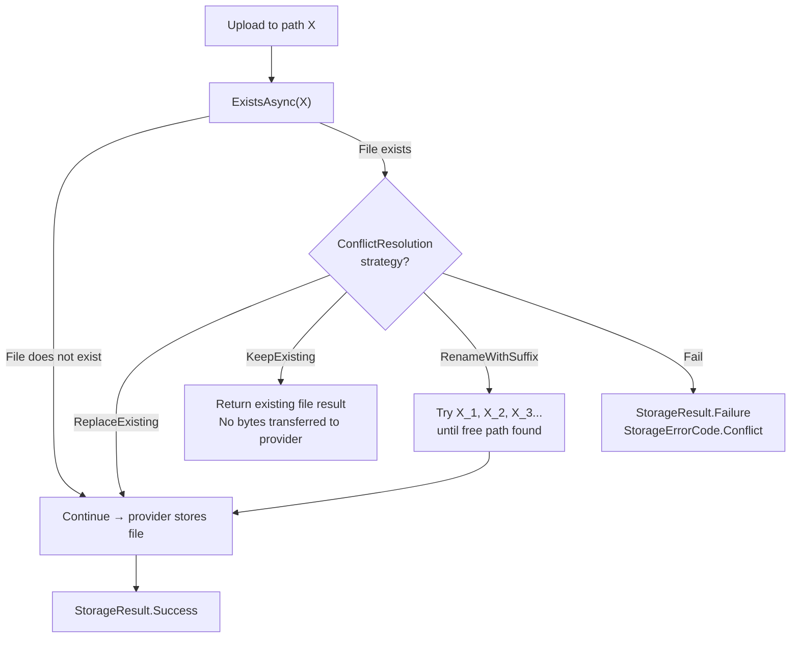

# Conflict Resolution Middleware

`ConflictResolutionMiddleware` handles the situation where an upload targets a path that already contains a file in the storage backend. Depending on the configured strategy, it can overwrite the existing file, silently return the existing file, rename the new file with a numeric suffix, or return a `Conflict` error. This runs as the last middleware before the upload reaches the provider.

---

## Registration

```csharp
.WithPipeline(p => p
    .UseValidation(v => { /* ... */ })
    // other middlewares ...
    .UseConflictResolution(ConflictResolution.ReplaceExisting)
)
```

---

## ConflictResolution Enum

| Value | Description |
|---|---|
| `ReplaceExisting` | Overwrite the existing file. Previous content is replaced. This is the most common choice. |
| `KeepExisting` | Do not upload the new file. Return the existing file's `UploadResult` as if the upload succeeded. |
| `RenameWithSuffix` | Append `_1`, `_2`, etc. to the filename stem until a free path is found. The final path is returned in `UploadResult.Path`. |
| `Fail` | Return `StorageResult.Failure` with `StorageErrorCode.Conflict`. The upload is rejected. |

---

## How Each Strategy Works



---

## ReplaceExisting

The most common strategy. If the path already exists, the provider simply overwrites the object with the new content. The old content is permanently replaced (subject to provider versioning settings — e.g., S3 versioning can preserve old versions).

```csharp
.UseConflictResolution(ConflictResolution.ReplaceExisting)
```

With `ReplaceExisting`, `ConflictResolutionMiddleware` calls `ExistsAsync` to check whether the file exists before proceeding. However, the upload continues in both cases (exists or not), so the existence check is primarily informational for event dispatching and logging. On some providers, you can skip the existence check entirely by not registering the middleware at all — the provider will overwrite by default.

**When to use:**

- User profile photos and avatars — always show the latest
- Application configuration files — latest upload wins
- Dashboard exports, report snapshots — overwrite previous
- Any "set" operation where only one version per path should exist

### Example

```csharp
// Upload a user's avatar — replaces the previous one at the same path
var result = await provider.UploadAsync(new UploadRequest
{
    Path        = StoragePath.From("users", userId, "avatar.jpg"),
    Content     = imageStream,
    ContentType = "image/jpeg"
});

if (result.IsSuccess)
    Console.WriteLine($"Avatar updated: {result.Value.Url}");
```

---

## KeepExisting

If the path already has content, the upload is short-circuited. The existing file's URL, path, size, and content-type are returned in an `UploadResult` as though a new upload occurred. No bytes are transferred to the provider.

```csharp
.UseConflictResolution(ConflictResolution.KeepExisting)
```

**When to use:**

- Idempotent upload APIs — "upload if not already present"
- Write-once archival systems — the first upload is authoritative
- Content-addressed assets — same path = same content, re-uploading is wasteful
- Initialization data — load defaults once, then leave them

### Example

```csharp
// Upload a default avatar only if one doesn't already exist
var result = await provider.UploadAsync(new UploadRequest
{
    Path        = StoragePath.From("users", userId, "avatar.jpg"),
    Content     = defaultAvatarStream,
    ContentType = "image/jpeg"
});

// IsSuccess is true in BOTH cases (new file OR existing file returned)
Console.WriteLine($"Avatar available at: {result.Value.Url}");
Console.WriteLine("(may be previously stored or newly uploaded)");
```

---

## RenameWithSuffix

If the target path exists, the middleware appends `_1`, `_2`, `_3`, ... to the filename stem (before the extension) and calls `ExistsAsync` for each candidate until a free path is found. The final resolved path is used for the upload and returned in `UploadResult.Path`.

```csharp
.UseConflictResolution(ConflictResolution.RenameWithSuffix)
```

### Path resolution example

| Candidate path | ExistsAsync result |
|---|---|
| `uploads/user-123/report.pdf` | true (exists) |
| `uploads/user-123/report_1.pdf` | true (exists) |
| `uploads/user-123/report_2.pdf` | true (exists) |
| `uploads/user-123/report_3.pdf` | false — upload here |

`UploadResult.Path` = `"uploads/user-123/report_3.pdf"`

### Example

```csharp
var result = await provider.UploadAsync(new UploadRequest
{
    Path    = StoragePath.From("uploads", userId, "report.pdf"),
    Content = reportStream
});

if (result.IsSuccess)
{
    // Path may differ from requested path if renaming occurred
    Console.WriteLine($"Stored at:    {result.Value.Path}");
    Console.WriteLine($"Accessible:   {result.Value.Url}");
}
```

**When to use:**

- User-facing file managers where each upload creates a distinct file
- Document management systems where all versions of a file should be preserved
- Bulk import tools where multiple files may share a name

:::info Rename limit
By default, `RenameWithSuffix` searches up to 1,000 candidate paths. If no free path is found within the limit, the upload fails with `StorageErrorCode.Conflict`. In practice, combine this strategy with `StoragePath.WithRandomSuffix()` to make the initial path nearly always unique, minimizing the rename search:

```csharp
var path = StoragePath
    .From("uploads", userId, StoragePath.Sanitize(file.FileName))
    .WithRandomSuffix();  // Near-zero chance of collision

// RenameWithSuffix will almost never need to iterate
.UseConflictResolution(ConflictResolution.RenameWithSuffix)
```
:::

---

## Fail

Return `StorageResult.Failure` with `StorageErrorCode.Conflict` immediately if a file already exists at the target path. No upload occurs.

```csharp
.UseConflictResolution(ConflictResolution.Fail)
```

**When to use:**

- Strict immutability requirements — overwriting is always a programming error
- Legal documents, financial records, compliance artifacts
- Audit log entries — append-only storage
- Content-addressed stores where path encodes content identity

### Example

```csharp
var result = await provider.UploadAsync(new UploadRequest
{
    Path    = StoragePath.From("legal", "signed-contract.pdf"),
    Content = pdfStream
});

if (result.IsSuccess)
    return Results.Created($"/documents/{result.Value.Path}", new { url = result.Value.Url });

if (result.ErrorCode == StorageErrorCode.Conflict)
    return Results.Conflict(new
    {
        error  = "A signed contract already exists at this path.",
        action = "To replace, delete the existing file through the proper approval process first."
    });

return Results.Problem(result.ErrorMessage);
```

---

## Per-Request Override

The pipeline's global conflict resolution strategy can be overridden for a specific upload via `UploadRequest.OverrideConflictResolution`:

```csharp
// Pipeline default is ReplaceExisting globally

// This specific upload should fail if the file already exists
var result = await provider.UploadAsync(new UploadRequest
{
    Path                       = StoragePath.From("compliance", "audit-log-2026-03.json"),
    Content                    = logStream,
    OverrideConflictResolution = ConflictResolution.Fail
});

if (result.ErrorCode == StorageErrorCode.Conflict)
    throw new InvalidOperationException("Audit log already exists — cannot overwrite.");
```

---

## ExistsAsync Call Overhead

`ConflictResolutionMiddleware` calls `ExistsAsync` before every upload. For AWS S3, Azure Blob, and GCP, `ExistsAsync` is a lightweight `HEAD` request — typically 10–50 ms depending on region. For the `Local` provider, it is a `File.Exists` call (sub-millisecond).

For `RenameWithSuffix`, multiple `ExistsAsync` calls may be needed when many numbered versions already exist. The number of round-trips equals `N + 1` where N is the count of existing numbered versions.

### Minimize round-trips

```csharp
// Option 1: Use ReplaceExisting — only one ExistsAsync call (some implementations skip it entirely)
.UseConflictResolution(ConflictResolution.ReplaceExisting)

// Option 2: Use WithRandomSuffix so paths are virtually always unique
// — RenameWithSuffix will almost never need to search
var path = StoragePath
    .From("uploads", StoragePath.Sanitize(file.FileName))
    .WithRandomSuffix();

// Option 3: Skip conflict resolution entirely for maximum throughput
// on high-volume write-once workloads (provider overwrites by default)
// (Do not register UseConflictResolution at all)
```

---

## Strategy Selection Guide

| Use case | Recommended strategy | Reason |
|---|---|---|
| User profile photo / avatar | `ReplaceExisting` | Only one avatar per user; latest wins |
| Application config or settings | `ReplaceExisting` | Updated configs replace old ones |
| User file manager (keep all versions) | `RenameWithSuffix` | Every upload is preserved |
| Content-addressed CDN asset | `KeepExisting` | Same content → same path; re-upload is wasteful |
| Idempotent API (upload once) | `KeepExisting` | Retrying returns the existing file |
| Legal / compliance documents | `Fail` | Overwriting is never acceptable |
| Audit log entries | `Fail` | Append-only; no overwrites |
| Large-scale media ingestion | `ReplaceExisting` + `WithRandomSuffix` | Unique paths, no existence checks |

---

## Related

- [Pipeline Overview](./overview.md) — Middleware ordering and execution model
- [StoragePath](../core/storage-path.md) — Use `WithRandomSuffix()` or `WithHashSuffix()` for application-level uniqueness
- [StorageResult](../core/storage-result.md) — Handling `StorageErrorCode.Conflict`
- [Upload](../core/upload.md) — `UploadRequest.OverrideConflictResolution` for per-request strategy override
