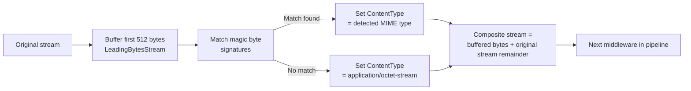

# Content-Type Detection Middleware

`ContentTypeDetectionMiddleware` determines the true MIME type of uploaded files by inspecting **magic bytes** — the leading bytes of the file stream — rather than trusting the `Content-Type` header or file extension supplied by the client. This ensures metadata accuracy and strengthens security when combined with `ValidationMiddleware`.

---

## Registration

```csharp
.WithPipeline(p => p
    .UseContentTypeDetection()          // default: detect and override any client-provided content-type
    // --- or with options ---
    .UseContentTypeDetection(o =>
    {
        o.OverrideExisting      = true;     // true = replace client content-type; false = detect only when missing
        o.SniffBytes            = 512;      // number of leading bytes to inspect (default: 512)
        o.FallbackContentType   = "application/octet-stream"; // used when no signature matches
    })
)
```

---

## ContentTypeDetectionOptions

| Option | Type | Default | Description |
|---|---|---|---|
| `OverrideExisting` | `bool` | `true` | If `true`, replaces any client-provided `Content-Type` with the detected type. If `false`, only detects when `ContentType` is null or empty |
| `SniffBytes` | `int` | `512` | Number of leading bytes to buffer for magic byte inspection |
| `FallbackContentType` | `string` | `"application/octet-stream"` | MIME type returned when no signature matches |

---

## How It Works



1. The middleware reads the first `SniffBytes` bytes into an internal buffer using a `LeadingBytesStream` wrapper.
2. The buffer is matched against a table of known magic byte signatures.
3. The detected MIME type is written to `UploadRequest.ContentType` (replacing the client-provided value if `OverrideExisting = true`).
4. The content stream is reconstructed as a composite of the buffered bytes prepended back to the original stream remainder, so downstream middlewares receive the complete, unmodified file content.

---

## Supported Formats

The following file types are detected from magic bytes:

| MIME Type | Common Extensions | Magic Bytes (hex) |
|---|---|---|
| `image/jpeg` | `.jpg`, `.jpeg` | `FF D8 FF` |
| `image/png` | `.png` | `89 50 4E 47 0D 0A 1A 0A` |
| `image/gif` | `.gif` | `47 49 46 38` (`GIF8`) |
| `image/webp` | `.webp` | `52 49 46 46 ?? ?? ?? ?? 57 45 42 50` (RIFF...WEBP) |
| `image/bmp` | `.bmp` | `42 4D` |
| `image/tiff` | `.tif`, `.tiff` | `49 49 2A 00` (little-endian) or `4D 4D 00 2A` (big-endian) |
| `image/avif` | `.avif` | ISO BMFF with `avif` compatible brand |
| `image/heic` | `.heic` | ISO BMFF with `heic` compatible brand |
| `application/pdf` | `.pdf` | `25 50 44 46` (`%PDF`) |
| `application/zip` | `.zip` | `50 4B 03 04` |
| `application/gzip` | `.gz` | `1F 8B` |
| `application/x-7z-compressed` | `.7z` | `37 7A BC AF 27 1C` |
| `application/x-rar-compressed` | `.rar` | `52 61 72 21 1A 07` |
| `application/vnd.ms-excel` | `.xls` | `D0 CF 11 E0` (OLE2 compound) |
| `application/vnd.ms-powerpoint` | `.ppt` | `D0 CF 11 E0` (OLE2 compound) |
| `application/msword` | `.doc` | `D0 CF 11 E0` (OLE2 compound) |
| `application/vnd.openxmlformats-officedocument.spreadsheetml.sheet` | `.xlsx` | `50 4B` (ZIP-based OOXML) |
| `application/vnd.openxmlformats-officedocument.wordprocessingml.document` | `.docx` | `50 4B` (ZIP-based OOXML) |
| `application/vnd.openxmlformats-officedocument.presentationml.presentation` | `.pptx` | `50 4B` (ZIP-based OOXML) |
| `video/mp4` | `.mp4`, `.m4v` | ISO BMFF with `mp4` or `isom` brand |
| `video/webm` | `.webm` | `1A 45 DF A3` (EBML) |
| `video/x-msvideo` | `.avi` | `52 49 46 46 ?? ?? ?? ?? 41 56 49 20` (RIFF...AVI) |
| `audio/mpeg` | `.mp3` | `FF FB`, `FF F3`, `FF F2`, or `49 44 33` (ID3) |
| `audio/ogg` | `.ogg`, `.oga` | `4F 67 67 53` (OggS) |
| `audio/flac` | `.flac` | `66 4C 61 43` (fLaC) |
| `audio/wav` | `.wav` | `52 49 46 46 ?? ?? ?? ?? 57 41 56 45` (RIFF...WAVE) |
| `text/plain` | `.txt` | UTF-8 BOM (`EF BB BF`) or UTF-16 BOM, or printable ASCII heuristic |
| `text/html` | `.html`, `.htm` | `3C 21 44 4F 43` (`<!DOC`) or `3C 68 74 6D 6C` (`<html`) |
| `text/xml` / `application/xml` | `.xml` | `3C 3F 78 6D 6C` (`<?xml`) |

If no magic byte signature matches, the content type falls back to `FallbackContentType` (`application/octet-stream` by default).

---

## Middleware Placement and Security

For maximum security, place `ContentTypeDetectionMiddleware` **before** `ValidationMiddleware`:

```csharp
.WithPipeline(p => p
    .UseContentTypeDetection(o => o.OverrideExisting = true)   // detect from bytes FIRST
    .UseValidation(v =>
    {
        // Now AllowedContentTypes is checked against the REAL detected type,
        // not the Content-Type header the client sent
        v.AllowedExtensions   = [".jpg", ".png", ".pdf"];
        v.AllowedContentTypes = ["image/jpeg", "image/png", "application/pdf"];
    })
    .UseVirusScan()   // further content-level security
)
```

With this order, a user who renames `malware.exe` to `document.pdf` will:

1. Pass the extension check (extension is `.pdf`, which is allowed).
2. **Fail** the content-type check, because detection reads the magic bytes and identifies the file as `application/x-msdownload` (or similar), which is not in `AllowedContentTypes`.

:::tip Defense in depth
Content-type detection from magic bytes significantly strengthens your security posture, but it is not foolproof. A sophisticated attacker can craft a file that begins with valid JPEG magic bytes but embeds malicious content later (a "polyglot file"). Pair detection with `VirusScanMiddleware` for comprehensive protection against crafted files.
:::

---

## Only Detect When Content-Type Is Missing

If you trust the client's content-type (for example, an internal service-to-service API) but want fallback detection when the field is empty:

```csharp
.UseContentTypeDetection(o =>
{
    o.OverrideExisting = false;  // only runs when ContentType is null or empty
})
```

This is useful when callers are trusted services that always set the correct content-type, but you want to handle edge cases where the field is accidentally omitted.

---

## Accessing the Detected Content-Type

The detected content-type is available in `UploadResult.ContentType` after a successful upload:

```csharp
var result = await provider.UploadAsync(new UploadRequest
{
    Path    = StoragePath.From("uploads", "mystery-file"),
    Content = unknownStream
    // ContentType intentionally omitted — will be auto-detected
});

if (result.IsSuccess)
    Console.WriteLine($"Detected content type: {result.Value.ContentType}");
```

It is also stored in object metadata and returned by `GetMetadataAsync`:

```csharp
var meta = await provider.GetMetadataAsync("uploads/mystery-file");
if (meta.IsSuccess)
    Console.WriteLine($"Stored content type: {meta.Value.ContentType}");
```

---

## MIME Type Detection vs Extension Trust

| Approach | How it works | Vulnerability |
|---|---|---|
| Trust file extension | Check the last segment after `.` in the filename | Trivially bypassed by renaming a file |
| Trust client `Content-Type` header | Check the HTTP header value | Client can set any header value |
| Magic bytes detection | Read first bytes of file content | Polyglot files can fool single-layer detection |
| Magic bytes + virus scan | Detect type AND scan content | Comprehensive; recommended for production |

The most secure configuration combines all approaches:

```csharp
.WithPipeline(p => p
    .UseContentTypeDetection(o => o.OverrideExisting = true)  // detect from bytes
    .UseValidation(v =>
    {
        v.AllowedExtensions   = [".jpg", ".png", ".pdf"];
        v.AllowedContentTypes = ["image/jpeg", "image/png", "application/pdf"];
        v.BlockedExtensions   = [".exe", ".bat", ".sh", ".php"];
    })
    .UseVirusScan()  // scan the actual content for malicious patterns
)
```

---

## Related

- [Validation](./validation.md) — Use detected content-type for allow-list enforcement
- [Virus Scan](./virus-scan.md) — Detect malware in file content after type detection
- [Pipeline Overview](./overview.md) — Middleware ordering and composition
