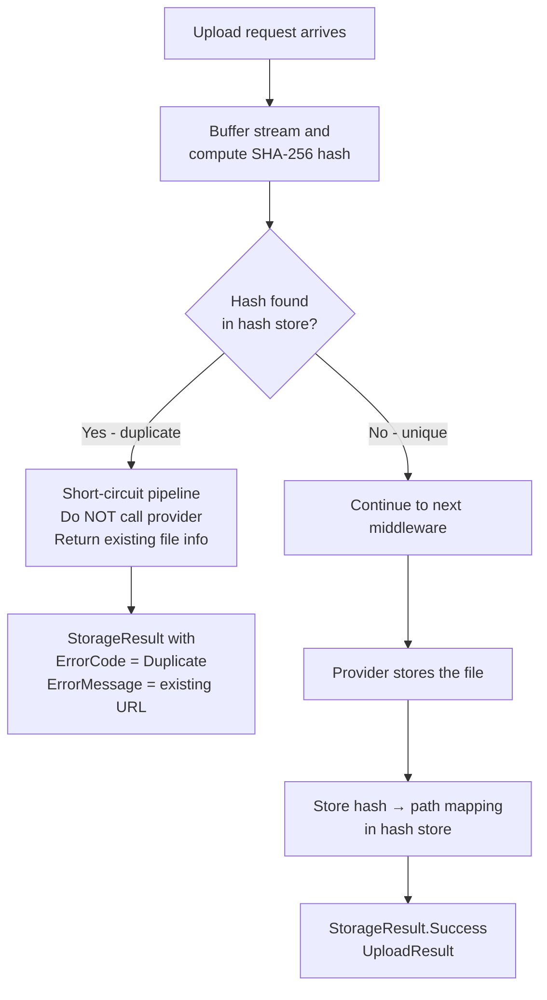

# Deduplication Middleware

`DeduplicationMiddleware` prevents storing identical file content more than once. It computes a **SHA-256 hash** of each uploaded file and, if an existing file with the same hash is found in the hash store, short-circuits the upload and returns the existing file's URL — without re-uploading or duplicating bytes in the storage backend.

---

## Registration

```csharp
.WithPipeline(p => p
    .UseValidation(v => { /* ... */ })
    .UseCompression()
    .UseDeduplication()           // default options
    // --- or with options ---
    .UseDeduplication(d =>
    {
        d.EnableDeduplication = true;
        d.StoreHash           = true;   // write x-vali-hash metadata on new uploads
    })
    .UseEncryption(e => e.Key = key)
)
```

---

## DeduplicationOptions

| Option | Type | Default | Description |
|---|---|---|---|
| `EnableDeduplication` | `bool` | `true` | Set `false` to temporarily disable without removing the middleware |
| `StoreHash` | `bool` | `true` | Store the SHA-256 hash in `x-vali-hash` metadata on every new upload |

---

## How It Works



1. The middleware computes a SHA-256 hash of the incoming stream content by piping it through a `CryptoStream`.
2. It queries the configured `IDeduplicationHashStore` for an existing file with the same hash.
3. If a duplicate is found, the pipeline **short-circuits** — the provider is never called, no bytes are transferred.
4. If the file is unique, the hash is stored and the pipeline continues to downstream middlewares.

---

## Deduplication Result Behavior

When a duplicate is detected, `UploadAsync` returns a failure result with `StorageErrorCode.Duplicate`. The `ErrorMessage` contains the URL of the existing file:

```csharp
var result = await provider.UploadAsync(new UploadRequest
{
    Path    = StoragePath.From("uploads", "logo.png"),
    Content = stream
});

if (result.ErrorCode == StorageErrorCode.Duplicate)
{
    // Identical content already exists — ErrorMessage contains the existing file URL
    Console.WriteLine($"File already stored at: {result.ErrorMessage}");

    return Results.Ok(new
    {
        duplicate    = true,
        existingUrl  = result.ErrorMessage,
        message      = "Your file was not re-stored because identical content already exists."
    });
}

if (result.IsSuccess)
{
    Console.WriteLine($"New file stored: {result.Value.Url}");
    return Results.Ok(new { url = result.Value.Url });
}
```

:::info Duplicate is not an error
`StorageErrorCode.Duplicate` is returned with `IsSuccess = false` even though the operation semantically succeeded — the content is available. Treat it as an informational condition, not a failure. Your API can return `200 OK` with the existing URL.
:::

---

## Hash Store

By default, deduplication uses an **in-memory hash store** — a thread-safe `ConcurrentDictionary<string, string>` mapping SHA-256 hex → storage path. This is fine for development and single-instance deployments but has two limitations:

- Hash state is **lost on application restart**.
- Hash state is **not shared** between multiple application instances.

### Custom hash store with Redis (production)

For distributed deployments, implement `IDeduplicationHashStore` with Redis:

```csharp
public interface IDeduplicationHashStore
{
    Task<string?> FindByHashAsync(string hash, CancellationToken ct = default);
    Task StoreAsync(string hash, string path, string url, CancellationToken ct = default);
    Task RemoveByPathAsync(string path, CancellationToken ct = default);
}
```

```csharp
public class RedisDeduplicationHashStore : IDeduplicationHashStore
{
    private readonly IDatabase _db;
    private const string Prefix = "valiblob:dedup:hash:";

    public RedisDeduplicationHashStore(IConnectionMultiplexer redis)
        => _db = redis.GetDatabase();

    public async Task<string?> FindByHashAsync(string hash, CancellationToken ct)
    {
        var value = await _db.StringGetAsync(Prefix + hash);
        return value.HasValue ? value.ToString() : null;
    }

    public Task StoreAsync(string hash, string path, string url, CancellationToken ct)
    {
        // Store url as value so we can return it when a duplicate is found
        return _db.StringSetAsync(
            Prefix + hash,
            url,
            expiry: TimeSpan.FromDays(365));  // optional TTL
    }

    public async Task RemoveByPathAsync(string path, CancellationToken ct)
    {
        // Requires a reverse index (path → hash) to clean up on delete
        // Simple implementation: scan is acceptable for small datasets
        // For large datasets, maintain a separate path→hash mapping
        await Task.CompletedTask;
    }
}
```

Register in DI:

```csharp
builder.Services.AddSingleton<IDeduplicationHashStore, RedisDeduplicationHashStore>();
```

### Database-backed hash store

For applications already using a database:

```csharp
public class DbDeduplicationHashStore : IDeduplicationHashStore
{
    private readonly AppDbContext _db;

    public DbDeduplicationHashStore(AppDbContext db) => _db = db;

    public async Task<string?> FindByHashAsync(string hash, CancellationToken ct)
    {
        var entry = await _db.FileHashes
            .FirstOrDefaultAsync(h => h.Hash == hash, ct);
        return entry?.Url;
    }

    public async Task StoreAsync(string hash, string path, string url, CancellationToken ct)
    {
        _db.FileHashes.Add(new FileHashEntry
        {
            Hash      = hash,
            Path      = path,
            Url       = url,
            StoredAt  = DateTimeOffset.UtcNow
        });
        await _db.SaveChangesAsync(ct);
    }

    public async Task RemoveByPathAsync(string path, CancellationToken ct)
    {
        var entry = await _db.FileHashes.FirstOrDefaultAsync(h => h.Path == path, ct);
        if (entry is not null)
        {
            _db.FileHashes.Remove(entry);
            await _db.SaveChangesAsync(ct);
        }
    }
}
```

---

## Metadata Written

When `StoreHash = true` (the default), the SHA-256 hash is stored in object metadata:

| Key | Value | Description |
|---|---|---|
| `x-vali-hash` | Hex-encoded SHA-256 (64 characters) | Hash of the file content at the point deduplication ran |

Inspect the hash via `GetMetadataAsync`:

```csharp
var meta = await provider.GetMetadataAsync("uploads/report.pdf");

if (meta.IsSuccess && meta.Value.CustomMetadata.TryGetValue("x-vali-hash", out var hash))
    Console.WriteLine($"Content hash: {hash}");
```

---

## Pipeline Placement

Deduplication should run **after compression** (so the hash is of the compressed content, reducing false duplicates from different compression runs) and **before encryption** (so the hash is deterministic):

```csharp
.WithPipeline(p => p
    .UseValidation(v => { /* ... */ })
    .UseContentTypeDetection()
    .UseCompression()                        // compress first
    .UseDeduplication()                      // hash the compressed bytes
    .UseEncryption(e => e.Key = key)         // encrypt after dedup
    .UseVirusScan()
    .UseQuota(q => { /* ... */ })
    .UseConflictResolution(ConflictResolution.ReplaceExisting)
)
```

:::warning Hash position in the pipeline
The SHA-256 hash is computed on whichever bytes are in the stream when `DeduplicationMiddleware` runs. If compression runs before deduplication, identical original files will produce identical hashes (since they compress to the same bytes). If encryption runs before deduplication, files encrypted with different IVs will have different hashes even if the underlying content is identical — deduplication will be ineffective. Place deduplication after compression and before encryption.
:::

---

## Performance Impact

Deduplication requires reading the **entire file stream** to compute the SHA-256 hash. ValiBlob uses a streaming `CryptoStream` so the file is never fully buffered in memory — bytes are processed chunk by chunk.

| File size | SHA-256 computation time (approximate) |
|---|---|
| 1 MB | < 1 ms |
| 10 MB | ~5 ms |
| 100 MB | ~50 ms |
| 1 GB | ~500 ms |

For very large uploads (multi-GB), the hashing overhead may add up to a second or more. If deduplication overhead is unacceptable for large files, consider adding a `MinSizeForDeduplication` option in a custom wrapper or disabling deduplication for specific upload paths.

---

## Use Cases

### Avoid re-storing identical attachments

Multiple users often upload the same corporate logo, onboarding PDF, or terms-of-service document. Deduplication prevents storing N identical copies and reduces storage costs proportionally.

```csharp
// User A uploads company-logo.png — stored fresh
var resultA = await provider.UploadAsync(new UploadRequest
{
    Path    = StoragePath.From("user-uploads", userA, "company-logo.png"),
    Content = logoStream
});

// User B uploads the SAME logo bytes — deduplication returns User A's URL
var resultB = await provider.UploadAsync(new UploadRequest
{
    Path    = StoragePath.From("user-uploads", userB, "company-logo.png"),
    Content = logoStream  // same bytes
});

// resultB.ErrorCode == StorageErrorCode.Duplicate
// resultB.ErrorMessage == resultA.Value.Url (the existing file URL)
```

### Content-addressed asset URLs

Use the SHA-256 hash from `x-vali-hash` metadata as a content address for stable, immutable URLs:

```csharp
var meta = await provider.GetMetadataAsync(uploadedPath);
if (meta.IsSuccess && meta.Value.CustomMetadata.TryGetValue("x-vali-hash", out var hash))
{
    var contentUrl = $"https://cdn.example.com/assets/{hash}";
    // This URL is stable: the same content always maps to the same URL
}
```

### Integrity verification

Verify a downloaded file has not been corrupted or tampered with since upload:

```csharp
var meta = await provider.GetMetadataAsync("important/document.pdf");
if (!meta.IsSuccess) return;

var storedHash = meta.Value.CustomMetadata["x-vali-hash"];

var download = await provider.DownloadAsync(new DownloadRequest { Path = "important/document.pdf" });
var downloadedBytes = await download.Value.ReadAllBytesAsync();
var computedHash    = Convert.ToHexString(SHA256.HashData(downloadedBytes)).ToLower();

Console.WriteLine(computedHash == storedHash ? "Integrity OK" : "INTEGRITY MISMATCH!");
```

---

## Related

- [Pipeline Overview](./overview.md) — Middleware ordering
- [Compression](./compression.md) — Run before deduplication for consistent hashes
- [Encryption](./encryption.md) — Run after deduplication
- [StorageResult](../core/storage-result.md) — Handling `StorageErrorCode.Duplicate`
- [Metadata](../core/metadata.md) — Reading `x-vali-hash`
