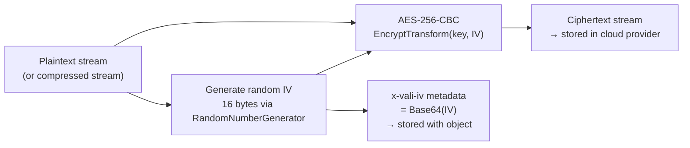

# Encryption Middleware

`EncryptionMiddleware` applies **AES-256-CBC** encryption to file content at upload time and automatically decrypts it at download time. Encryption happens in your application process, before bytes leave your server. The cloud provider stores only ciphertext and never has access to the encryption key or the plaintext.

---

## Registration

```csharp
.WithPipeline(p => p
    .UseValidation(v => { /* ... */ })
    .UseCompression()                              // always compress BEFORE encrypting
    .UseEncryption(e =>
    {
        e.Key = config["Storage:EncryptionKey"]!;  // required: 32-byte base64 key
    })
)
```

---

## EncryptionOptions

| Option | Type | Required | Description |
|---|---|---|---|
| `Key` | `string` | Yes | Base64-encoded 32-byte (256-bit) AES encryption key |
| `EnableEncryption` | `bool` | No (default: `true`) | Set `false` to disable encryption without removing the middleware registration |

---

## Generating an Encryption Key

Generate a cryptographically secure 256-bit key using .NET's `RandomNumberGenerator`:

```csharp
using System.Security.Cryptography;

var keyBytes = RandomNumberGenerator.GetBytes(32); // 256 bits = 32 bytes
var keyBase64 = Convert.ToBase64String(keyBytes);
Console.WriteLine(keyBase64);
// Example output: "h3K9mPqRx2wVtN8sLkYdF4cBjXzA5oe+7rGmJu0n1QI="
```

Store this value in your secrets manager:

```bash
# Local development
dotnet user-secrets set "Storage:EncryptionKey" "h3K9mPqRx2wVtN8sLkYdF4cBjXzA5oe+7rGmJu0n1QI="
```

```bash
# AWS Secrets Manager
aws secretsmanager create-secret \
  --name "myapp/storage/encryption-key" \
  --secret-string "h3K9mPqRx2wVtN8sLkYdF4cBjXzA5oe+7rGmJu0n1QI="
```

:::warning Key loss means permanent data loss
If you lose the encryption key, all files encrypted with it become permanently unrecoverable. There is no backdoor or key escrow in ValiBlob's encryption implementation. Store your key in a hardware-backed secrets manager with backup and recovery configured. Never commit the key to source control.
:::

---

## How It Works

### On Upload



1. A unique, cryptographically random 16-byte **Initialization Vector (IV)** is generated fresh for each file.
2. The file content stream (compressed bytes if `CompressionMiddleware` ran first) is wrapped in an `AES-256-CBC CryptoStream` using the configured key and the per-file IV.
3. The IV is stored in object metadata under `x-vali-iv` as a Base64 string.
4. The ciphertext stream replaces `UploadRequest.Content` and continues down the pipeline to the provider.

### On Download

1. The file's metadata is read to retrieve `x-vali-iv`.
2. If present and `AutoDecrypt = true` on the `DownloadRequest` (the default), the downloaded ciphertext stream is wrapped in an `AES-256-CBC CryptoStream` using the configured key and the stored IV.
3. The caller receives the original plaintext stream (which may then also be decompressed if `CompressionMiddleware` was active).

---

## Per-File IV Security

Using a unique IV for every file is a security requirement, not just a best practice:

- **Prevents ciphertext analysis** — two files with identical plaintext content produce different ciphertext because their IVs differ.
- **Prevents IV reuse attacks** — reusing the same key+IV pair with different plaintexts leaks information about the relationship between the two plaintexts under CBC mode.
- The IV is **not secret** — it is stored in plaintext in the object metadata. IV confidentiality is not required for CBC security. What matters is uniqueness.

---

## Metadata Written

| Key | Value | Description |
|---|---|---|
| `x-vali-iv` | Base64-encoded 16-byte IV | Per-file AES initialization vector; presence indicates encryption |

Inspect encryption state for any stored file:

```csharp
var meta = await provider.GetMetadataAsync("secure/contract.pdf");

if (meta.IsSuccess)
{
    var isEncrypted = meta.Value.CustomMetadata.ContainsKey("x-vali-iv");
    Console.WriteLine($"File is encrypted: {isEncrypted}");

    if (isEncrypted)
    {
        var iv = meta.Value.CustomMetadata["x-vali-iv"];
        Console.WriteLine($"IV: {iv}");
    }
}
```

---

## Opt Out of Decryption for a Specific Download

To retrieve the raw ciphertext bytes without decrypting:

```csharp
var result = await provider.DownloadAsync(new DownloadRequest
{
    Path        = "secure/private-key.bin",
    AutoDecrypt = false   // returns raw AES-256-CBC ciphertext
});

// Forward the ciphertext to a separate HSM or key management system for decryption
await ForwardToKeyVaultAsync(result.Value);
```

---

## Upload and Download Example

```csharp
// Setup
builder.Services
    .AddValiBlob(o => o.DefaultProvider = "aws")
    .AddProvider<AWSS3Provider>("aws", o => { /* ... */ })
    .WithPipeline(p => p
        .UseCompression()                                    // compress first
        .UseEncryption(e => e.Key = config["Storage:EncryptionKey"]!)  // then encrypt
    );

// Upload — CSV is compressed then encrypted before reaching S3
var result = await provider.UploadAsync(new UploadRequest
{
    Path        = StoragePath.From("secure", "salary-data.csv"),
    Content     = csvStream,
    ContentType = "text/csv"
});

Console.WriteLine($"Stored encrypted file: {result.Value.Path}");
Console.WriteLine($"Stored size: {result.Value.SizeBytes:N0} bytes (compressed + encrypted)");

// Download — transparent decrypt and decompress
var download = await provider.DownloadAsync(new DownloadRequest
{
    Path = "secure/salary-data.csv"
    // AutoDecrypt = true (default)
    // AutoDecompress = true (default)
});

using var reader = new StreamReader(download.Value);
var originalCsv  = await reader.ReadToEndAsync();
// originalCsv is the original plaintext CSV, decrypted and decompressed automatically
```

---

## Key Rotation

ValiBlob does not manage key rotation automatically. If you need to rotate your encryption key:

1. Update your secrets manager with the new key.
2. Write a background job that:
   a. Lists all encrypted files (detect via `x-vali-iv` metadata).
   b. Downloads each file with the **old** key (`AutoDecrypt = true` with the old key configured).
   c. Re-uploads each file with the **new** key.
   d. Deletes the old encrypted copy.
3. Once all files are migrated, decommission the old key.

For large-scale rotation, process files in batches to avoid overwhelming the storage API and to allow rollback if issues are detected mid-migration.

---

## Security Considerations

| Consideration | Detail |
|---|---|
| Algorithm | AES-256-CBC — FIPS 197 approved, industry standard |
| Key size | 256 bits (32 bytes) — maximum AES key size |
| IV size | 128 bits (16 bytes) — one AES block, unique per file |
| Authenticated encryption | CBC mode provides confidentiality but not authenticity (no MAC). If you need to detect tampering or corruption, add an HMAC step in a custom middleware |
| Key storage | Use a hardware-backed secrets manager in production: AWS KMS, Azure Key Vault, GCP Cloud KMS, HashiCorp Vault |
| Provider-side encryption | ValiBlob encryption is **application-layer** encryption. It is **in addition to**, not instead of, provider-side encryption (S3 SSE-S3 / SSE-KMS, Azure Storage Service Encryption). Running both provides defense in depth |
| Compression oracle risk | Encrypting already-compressed data (compression before encryption) prevents compression oracle attacks like CRIME/BREACH |

---

## Compress Before Encrypt — Critical Detail

```csharp
// Correct order
.WithPipeline(p => p
    .UseCompression()                            // step 1: GZip compress
    .UseEncryption(e => e.Key = key)             // step 2: AES-256-CBC encrypt
)

// WRONG order — do not do this
.WithPipeline(p => p
    .UseEncryption(e => e.Key = key)  // WRONG: compressing ciphertext is ineffective
    .UseCompression()
)
```

Compressed data is highly compressible. Ciphertext is pseudo-random and incompressible. Always compress first.

---

## Related

- [Compression](./compression.md) — Always compress before encrypting
- [Download](../core/download.md) — `AutoDecrypt` on `DownloadRequest`
- [Metadata](../core/metadata.md) — Reading `x-vali-iv`
- [Pipeline Overview](./overview.md) — Middleware ordering
