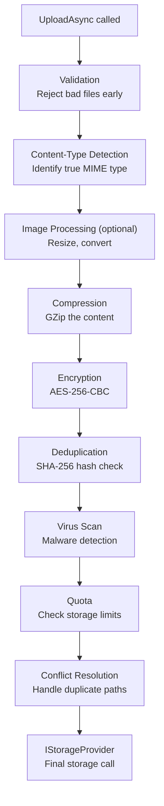

# Pipeline Overview

The ValiBlob storage pipeline is a composable chain of middleware that runs on every upload and download operation. Middlewares are registered at application startup and execute in the order they are added. Each middleware can inspect, transform, short-circuit, or fail the request before passing it to the next stage.

---

## Architecture

```mermaid
graph LR
    Request --> MW1["1. Validation"]
    MW1 --> MW2["2. Content-Type Detection"]
    MW2 --> MW3["3. Compression"]
    MW3 --> MW4["4. Encryption"]
    MW4 --> MW5["5. Deduplication"]
    MW5 --> MW6["6. Virus Scan"]
    MW6 --> MW7["7. Quota"]
    MW7 --> MW8["8. Conflict Resolution"]
    MW8 --> Provider["IStorageProvider\n(AWS / Azure / GCP / ...)"]
    Provider --> Response
```



On upload, middlewares run in registration order (left to right). On download, the pipeline's post-processing steps run in reverse order (right to left), ensuring that decryption and decompression are applied in the correct inverse sequence.

---

## Recommended Middleware Order



:::info Order matters
**Validation first** — reject invalid files before spending CPU on compression, encryption, or virus scanning. There is no point compressing a file that will fail validation.

**Compression before encryption** — compressing encrypted data is ineffective. Encryption produces pseudo-random bytes that do not compress. Always compress first.

**Deduplication after compression** — if you want to deduplicate based on compressed content, run deduplication after compression. If you want to deduplicate on raw content, run it before compression.

**Encryption before deduplication** — if you want to prevent deduplication leaking information about file content identity, run encryption before deduplication (the opposite of the standard recommendation). Choose based on your security model.

**Quota last before the provider** — quota is checked after all transforms so the stored size (compressed, encrypted) is what is counted against the quota.
:::

---

## Configuration

Configure the pipeline using the fluent `StoragePipelineBuilder` via `WithPipeline()`:

```csharp
builder.Services
    .AddValiBlob(o => o.DefaultProvider = "aws")
    .AddProvider<AWSS3Provider>("aws", o =>
    {
        o.BucketName = config["AWS:BucketName"]!;
        o.Region     = config["AWS:Region"]!;
    })
    .WithPipeline(p => p
        .UseValidation(v =>
        {
            v.MaxFileSizeBytes  = 100_000_000;     // 100 MB
            v.AllowedExtensions = [".jpg", ".png", ".pdf"];
        })
        .UseContentTypeDetection()
        .UseCompression()
        .UseEncryption(e => e.Key = config["Storage:EncryptionKey"]!)
        .UseDeduplication()
        .UseVirusScan()
        .UseQuota(q => q.MaxTotalBytes = 10L * 1024 * 1024 * 1024)
        .UseConflictResolution(ConflictResolution.ReplaceExisting)
    );
```

Every middleware is optional. A minimal pipeline may only include validation:

```csharp
.WithPipeline(p => p
    .UseValidation(v =>
    {
        v.MaxFileSizeBytes  = 10_000_000;
        v.AllowedExtensions = [".jpg", ".png"];
    })
    .UseConflictResolution(ConflictResolution.ReplaceExisting)
)
```

---

## StoragePipelineContext

Every middleware receives a `StoragePipelineContext` that carries the mutable request and response state for the current operation:

```csharp
public sealed class StoragePipelineContext
{
    // Upload state
    public UploadRequest  UploadRequest  { get; set; }
    public UploadResult?  UploadResult   { get; set; }  // set by a middleware to short-circuit

    // Download state
    public DownloadRequest DownloadRequest { get; set; }
    public Stream?         DownloadStream  { get; set; }

    // Shared context
    public string          ProviderId  { get; init; }  // named provider key ("aws", "azure", etc.)
    public OperationType   Operation   { get; init; }  // Upload or Download
    public CancellationToken CancellationToken { get; init; }

    // Scratch pad for middleware-to-middleware communication
    public IDictionary<string, object?> Items { get; }
}
```

Middlewares communicate via `ctx.Items`. For example, `ContentTypeDetectionMiddleware` stores the detected MIME type in `ctx.Items["detected-content-type"]` so downstream middlewares can access it without re-reading the stream.

---

## IStorageMiddleware

To write a custom middleware, implement `IStorageMiddleware`:

```csharp
public interface IStorageMiddleware
{
    Task InvokeAsync(
        StoragePipelineContext context,
        Func<Task> next,
        CancellationToken ct = default);
}
```

Call `await next()` to pass control to the next middleware in the chain. Do **not** call `next()` to short-circuit (terminate the pipeline early).

### Custom middleware example

```csharp
public class MyCustomMiddleware : IStorageMiddleware
{
    private readonly ILogger<MyCustomMiddleware> _logger;

    public MyCustomMiddleware(ILogger<MyCustomMiddleware> logger)
        => _logger = logger;

    public async Task InvokeAsync(StoragePipelineContext ctx, Func<Task> next)
    {
        if (ctx.Operation == OperationType.Upload)
        {
            // Pre-processing: runs before the file reaches the provider
            _logger.LogInformation("About to upload: {Path}", ctx.UploadRequest.Path);

            // Store data for downstream middlewares via ctx.Items
            ctx.Items["custom-key"] = "value";
        }

        // Pass to the next middleware
        await next();

        if (ctx.Operation == OperationType.Upload && ctx.UploadResult is not null)
        {
            // Post-processing: runs after the provider returns
            _logger.LogInformation("Uploaded successfully: {Url}", ctx.UploadResult.Url);
        }
    }
}
```

### Watermark middleware example

```csharp
public class WatermarkMiddleware : IStorageMiddleware
{
    private readonly WatermarkOptions _options;

    public WatermarkMiddleware(IOptions<WatermarkOptions> options)
        => _options = options.Value;

    public async Task InvokeAsync(StoragePipelineContext ctx, Func<Task> next)
    {
        // Only process images on upload
        if (ctx.Operation == OperationType.Upload
            && ctx.UploadRequest.ContentType?.StartsWith("image/") == true)
        {
            var watermarked = await ApplyWatermarkAsync(
                ctx.UploadRequest.Content,
                _options);

            // Replace the content stream with the watermarked version
            ctx.UploadRequest = ctx.UploadRequest with { Content = watermarked };
        }

        await next();
    }

    private Task<Stream> ApplyWatermarkAsync(Stream input, WatermarkOptions opts)
    {
        // ... watermark implementation ...
        throw new NotImplementedException();
    }
}
```

### Registering a custom middleware

```csharp
// Register the middleware class in DI
builder.Services.AddTransient<WatermarkMiddleware>();
builder.Services.Configure<WatermarkOptions>(o =>
{
    o.Text     = "CONFIDENTIAL";
    o.Opacity  = 0.3f;
    o.Position = WatermarkPosition.BottomRight;
});

// Add it to the pipeline
.WithPipeline(p => p
    .UseValidation(v => v.AllowedExtensions = [".jpg", ".png"])
    .Use<WatermarkMiddleware>()     // custom middleware
    .UseCompression()
    .UseConflictResolution(ConflictResolution.ReplaceExisting)
)
```

---

## Short-Circuiting the Pipeline

A middleware short-circuits the chain by **not calling `next()`**. This is how `DeduplicationMiddleware` returns an existing file URL without ever calling the provider:

```csharp
public class DeduplicationMiddleware : IStorageMiddleware
{
    private readonly IDeduplicationHashStore _hashStore;

    public DeduplicationMiddleware(IDeduplicationHashStore hashStore)
        => _hashStore = hashStore;

    public async Task InvokeAsync(StoragePipelineContext ctx, Func<Task> next)
    {
        if (ctx.Operation == OperationType.Upload)
        {
            var hash     = await ComputeHashAsync(ctx.UploadRequest.Content);
            var existing = await _hashStore.FindByHashAsync(hash);

            if (existing is not null)
            {
                // Short-circuit: set UploadResult directly, do NOT call next()
                ctx.UploadResult = new UploadResult
                {
                    Path        = existing.Path,
                    Url         = existing.Url,
                    SizeBytes   = existing.SizeBytes,
                    ContentType = existing.ContentType
                };
                return; // pipeline ends here — provider is never called
            }

            ctx.Items["content-hash"] = hash;
        }

        await next(); // unique file — continue to next middleware
    }

    private static async Task<string> ComputeHashAsync(Stream content) { /* ... */ }
}
```

---

## Error Propagation

When a middleware determines the upload should fail (validation rejected, virus detected, quota exceeded, etc.), it throws a `StoragePipelineException` or sets a failure state. The pipeline runner catches this and converts it to a `StorageResult.Failure` with the appropriate `StorageErrorCode` before returning to the caller. All middleware failures appear as `StorageResult` failures — no unhandled exceptions reach your application code under normal conditions.

---

## Available Middlewares Summary

| Middleware | Registration method | Package | Key options |
|---|---|---|---|
| Validation | `UseValidation()` | ValiBlob.Core | `MaxFileSizeBytes`, `AllowedExtensions`, `AllowedContentTypes` |
| Content-Type Detection | `UseContentTypeDetection()` | ValiBlob.Core | `OverrideExisting`, `SniffBytes` |
| Compression | `UseCompression()` | ValiBlob.Core | `CompressionLevel`, `MinSizeBytes`, `SkipContentTypes` |
| Encryption | `UseEncryption()` | ValiBlob.Core | `Key` (32-byte base64) |
| Deduplication | `UseDeduplication()` | ValiBlob.Core | `EnableDeduplication`, `StoreHash` |
| Virus Scan | `UseVirusScan()` | ValiBlob.Core | `IVirusScanner` implementation, `FailOnScannerUnavailable` |
| Quota | `UseQuota()` | ValiBlob.Core | `MaxTotalBytes`, `MaxFileCount`, `IStorageQuotaService` |
| Conflict Resolution | `UseConflictResolution()` | ValiBlob.Core | `ConflictResolution` enum |
| Image Processing | `UseImageProcessing()` | ValiBlob.ImageSharp | `ResizeWidth`, `OutputFormat`, `GenerateThumbnail` |
| Custom | `Use<T>()` | Any | Any `IStorageMiddleware` |

---

## Related

- [Validation](./validation.md)
- [Compression](./compression.md)
- [Encryption](./encryption.md)
- [Content-Type Detection](./content-type-detection.md)
- [Deduplication](./deduplication.md)
- [Virus Scan](./virus-scan.md)
- [Quota](./quota.md)
- [Conflict Resolution](./conflict-resolution.md)
