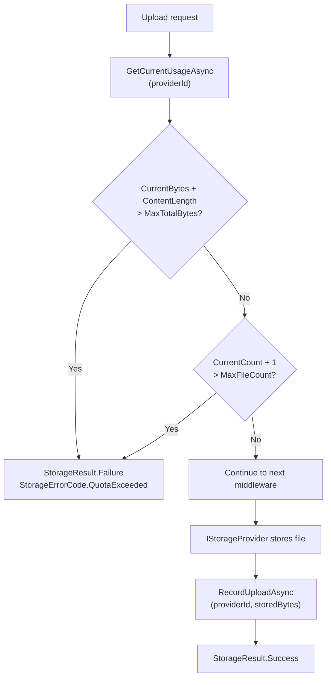

# Quota Middleware

`QuotaMiddleware` enforces storage size and file count limits before each upload. It calls a pluggable `IStorageQuotaService` to check current usage and, if adding the new file would exceed the configured limit, rejects the upload with `StorageErrorCode.QuotaExceeded` before any bytes are transferred to the provider.

---

## Registration

```csharp
.WithPipeline(p => p
    .UseValidation(v => { /* ... */ })
    .UseVirusScan()
    .UseQuota(q =>
    {
        q.MaxTotalBytes = 10L * 1024 * 1024 * 1024;   // 10 GB global limit
        q.MaxFileCount  = 100_000;                     // max 100,000 files
    })
    .UseConflictResolution(ConflictResolution.ReplaceExisting)
)
```

---

## QuotaOptions

| Option | Type | Default | Description |
|---|---|---|---|
| `MaxTotalBytes` | `long?` | `null` (unlimited) | Maximum total stored bytes across all files |
| `MaxFileCount` | `long?` | `null` (unlimited) | Maximum number of files |

Both limits are enforced independently. If either would be exceeded by the incoming upload, the upload is rejected.

---

## IStorageQuotaService

ValiBlob ships with an in-memory quota service registered automatically by `UseQuota()`. For production use, implement `IStorageQuotaService` backed by a shared data store:

```csharp
public interface IStorageQuotaService
{
    Task<StorageUsage> GetCurrentUsageAsync(
        string providerId,
        CancellationToken ct = default);

    Task RecordUploadAsync(
        string providerId,
        long bytes,
        CancellationToken ct = default);

    Task RecordDeleteAsync(
        string providerId,
        long bytes,
        CancellationToken ct = default);
}

public sealed record StorageUsage
{
    public long TotalBytes { get; init; }
    public long FileCount  { get; init; }
}
```

---

## How Quota Is Checked



1. `GetCurrentUsageAsync` retrieves the current usage from the quota service.
2. The incoming file's `ContentLength` (if set) plus current `TotalBytes` is compared to `MaxTotalBytes`.
3. `CurrentCount + 1` is compared to `MaxFileCount`.
4. If either limit is exceeded, `StorageResult.Failure(QuotaExceeded)` is returned.
5. If within limits, the pipeline continues. After the provider successfully stores the file, `RecordUploadAsync` is called to update the usage counters.

:::note ContentLength requirement
The pre-upload quota check uses `UploadRequest.ContentLength` to calculate whether the new file will exceed the byte limit. If `ContentLength` is not set, ValiBlob cannot perform the pre-check and will only update the counter after storage. Always set `ContentLength` when the quota middleware is active to ensure accurate enforcement.
:::

---

## InMemoryStorageQuotaService (Default)

The built-in in-memory quota service uses a `ConcurrentDictionary` per provider. It is registered automatically by `UseQuota()`:

```csharp
// No additional registration needed
.WithPipeline(p => p
    .UseQuota(q => q.MaxTotalBytes = 5L * 1024 * 1024 * 1024)
)
```

Limitations:
- Usage counters are **lost on application restart** — they start from zero.
- State is **not shared** between multiple application instances.

Use `InMemoryStorageQuotaService` for development and single-instance applications only.

---

## Custom Quota Service — Database Implementation

For production multi-instance deployments, implement a database-backed quota service:

```csharp
public class PostgresStorageQuotaService : IStorageQuotaService
{
    private readonly AppDbContext _db;
    private readonly ILogger<PostgresStorageQuotaService> _logger;

    public PostgresStorageQuotaService(AppDbContext db, ILogger<PostgresStorageQuotaService> logger)
    {
        _db     = db;
        _logger = logger;
    }

    public async Task<StorageUsage> GetCurrentUsageAsync(string providerId, CancellationToken ct)
    {
        var row = await _db.StorageQuotas
            .FirstOrDefaultAsync(q => q.ProviderId == providerId, ct);

        return new StorageUsage
        {
            TotalBytes = row?.TotalBytes ?? 0L,
            FileCount  = row?.FileCount  ?? 0L
        };
    }

    public async Task RecordUploadAsync(string providerId, long bytes, CancellationToken ct)
    {
        var row = await _db.StorageQuotas
            .FirstOrDefaultAsync(q => q.ProviderId == providerId, ct);

        if (row is null)
        {
            _db.StorageQuotas.Add(new StorageQuotaRow
            {
                ProviderId = providerId,
                TotalBytes = bytes,
                FileCount  = 1
            });
        }
        else
        {
            row.TotalBytes += bytes;
            row.FileCount  += 1;
        }

        await _db.SaveChangesAsync(ct);
    }

    public async Task RecordDeleteAsync(string providerId, long bytes, CancellationToken ct)
    {
        var row = await _db.StorageQuotas
            .FirstOrDefaultAsync(q => q.ProviderId == providerId, ct);

        if (row is not null)
        {
            row.TotalBytes = Math.Max(0, row.TotalBytes - bytes);
            row.FileCount  = Math.Max(0, row.FileCount  - 1);
            await _db.SaveChangesAsync(ct);
        }
    }
}
```

Register:

```csharp
builder.Services.AddScoped<IStorageQuotaService, PostgresStorageQuotaService>();
```

---

## Per-User / Per-Tenant Quota

For multi-tenant applications, scope quota checks to the authenticated user or tenant:

```csharp
public class TenantStorageQuotaService : IStorageQuotaService
{
    private readonly IHttpContextAccessor  _http;
    private readonly IStorageUsageRepository _repo;

    public TenantStorageQuotaService(
        IHttpContextAccessor http,
        IStorageUsageRepository repo)
    {
        _http = http;
        _repo = repo;
    }

    private string GetTenantId()
        => _http.HttpContext?.User.FindFirstValue("tenant_id")
           ?? throw new InvalidOperationException("Tenant context is not available.");

    public async Task<StorageUsage> GetCurrentUsageAsync(string providerId, CancellationToken ct)
    {
        var tenantId = GetTenantId();
        return await _repo.GetUsageAsync(tenantId, providerId, ct);
    }

    public async Task RecordUploadAsync(string providerId, long bytes, CancellationToken ct)
    {
        var tenantId = GetTenantId();
        await _repo.IncrementAsync(tenantId, providerId, bytes, fileCountDelta: 1, ct);
    }

    public async Task RecordDeleteAsync(string providerId, long bytes, CancellationToken ct)
    {
        var tenantId = GetTenantId();
        await _repo.DecrementAsync(tenantId, providerId, bytes, fileCountDelta: 1, ct);
    }
}
```

For dynamic per-tenant limits, look up the tenant's plan quota in `GetCurrentUsageAsync` and compare against it rather than using the static `MaxTotalBytes` in `QuotaOptions`.

---

## Querying Current Usage

Expose a usage endpoint so users can see how much storage they have consumed:

```csharp
app.MapGet("/storage/usage", async (
    IStorageQuotaService quotaService,
    IConfiguration config) =>
{
    var usage = await quotaService.GetCurrentUsageAsync("aws");
    var maxBytes = long.Parse(config["Storage:MaxTotalBytes"] ?? "10737418240");

    return Results.Ok(new
    {
        usedBytes      = usage.TotalBytes,
        maxBytes       = maxBytes,
        usedPercent    = (double)usage.TotalBytes / maxBytes * 100,
        fileCount      = usage.FileCount,
        remainingBytes = Math.Max(0, maxBytes - usage.TotalBytes)
    });
});
```

---

## Handling Quota Exceeded

```csharp
var result = await provider.UploadAsync(request);

if (result.ErrorCode == StorageErrorCode.QuotaExceeded)
{
    return Results.Json(
        new
        {
            error   = "Storage quota exceeded.",
            details = result.ErrorMessage,
            code    = "QUOTA_EXCEEDED",
            action  = "Delete some files or upgrade your plan to upload more."
        },
        statusCode: 507  // HTTP 507 Insufficient Storage
    );
}
```

---

## Quota and Deletion

When a file is deleted, the quota counter must be decremented. If you are using a custom `IStorageQuotaService`, hook into the deletion event via `IStorageEventHandler<DeletedEvent>`:

```csharp
public class QuotaDecrementOnDeleteHandler : IStorageEventHandler<DeletedEvent>
{
    private readonly IStorageQuotaService _quota;

    public QuotaDecrementOnDeleteHandler(IStorageQuotaService quota) => _quota = quota;

    public async Task HandleAsync(DeletedEvent evt, CancellationToken ct)
    {
        // You need to know the file size — store it in metadata or look it up before deletion
        if (evt.SizeBytes.HasValue)
            await _quota.RecordDeleteAsync(evt.Context.ProviderId, evt.SizeBytes.Value, ct);
    }
}
```

Register the handler:

```csharp
builder.Services.AddScoped<IStorageEventHandler<DeletedEvent>, QuotaDecrementOnDeleteHandler>();
```

---

## Related

- [Pipeline Overview](./overview.md) — Middleware registration and ordering
- [StorageResult](../core/storage-result.md) — Handling `StorageErrorCode.QuotaExceeded`
- [Events](../core/events.md) — Using `DeletedEvent` to decrement quota on deletion
