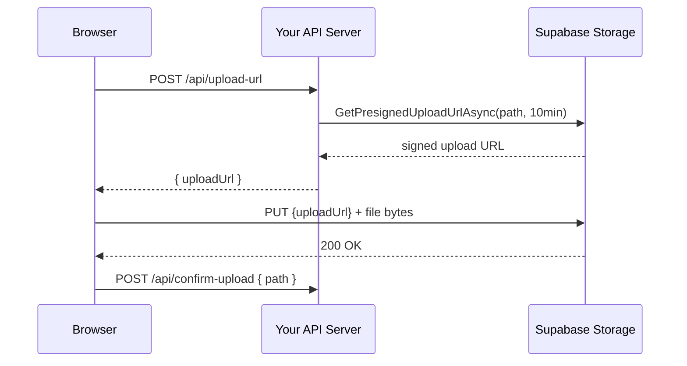

# Supabase Storage Provider

`ValiBlob.Supabase` provides `SupabaseStorageProvider`, implementing `IStorageProvider`, `IResumableUploadProvider`, and `IPresignedUrlProvider` backed by [Supabase Storage](https://supabase.com/docs/guides/storage). Supabase Storage is built on S3 and exposes a REST API with PostgreSQL Row Level Security (RLS) for fine-grained access control.

---

## Installation

```bash
dotnet add package ValiBlob.Core
dotnet add package ValiBlob.Supabase
```

---

## SupabaseStorageOptions Reference

| Option | Type | Required | Description |
|---|---|---|---|
| `Url` | `string` | Yes | Supabase project URL, e.g. `"https://xyzabc.supabase.co"`. |
| `ServiceKey` | `string` | Yes | `service_role` JWT from your project API settings. |
| `BucketName` | `string` | Yes | Storage bucket name for all operations. |

---

## DI Registration

```csharp
using ValiBlob.Core;
using ValiBlob.Supabase;

builder.Services
    .AddValiBlob(o => o.DefaultProvider = "supabase")
    .AddProvider<SupabaseStorageProvider>("supabase", opts =>
    {
        opts.Url        = builder.Configuration["Supabase:Url"]!;
        opts.ServiceKey = builder.Configuration["Supabase:ServiceKey"]!;
        opts.BucketName = builder.Configuration["Supabase:BucketName"]!;
    })
    .WithPipeline(p => p
        .UseValidation(v =>
        {
            v.MaxFileSizeBytes  = 50_000_000;
            v.AllowedExtensions = [".jpg", ".png", ".pdf", ".mp4"];
        })
        .UseContentTypeDetection()
        .UseConflictResolution(ConflictResolution.ReplaceExisting)
    );
```

### appsettings.json

```json
{
  "Supabase": {
    "Url": "https://xyzabc.supabase.co",
    "BucketName": "uploads"
  }
}
```

:::warning Protect the service_role key
The `service_role` key bypasses all Row Level Security policies. Keep it exclusively on your server. For client-side uploads from browsers or mobile apps, use presigned URLs instead.
:::

---

## Getting Your Credentials

1. Open the [Supabase Dashboard](https://app.supabase.com)
2. Select your project
3. Navigate to **Settings** → **API**
4. Copy the **Project URL** → use as `Url`
5. Under **Project API keys**, copy the **service_role** secret → use as `ServiceKey`

Store the `ServiceKey` using `dotnet user-secrets` for development:

```bash
dotnet user-secrets set "Supabase:ServiceKey" "eyJhbGci..."
```

---

## Creating Buckets

### Via Supabase Dashboard

1. Navigate to **Storage** in your project sidebar
2. Click **New bucket**
3. Enter a name and choose **Public** or **Private** visibility

### Via SQL (Migration)

```sql
-- Create a private bucket
INSERT INTO storage.buckets (id, name, public)
VALUES ('uploads', 'uploads', false);
```

### Public vs Private Buckets

| Bucket Type | Read Access | Write Access | Best For |
|---|---|---|---|
| Public | Anyone with the URL — no authentication required | Authenticated users (controlled by RLS) | Profile images, public assets |
| Private | Requires a signed URL or authenticated request with RLS | Authenticated users (controlled by RLS) | Documents, user files, sensitive data |

---

## Row Level Security (RLS) Policies

Supabase Storage integrates with PostgreSQL RLS. Define policies in **Storage** → **Policies** in the dashboard, or via SQL migrations:

### Allow authenticated users to upload to their own path

```sql
CREATE POLICY "Users can upload their own files"
ON storage.objects FOR INSERT
TO authenticated
WITH CHECK (
    bucket_id = 'uploads' AND
    (storage.foldername(name))[1] = auth.uid()::text
);
```

### Allow authenticated users to read their own files

```sql
CREATE POLICY "Users can read their own files"
ON storage.objects FOR SELECT
TO authenticated
USING (
    bucket_id = 'uploads' AND
    (storage.foldername(name))[1] = auth.uid()::text
);
```

### Allow public read on the public subfolder

```sql
CREATE POLICY "Public read on public folder"
ON storage.objects FOR SELECT
TO anon
USING (
    bucket_id = 'uploads' AND
    (storage.foldername(name))[1] = 'public'
);
```

### Allow users to delete only their own files

```sql
CREATE POLICY "Users can delete their own files"
ON storage.objects FOR DELETE
TO authenticated
USING (
    bucket_id = 'uploads' AND
    (storage.foldername(name))[1] = auth.uid()::text
);
```

:::tip RLS policies only apply to anon/authenticated keys
When ValiBlob uses the `service_role` key, RLS is bypassed. RLS policies control access when clients interact directly with Supabase using the `anon` or user JWT keys.
:::

---

## Presigned URLs

`SupabaseStorageProvider` implements `IPresignedUrlProvider`. Signed URLs grant time-limited, unauthenticated access to specific objects — ideal for sharing private files or enabling direct client uploads without routing data through your server:

```csharp
var provider = factory.Create("supabase");

if (provider is IPresignedUrlProvider presigned)
{
    // Signed upload URL — client uploads directly to Supabase for 10 minutes
    var uploadUrl = await presigned.GetPresignedUploadUrlAsync(
        StoragePath.From("uploads", userId, "avatar.jpg"),
        expiresIn: TimeSpan.FromMinutes(10));

    // Signed download URL — time-limited access to a private file
    var downloadUrl = await presigned.GetPresignedDownloadUrlAsync(
        StoragePath.From("uploads", userId, "contract.pdf"),
        expiresIn: TimeSpan.FromHours(24));

    return Results.Ok(new
    {
        uploadUrl   = uploadUrl.Value,
        downloadUrl = downloadUrl.Value
    });
}
```

### Direct Client Upload Flow



Your server never handles file bytes in this pattern — it only generates URLs.

---

## File Organization

Organize files using path segments within the bucket:

```
uploads/
  {userId}/
    avatars/
      profile.jpg
    documents/
      contract.pdf
  public/
    banner.jpg
```

```csharp
// Upload to a user-scoped path
await provider.UploadAsync(new UploadRequest
{
    Path        = StoragePath.From("uploads", userId, "avatars", "profile.jpg"),
    Content     = fileStream,
    ContentType = "image/jpeg"
});

// List all files for a user
var files = await provider.ListFilesAsync($"uploads/{userId}/");
```

---

## Image Transformations (Delivery-Time)

Supabase Storage supports on-the-fly image transformations for public buckets via URL parameters:

```
# Resize to 300×300, crop to fill
https://xyzabc.supabase.co/storage/v1/render/image/public/uploads/photo.jpg?width=300&height=300&resize=cover

# Convert to WebP
https://xyzabc.supabase.co/storage/v1/render/image/public/uploads/photo.jpg?format=origin
```

ValiBlob's `ImageProcessingMiddleware` (via `ValiBlob.ImageSharp`) handles upload-time transformations — these two approaches are complementary.

---

## Resumable Uploads (TUS Protocol)

`SupabaseStorageProvider` implements `IResumableUploadProvider` using the TUS protocol, which Supabase Storage natively supports:

```csharp
var provider = factory.Create("supabase");
var resumable = (IResumableUploadProvider)provider;

// Step 1: Start
var start = await resumable.StartResumableUploadAsync(new StartResumableUploadRequest
{
    Path        = StoragePath.From("uploads", userId, "large-video.mp4"),
    TotalSize   = 524_288_000,  // 500 MB
    ContentType = "video/mp4"
});

// Step 2: Upload chunks
var uploadId = start.Value.UploadId;
var chunkSize = 5 * 1024 * 1024; // 5 MB
// ... chunk loop (see Resumable Uploads documentation)

// Step 3: Complete
await resumable.CompleteResumableUploadAsync(uploadId);
```

---

## Local Development with Supabase CLI

Use the Supabase CLI to run a full local Supabase stack including Storage:

```bash
# Install Supabase CLI
brew install supabase/tap/supabase

# Initialize project and start local stack
supabase init
supabase start
```

The local storage API runs at `http://localhost:54321/storage/v1`. Configure ValiBlob:

```csharp
.AddProvider<SupabaseStorageProvider>("supabase", opts =>
{
    opts.Url        = "http://localhost:54321";
    opts.ServiceKey = "<service_key from supabase start output>";
    opts.BucketName = "uploads";
})
```

Create buckets in the local stack:

```bash
# Create a bucket via the Supabase Management API
curl -X POST http://localhost:54321/storage/v1/bucket \
  -H "Authorization: Bearer <service_key>" \
  -H "Content-Type: application/json" \
  -d '{"id": "uploads", "name": "uploads", "public": false}'
```

---

## Supported Operations

| Operation | Supported | Notes |
|---|---|---|
| `UploadAsync` | Yes | |
| `DownloadAsync` | Yes | |
| `DeleteAsync` | Yes | |
| `DeleteFolderAsync` | Yes | Batch list + delete by prefix |
| `ExistsAsync` | Yes | |
| `CopyAsync` | Yes | |
| `GetMetadataAsync` | Yes | |
| `SetMetadataAsync` | Yes | |
| `ListFilesAsync` | Yes | |
| `ListFoldersAsync` | Yes | |
| `GetUrlAsync` | Yes | Public URL or signed URL |
| `StartResumableUploadAsync` | Yes | TUS protocol |
| `UploadChunkAsync` | Yes | TUS PATCH |
| `CompleteResumableUploadAsync` | Yes | Final TUS PATCH |
| `AbortResumableUploadAsync` | Yes | TUS DELETE |
| `GetPresignedUploadUrlAsync` | Yes | Supabase signed upload URL |
| `GetPresignedDownloadUrlAsync` | Yes | Supabase signed download URL |

---

## Related

- [Packages](../packages.md) — Full package reference
- [Presigned URLs](../advanced/presigned-urls.md) — Time-limited access patterns
- [Resumable Uploads](../resumable/overview.md) — Large file upload flow
- [Migration](../advanced/migration.md) — Migrate files between providers
