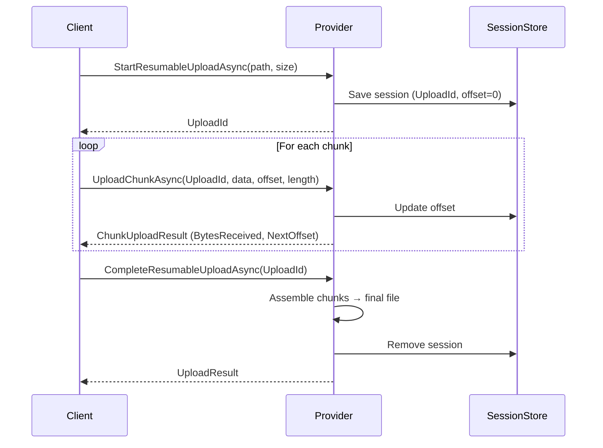

# Resumable Uploads

ValiBlob implements TUS protocol-inspired resumable uploads. Files are split into chunks, each chunk is uploaded independently, and the final file is assembled server-side. If the network drops or the client navigates away, the upload resumes from the last confirmed chunk — no bytes are re-sent.

Resumable uploads are available via the `IResumableUploadProvider` interface, implemented by all built-in providers (AWS S3, Azure Blob, GCP, OCI, Supabase, Local, and InMemory).

---

## When to Use Resumable Uploads

| File Size | Recommendation |
|---|---|
| < 50 MB | Regular `UploadAsync` is sufficient |
| 50 MB – 500 MB | Resumable uploads recommended |
| > 500 MB | Resumable uploads required |

Standard HTTP uploads fail for large files under unstable network conditions. Resumable uploads tolerate connection drops, browser tab closes, and server restarts (when using Redis or EF Core session stores).

---

## IResumableUploadProvider Interface

```csharp
public interface IResumableUploadProvider
{
    Task<StorageResult<ResumableUploadSession>> StartResumableUploadAsync(
        ResumableUploadRequest request,
        CancellationToken ct = default);

    Task<StorageResult<ChunkUploadResult>> UploadChunkAsync(
        ResumableChunkRequest request,
        CancellationToken ct = default);

    Task<StorageResult<UploadResult>> CompleteResumableUploadAsync(
        string uploadId,
        CancellationToken ct = default);

    Task<StorageResult> AbortResumableUploadAsync(
        string uploadId,
        CancellationToken ct = default);

    Task<StorageResult<ResumableUploadStatus>> GetResumableUploadStatusAsync(
        string uploadId,
        CancellationToken ct = default);
}
```

Resolve the provider and cast to `IResumableUploadProvider`:

```csharp
var provider = factory.Create("aws");

if (provider is not IResumableUploadProvider resumable)
    throw new InvalidOperationException("Provider does not support resumable uploads.");
```

---

## Three-Step Flow



---

## Step 1: Start the Upload

```csharp
var session = await resumable.StartResumableUploadAsync(new ResumableUploadRequest
{
    Path        = StoragePath.From("uploads", "large-video.mp4"),
    TotalSize   = 104_857_600,       // 100 MB
    ContentType = "video/mp4",
    Metadata    = new Dictionary<string, string>
    {
        ["uploaded-by"] = userId
    }
});

if (!session.IsSuccess)
    return Results.Problem(session.ErrorMessage);

var uploadId = session.Value.UploadId;
// Store this on the client to enable resuming if the connection drops
```

### ResumableUploadSession fields

| Field | Type | Description |
|---|---|---|
| `UploadId` | `string` | Unique session identifier — pass with every subsequent call |
| `Path` | `string` | Resolved storage path |
| `TotalSize` | `long` | Expected total file size in bytes |
| `ExpiresAt` | `DateTimeOffset` | Session expiry (controlled by session store TTL) |

---

## Step 2: Upload Chunks

Send chunks sequentially, providing the byte offset and chunk length:

```csharp
const int chunkSize = 5 * 1024 * 1024;  // 5 MB per chunk
var buffer          = new byte[chunkSize];
long offset         = 0;

await using var fileStream = File.OpenRead(localFilePath);
var totalSize = fileStream.Length;

while (offset < totalSize)
{
    var bytesRead = await fileStream.ReadAsync(buffer, 0, chunkSize);

    using var chunkStream = new MemoryStream(buffer, 0, bytesRead);

    var result = await resumable.UploadChunkAsync(new ResumableChunkRequest
    {
        UploadId = uploadId,
        Content  = chunkStream,
        Offset   = offset,
        Length   = bytesRead
    });

    if (!result.IsSuccess)
    {
        Console.WriteLine($"Chunk failed at offset {offset}: {result.ErrorMessage}");
        break;
    }

    offset = result.Value.NextOffset;
    var pct = (double)offset / totalSize * 100;
    Console.Write($"\rProgress: {pct:F1}%  ({offset:N0}/{totalSize:N0} bytes)");
}
```

### ResumableChunkRequest fields

| Field | Type | Description |
|---|---|---|
| `UploadId` | `string` | Upload session identifier |
| `Content` | `Stream` | Chunk content |
| `Offset` | `long` | Byte offset where this chunk begins (0-based) |
| `Length` | `long` | Number of bytes in this chunk |

### ChunkUploadResult fields

| Field | Type | Description |
|---|---|---|
| `BytesReceived` | `long` | Total bytes received for this upload so far |
| `NextOffset` | `long` | Expected offset for the next chunk |
| `IsComplete` | `bool` | `true` when all bytes have been received |

---

## Step 3: Complete the Upload

```csharp
var completeResult = await resumable.CompleteResumableUploadAsync(uploadId);

if (!completeResult.IsSuccess)
    return Results.Problem(completeResult.ErrorMessage);

Console.WriteLine($"File stored at: {completeResult.Value.Path}");
Console.WriteLine($"Public URL:     {completeResult.Value.Url}");
```

The provider assembles chunks, moves them to the final path, removes the session from the store, and returns a standard `UploadResult`.

---

## Resuming an Interrupted Upload

Query status to find the last confirmed offset, then resume from there:

```csharp
var status = await resumable.GetResumableUploadStatusAsync(savedUploadId);

if (!status.IsSuccess)
{
    Console.WriteLine("Session expired — start a new upload.");
    return;
}

long resumeOffset = status.Value.BytesReceived;
Console.WriteLine($"Resuming from byte {resumeOffset:N0}");

await using var fileStream = File.OpenRead(localFilePath);
fileStream.Seek(resumeOffset, SeekOrigin.Begin);
// Continue the chunk loop from resumeOffset...
```

### ResumableUploadStatus fields

| Field | Type | Description |
|---|---|---|
| `UploadId` | `string` | Session identifier |
| `Path` | `string` | Target storage path |
| `TotalSize` | `long` | Expected total file size |
| `BytesReceived` | `long` | Total bytes received so far |
| `IsComplete` | `bool` | All bytes received; awaiting `Complete` call |
| `ExpiresAt` | `DateTimeOffset` | Session expiry time |

---

## Full Example: 100 MB Upload with Retry Logic

```csharp
public static async Task<string> UploadLargeFileAsync(
    IResumableUploadProvider resumable,
    string localPath,
    string remotePath,
    CancellationToken ct = default)
{
    const int chunkSize  = 5 * 1024 * 1024;  // 5 MB
    const int maxRetries = 3;

    var fileInfo = new FileInfo(localPath);

    // Step 1: Start session
    var sessionResult = await resumable.StartResumableUploadAsync(new ResumableUploadRequest
    {
        Path        = remotePath,
        TotalSize   = fileInfo.Length,
        ContentType = "application/octet-stream"
    }, ct);

    if (!sessionResult.IsSuccess)
        throw new IOException($"Could not start upload: {sessionResult.ErrorMessage}");

    var uploadId = sessionResult.Value.UploadId;
    Console.WriteLine($"Session: {uploadId}");

    // Step 2: Send chunks with retry
    await using var fileStream = File.OpenRead(localPath);
    var buffer = new byte[chunkSize];
    long offset = 0;

    while (offset < fileInfo.Length)
    {
        fileStream.Seek(offset, SeekOrigin.Begin);
        var bytesRead = await fileStream.ReadAsync(buffer, 0, chunkSize, ct);
        StorageResult<ChunkUploadResult>? chunkResult = null;

        for (int attempt = 0; attempt < maxRetries; attempt++)
        {
            using var chunk = new MemoryStream(buffer, 0, bytesRead);

            chunkResult = await resumable.UploadChunkAsync(new ResumableChunkRequest
            {
                UploadId = uploadId,
                Content  = chunk,
                Offset   = offset,
                Length   = bytesRead
            }, ct);

            if (chunkResult.IsSuccess) break;

            if (attempt < maxRetries - 1)
            {
                await Task.Delay(500 * (int)Math.Pow(2, attempt), ct);
                Console.WriteLine($"Retry {attempt + 1} for offset {offset:N0}");
            }
        }

        if (chunkResult is null || chunkResult.IsFailure)
        {
            await resumable.AbortResumableUploadAsync(uploadId, ct);
            throw new IOException($"Upload aborted after {maxRetries} failed attempts at offset {offset:N0}");
        }

        offset = chunkResult.Value.NextOffset;
        Console.Write($"\r{(double)offset / fileInfo.Length * 100:F1}% complete");
    }

    Console.WriteLine();

    // Step 3: Finalize
    var completeResult = await resumable.CompleteResumableUploadAsync(uploadId, ct);

    if (!completeResult.IsSuccess)
        throw new IOException($"Could not complete upload: {completeResult.ErrorMessage}");

    Console.WriteLine($"Done: {completeResult.Value.Url}");
    return completeResult.Value.Url;
}
```

---

## Aborting an Upload

```csharp
var abortResult = await resumable.AbortResumableUploadAsync(uploadId);

Console.WriteLine(abortResult.IsSuccess
    ? "Upload aborted and chunks cleaned up."
    : $"Abort failed: {abortResult.ErrorMessage}");
```

Always abort cancelled uploads to avoid orphaned chunk storage.

---

## ASP.NET Core API Endpoints

```csharp
var uploads = app.MapGroup("/uploads");

uploads.MapPost("/", async (StartUploadDto dto, IStorageFactory factory) =>
{
    var resumable = (IResumableUploadProvider)factory.Create();
    var result    = await resumable.StartResumableUploadAsync(new ResumableUploadRequest
    {
        Path        = StoragePath.From("uploads", StoragePath.Sanitize(dto.FileName)),
        TotalSize   = dto.TotalSize,
        ContentType = dto.ContentType
    });

    return result.IsSuccess
        ? Results.Ok(new { result.Value.UploadId, result.Value.ExpiresAt })
        : Results.Problem(result.ErrorMessage);
});

uploads.MapPatch("/{id}", async (string id, HttpRequest req, IStorageFactory factory) =>
{
    var offset    = long.Parse(req.Headers["Upload-Offset"]);
    var resumable = (IResumableUploadProvider)factory.Create();
    var result    = await resumable.UploadChunkAsync(new ResumableChunkRequest
    {
        UploadId = id,
        Content  = req.Body,
        Offset   = offset,
        Length   = req.ContentLength ?? 0
    });

    return result.IsSuccess
        ? Results.Ok(new { result.Value.BytesReceived, result.Value.NextOffset })
        : Results.Problem(result.ErrorMessage);
});

uploads.MapPost("/{id}/complete", async (string id, IStorageFactory factory) =>
{
    var resumable = (IResumableUploadProvider)factory.Create();
    var result    = await resumable.CompleteResumableUploadAsync(id);

    return result.IsSuccess
        ? Results.Ok(new { result.Value.Url })
        : Results.Problem(result.ErrorMessage);
});

uploads.MapGet("/{id}/status", async (string id, IStorageFactory factory) =>
{
    var resumable = (IResumableUploadProvider)factory.Create();
    var result    = await resumable.GetResumableUploadStatusAsync(id);

    return result.IsSuccess ? Results.Ok(result.Value) : Results.NotFound();
});

uploads.MapDelete("/{id}", async (string id, IStorageFactory factory) =>
{
    var resumable = (IResumableUploadProvider)factory.Create();
    var result    = await resumable.AbortResumableUploadAsync(id);

    return result.IsSuccess ? Results.NoContent() : Results.Problem(result.ErrorMessage);
});
```

---

## Chunk Size Recommendations

| File Size | Recommended Chunk Size | Notes |
|---|---|---|
| < 50 MB | 1–2 MB | Fine-grained progress |
| 50–500 MB | 5–10 MB | Good balance of overhead/speed |
| > 500 MB | 10–25 MB | Fewer API calls, faster overall |

:::note AWS S3 minimum chunk size
AWS S3 multipart upload requires each part (except the last) to be at least 5 MB. ValiBlob enforces this automatically, but set your chunk size to at least 5 MB for S3 uploads.
:::

---

## Session Stores

| Store | Package | Persistence | Multi-Instance Support |
|---|---|---|---|
| InMemory (default) | `ValiBlob.Core` | No | No |
| Redis | `ValiBlob.Redis` | Yes (TTL) | Yes |
| EF Core | `ValiBlob.EFCore` | Yes (database) | Yes |

---

## Provider Support

| Provider | Resumable Upload | Underlying Mechanism |
|---|---|---|
| AWS S3 | Yes | S3 Multipart Upload |
| Azure Blob | Yes | Block Blob uncommitted blocks |
| GCP | Yes | GCS Resumable Upload Sessions |
| OCI | Yes | OCI Multipart Uploads |
| Supabase | Via ValiBlob chunking layer | Chunk staging |
| Local | Yes | Chunk files in `.chunks/` directory |
| InMemory | Yes | In-memory byte arrays |

---

## Related

- [Session Stores](./session-stores.md) — InMemory, Redis, EF Core comparison
- [Redis Store](./redis-store.md) — Configure Redis-backed sessions
- [EF Core Store](./efcore-store.md) — Configure database-backed sessions
- [Upload](../core/upload.md) — Regular single-request uploads
