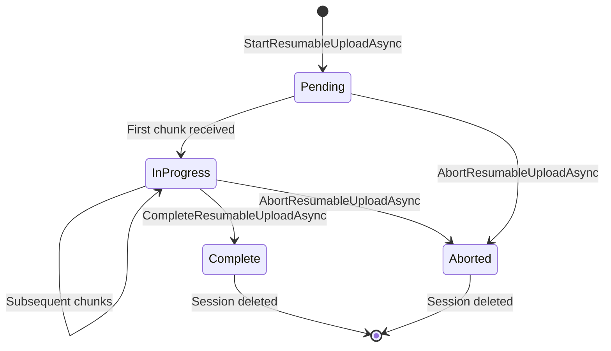

# Resumable Session Stores

ValiBlob tracks resumable upload sessions using a pluggable `IResumableSessionStore`. The session store records each in-progress upload's state: upload ID, target path, total file size, bytes received, and expiry time. This state is needed to resume interrupted uploads and to assemble chunks in the correct order.

---

## IResumableSessionStore Interface

```csharp
public interface IResumableSessionStore
{
    Task SaveAsync(ResumableUploadSession session, CancellationToken ct = default);
    Task<ResumableUploadSession?> GetAsync(string uploadId, CancellationToken ct = default);
    Task UpdateAsync(ResumableUploadSession session, CancellationToken ct = default);
    Task DeleteAsync(string uploadId, CancellationToken ct = default);
}
```

| Method | When called |
|---|---|
| `SaveAsync` | `StartResumableUploadAsync` — creates the session record |
| `GetAsync` | `UploadChunkAsync`, `CompleteResumableUploadAsync`, `GetResumableUploadStatusAsync` — retrieve session state |
| `UpdateAsync` | After each chunk is successfully stored — advances `UploadedBytes` |
| `DeleteAsync` | `CompleteResumableUploadAsync` and `AbortResumableUploadAsync` — clean up |

### ResumableUploadSession Model

```csharp
public class ResumableUploadSession
{
    public string   UploadId      { get; set; } = default!;
    public string   Path          { get; set; } = default!;
    public long     TotalSize     { get; set; }
    public long     UploadedBytes { get; set; }
    public string?  ContentType   { get; set; }
    public DateTime CreatedAt     { get; set; }
    public DateTime UpdatedAt     { get; set; }
    public ResumableUploadStatus Status { get; set; }
}

public enum ResumableUploadStatus
{
    Pending,
    InProgress,
    Complete,
    Aborted
}
```

---

## Available Session Stores

### InMemory (Default)

The in-memory store uses a `ConcurrentDictionary<string, ResumableUploadSession>` held in process memory. No external dependencies required.

```csharp
// InMemory is the default — no additional registration needed
builder.Services
    .AddValiBlob(o => o.DefaultProvider = "aws")
    .AddProvider<AWSS3Provider>("aws", o => { /* ... */ });

// Explicit registration (optional, same effect)
builder.Services.AddValiBlob().AddInMemorySessionStore();
```

**Characteristics:**

| Property | Value |
|---|---|
| Persistence across restarts | No |
| Multi-instance safe | No |
| Automatic TTL | No |
| Setup complexity | None |
| Latency | ~0 ms |
| Best for | Development, single-instance apps, tests |

**Limitation:** If your application runs multiple instances (containers, pods), each instance has its own dictionary. A chunk upload routed to a different instance than the `StartResumableUploadAsync` call will fail with a session-not-found error. Use Redis or EF Core for multi-instance deployments.

---

### Redis

`ValiBlob.Redis` provides `RedisResumableSessionStore` backed by StackExchange.Redis. Sessions are serialized to JSON and stored as Redis string keys with a sliding TTL.

See [Redis Store](./redis-store.md) for full configuration.

---

### EF Core

`ValiBlob.EFCore` provides `EfCoreResumableSessionStore`, which persists sessions in a relational database table via Entity Framework Core.

See [EF Core Store](./efcore-store.md) for full configuration.

---

## Comparison Table

| Feature | InMemory | Redis | EF Core |
|---|---|---|---|
| Persistence across restarts | No | Yes | Yes |
| Multi-instance safe | No | Yes | Yes (with care) |
| Automatic TTL / expiry | No | Yes (sliding) | Optional (background job) |
| Query sessions by path | Manual scan | No (key-based) | Yes (LINQ) |
| Setup complexity | None | Low | Medium (migration) |
| External dependency | None | Redis server | SQL database |
| Latency | ~0 ms | ~0.5–2 ms | ~1–10 ms |
| Best for | Dev / Test | Production (stateless) | Production (SQL-heavy) |

---

## Choosing a Session Store

```
Is this for development or testing only?
    YES → Use InMemory (zero setup, zero dependencies).

Do you already run Redis in your infrastructure?
    YES → Use Redis (lowest overhead, automatic TTL, dead-simple setup).

Do you prefer a SQL database and already use EF Core?
    YES → Use EF Core (queryable sessions, integrates with existing schema).

Single-instance app with restart-safe sessions, no Redis?
    → Use EF Core with SQLite for a lightweight embedded option.
```

---

## Session Lifecycle



If neither `Complete` nor `Abort` is ever called — because the client disconnected permanently — the session remains in the store until:
- Redis TTL expires (Redis store), or
- A background cleanup job removes it (InMemory / EF Core stores).

---

## Cleaning Up Stale Sessions

For InMemory and EF Core stores, add a background cleanup service:

```csharp
public class StaleSessionCleanupService(
    IResumableSessionStore store,
    IStorageFactory factory,
    ILogger<StaleSessionCleanupService> logger) : BackgroundService
{
    protected override async Task ExecuteAsync(CancellationToken ct)
    {
        while (!ct.IsCancellationRequested)
        {
            await Task.Delay(TimeSpan.FromHours(1), ct);

            try
            {
                // EF Core store supports GetExpiredAsync — InMemory does not
                if (store is EfCoreResumableSessionStore efStore)
                {
                    var expired = await efStore.GetExpiredAsync(ct);

                    foreach (var session in expired)
                    {
                        var provider = (IResumableUploadProvider)factory.Create();
                        await provider.AbortResumableUploadAsync(session.UploadId, ct);
                        logger.LogInformation("Cleaned up stale session {UploadId}", session.UploadId);
                    }
                }
            }
            catch (Exception ex)
            {
                logger.LogError(ex, "Error during stale session cleanup");
            }
        }
    }
}

// Register
builder.Services.AddHostedService<StaleSessionCleanupService>();
```

Redis handles TTL-based expiry automatically — no cleanup service needed.

---

## Implementing a Custom Session Store

Any type that implements `IResumableSessionStore` and is registered in DI will be picked up by ValiBlob automatically. See the DynamoDB example in the [full session stores documentation](./session-stores.md).

```csharp
// Register your custom store
builder.Services.AddSingleton<IResumableSessionStore, DynamoDbSessionStore>();

builder.Services
    .AddValiBlob(o => o.DefaultProvider = "aws")
    .AddProvider<AWSS3Provider>("aws", o => { /* ... */ });
// ValiBlob detects and uses your registered IResumableSessionStore automatically
```

---

## Related

- [Resumable Uploads Overview](./overview.md) — Three-step upload flow
- [Redis Store](./redis-store.md) — Configure Redis-backed sessions
- [EF Core Store](./efcore-store.md) — Configure EF Core database sessions
