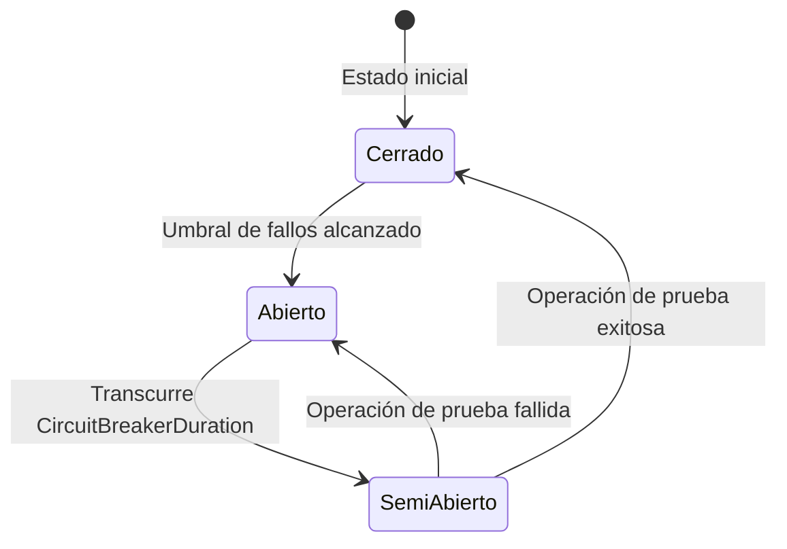

# Resiliencia

ValiBlob incluye integración con [Polly](https://github.com/App-vNext/Polly) para agregar reintentos automáticos, circuit breaker y timeouts a las operaciones de almacenamiento. Esto hace la aplicación más resistente ante fallos transitorios de red o del proveedor de nube.

## Configuración

```csharp
builder.Services
    .AddValiBlob(o => o.DefaultProvider = "aws")
    .AddProvider<AWSS3Provider>("aws", opts => { /* ... */ })
    .WithResilience(r =>
    {
        r.MaxRetries = 3;
        r.RetryDelay = TimeSpan.FromSeconds(1);
        r.UseExponentialBackoff = true;
        r.CircuitBreakerThreshold = 5;
        r.CircuitBreakerDuration = TimeSpan.FromSeconds(30);
        r.OperationTimeout = TimeSpan.FromSeconds(60);
    });
```

## ResilienceOptions

```csharp
public class ResilienceOptions
{
    /// <summary>Número máximo de reintentos por operación. Por defecto: 3.</summary>
    public int MaxRetries { get; set; } = 3;

    /// <summary>Tiempo base de espera entre reintentos. Por defecto: 1 segundo.</summary>
    public TimeSpan RetryDelay { get; set; } = TimeSpan.FromSeconds(1);

    /// <summary>Si true, usa backoff exponencial (1s, 2s, 4s...). Si false, espera fija.</summary>
    public bool UseExponentialBackoff { get; set; } = true;

    /// <summary>Agregar jitter aleatorio para evitar el problema de thundering herd.</summary>
    public bool UseJitter { get; set; } = true;

    /// <summary>Número de fallos consecutivos para activar el circuit breaker.</summary>
    public int CircuitBreakerThreshold { get; set; } = 5;

    /// <summary>Tiempo que el circuit breaker permanece abierto antes de intentar recuperarse.</summary>
    public TimeSpan CircuitBreakerDuration { get; set; } = TimeSpan.FromSeconds(30);

    /// <summary>Timeout por operación individual. Por defecto: 5 minutos.</summary>
    public TimeSpan OperationTimeout { get; set; } = TimeSpan.FromMinutes(5);

    /// <summary>Operaciones excluidas del reintento automático.</summary>
    public ISet<StorageOperation> ExcludedFromRetry { get; set; } = new HashSet<StorageOperation>();

    /// <summary>Códigos de error que NO deben reintentarse (errores de negocio, no transitorios).</summary>
    public ISet<StorageErrorCode> NonRetryableErrors { get; set; } = new HashSet<StorageErrorCode>
    {
        StorageErrorCode.FileTooLarge,
        StorageErrorCode.InvalidFileType,
        StorageErrorCode.QuotaExceeded,
        StorageErrorCode.VirusDetected,
        StorageErrorCode.PermissionDenied,
        StorageErrorCode.DuplicateFile,
        StorageErrorCode.Cancelled
    };
}
```

## Backoff exponencial con jitter

```
Intento 1: Falla → Esperar ~1.0s  (1s base + jitter 0–200ms)
Intento 2: Falla → Esperar ~2.1s  (2s base + jitter 0–200ms)
Intento 3: Falla → Esperar ~4.2s  (4s base + jitter 0–200ms)
Intento 4 (último): Si falla → StorageResult.Failure final
```

Con `UseJitter = true`, el tiempo de espera incluye un componente aleatorio para evitar que múltiples instancias del servidor reintentan exactamente al mismo tiempo (thundering herd problem).

## Circuit Breaker

El circuit breaker monitorea los fallos consecutivos y cuando superan el umbral "abre el circuito", devolviendo errores inmediatamente sin intentar la operación hasta que transcurra el tiempo de recuperación.



```csharp
.WithResilience(r =>
{
    r.CircuitBreakerThreshold = 5;                        // Abrir con 5 fallos consecutivos
    r.CircuitBreakerDuration = TimeSpan.FromSeconds(30);  // Recuperar tras 30 segundos
})
```

Cuando el circuit breaker está abierto, las operaciones retornan inmediatamente con:
```
StorageResult.Failure(StorageErrorCode.ProviderError, "Circuit breaker abierto.")
```

## Configuración por proveedor

```csharp
builder.Services
    .AddValiBlob(o => o.DefaultProvider = "aws")
    // AWS S3: estable, reintentos moderados
    .AddProvider<AWSS3Provider>("aws", opts => { /* ... */ })
    .WithResilience(r =>
    {
        r.MaxRetries = 3;
        r.RetryDelay = TimeSpan.FromMilliseconds(500);
        r.UseExponentialBackoff = true;
        r.CircuitBreakerThreshold = 10;
    })
    // Supabase: puede tener más latencia variable
    .AddProvider<SupabaseStorageProvider>("supabase", opts => { /* ... */ })
    .WithResilience(r =>
    {
        r.MaxRetries = 5;
        r.RetryDelay = TimeSpan.FromSeconds(1);
        r.UseExponentialBackoff = true;
        r.CircuitBreakerThreshold = 3;
        r.CircuitBreakerDuration = TimeSpan.FromSeconds(60);
    });
```

## Excluir operaciones del reintento

```csharp
.WithResilience(r =>
{
    r.MaxRetries = 3;
    r.RetryDelay = TimeSpan.FromMilliseconds(500);
    r.UseExponentialBackoff = true;
    r.UseJitter = true;

    // No reintentar descargas (el stream puede estar parcialmente consumido)
    r.ExcludedFromRetry.Add(StorageOperation.Download);
})
```

## Timeout por operación

```csharp
.WithResilience(r =>
{
    r.OperationTimeout = TimeSpan.FromSeconds(30);  // Timeout general
    r.UploadTimeout = TimeSpan.FromMinutes(10);     // Subidas de archivos grandes
    r.DownloadTimeout = TimeSpan.FromMinutes(5);    // Descargas
})
```

## Logging automático de reintentos

ValiBlob registra automáticamente cada reintento y el resultado final:

```
[DBG] ValiBlob: Upload falló (intento 1/3). Reintentando en 1000ms. Error: NetworkError
[DBG] ValiBlob: Upload falló (intento 2/3). Reintentando en 2000ms. Error: NetworkError
[INF] ValiBlob: Upload exitoso después de 3 intentos.
```

## Monitorear el estado del circuit breaker

```csharp
public class MonitorCircuitBreaker(
    IStorageResilienceMonitor monitor,
    ILogger<MonitorCircuitBreaker> logger) : BackgroundService
{
    protected override async Task ExecuteAsync(CancellationToken ct)
    {
        using var timer = new PeriodicTimer(TimeSpan.FromSeconds(10));

        while (await timer.WaitForNextTickAsync(ct))
        {
            var estado = monitor.GetCircuitBreakerState("aws");

            if (estado == CircuitBreakerState.Open)
                logger.LogWarning(
                    "Circuit breaker del proveedor 'aws' está ABIERTO. " +
                    "Las operaciones de almacenamiento fallarán inmediatamente.");
        }
    }
}
```

:::tip Consejo
Los errores de negocio como `FileTooLarge`, `InvalidFileType` o `VirusDetected` nunca deben reintentarse: el resultado será siempre el mismo. Solo reintentar errores transitorios (`NetworkError`, `Timeout`, `ProviderError`). Asegúrate de que los errores de negocio estén en `NonRetryableErrors`.
:::

:::warning Advertencia
Con `MaxRetries = 3` y backoff exponencial, el tiempo total máximo de espera antes del fallo definitivo puede ser hasta `1s + 2s + 4s = 7s`. Para endpoints de API interactivos con usuarios, ajusta los valores de reintento o aplica reintentos solo a operaciones en background. Un timeout de `OperationTimeout = 5 min` es apropiado para subidas grandes, pero demasiado para llamadas de lectura de metadatos.
:::
