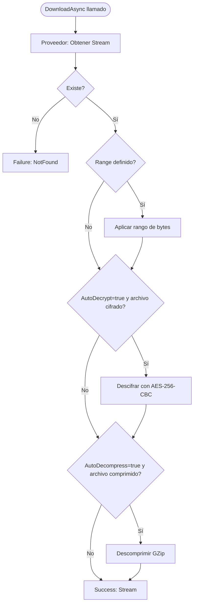

# Descarga de Archivos

`DownloadAsync` recupera el contenido de un archivo almacenado como un `Stream`. Soporta descarga por rango (HTTP Range Requests), descifrado automático, descompresión automática y streaming eficiente hacia respuestas HTTP.

## Firma del método

```csharp
Task<StorageResult<Stream>> DownloadAsync(
    DownloadRequest request,
    CancellationToken ct = default);
```

## DownloadRequest — todos los campos

```csharp
public class DownloadRequest
{
    /// <summary>Ruta del archivo a descargar. Requerido.</summary>
    public required string Path { get; set; }

    /// <summary>Rango de bytes para descargas parciales (HTTP Range).</summary>
    public ByteRange? Range { get; set; }

    /// <summary>Descifrar automáticamente si el archivo fue cifrado con EncryptionMiddleware.</summary>
    public bool AutoDecrypt { get; set; } = true;

    /// <summary>Descomprimir automáticamente si el archivo fue comprimido con CompressionMiddleware.</summary>
    public bool AutoDecompress { get; set; } = true;
}

public record struct ByteRange(long Start, long? End = null)
{
    /// <summary>Crea un rango desde una posición hasta el final del archivo.</summary>
    public static ByteRange From(long inicio) => new(inicio);

    /// <summary>Crea un rango entre dos posiciones específicas (incluyendo ambos extremos).</summary>
    public static ByteRange Between(long inicio, long fin) => new(inicio, fin);

    /// <summary>Crea un rango de los últimos N bytes del archivo.</summary>
    public static ByteRange Last(long bytes) => new(-bytes);
}
```

### Descripción de campos

| Campo | Tipo | Requerido | Descripción |
|---|---|---|---|
| `Path` | `string` | Sí | Ruta del archivo en el almacenamiento |
| `Range` | `ByteRange?` | No | Rango de bytes para descargas parciales |
| `AutoDecrypt` | `bool` | No | Descifra automáticamente archivos con `x-vali-iv` en metadatos |
| `AutoDecompress` | `bool` | No | Descomprime automáticamente archivos con `x-vali-compressed` en metadatos |

## Diagrama de flujo de descarga



## Ejemplos de uso

### Descarga simple

```csharp
var resultado = await storage.DownloadAsync(new DownloadRequest
{
    Path = "documentos/reporte-anual.pdf"
}, ct);

if (!resultado.IsSuccess)
{
    if (resultado.ErrorCode == StorageErrorCode.NotFound)
        return Results.NotFound();

    return Results.StatusCode(500);
}

return Results.Stream(resultado.Value!, "application/pdf", "reporte-anual.pdf");
```

### Streaming en una Minimal API de ASP.NET Core

```csharp
app.MapGet("/archivos/{*ruta}", async (
    string ruta,
    IStorageProvider storage,
    HttpContext http,
    CancellationToken ct) =>
{
    var descarga = await storage.DownloadAsync(new DownloadRequest
    {
        Path = Uri.UnescapeDataString(ruta)
    }, ct);

    if (!descarga.IsSuccess)
    {
        return descarga.ErrorCode == StorageErrorCode.NotFound
            ? Results.NotFound()
            : Results.StatusCode(500);
    }

    var meta = await storage.GetMetadataAsync(Uri.UnescapeDataString(ruta), ct);
    var tipoContenido = meta.Value?.ContentType ?? "application/octet-stream";
    var nombreArchivo = StoragePath.GetFileName(ruta);

    return Results.Stream(
        stream: descarga.Value!,
        contentType: tipoContenido,
        fileDownloadName: nombreArchivo,
        enableRangeProcessing: true
    );
});
```

### Descarga por rango de bytes

Útil para streaming de video, reanudación de descargas del lado del cliente, o procesamiento de partes específicas de archivos grandes:

```csharp
// Descargar bytes del 0 al 999 (primer kilobyte)
var resultado = await storage.DownloadAsync(new DownloadRequest
{
    Path = "videos/tutorial.mp4",
    Range = ByteRange.Between(0, 999)
}, ct);

// Descargar desde el byte 50000 hasta el final
var resultado = await storage.DownloadAsync(new DownloadRequest
{
    Path = "archivos/grande.bin",
    Range = ByteRange.From(50_000)
}, ct);

// Descargar los últimos 8192 bytes (útil para leer el fin de logs)
var resultado = await storage.DownloadAsync(new DownloadRequest
{
    Path = "logs/aplicacion.log",
    Range = ByteRange.Last(8192)
}, ct);
```

### Implementar soporte de HTTP Range Request

```csharp
app.MapGet("/videos/{*ruta}", async (
    string ruta,
    HttpRequest req,
    IStorageProvider storage,
    CancellationToken ct) =>
{
    ByteRange? rangoBytes = null;
    int codigoEstado = 200;

    if (req.Headers.TryGetValue("Range", out var rangeHeader))
    {
        // Formato HTTP Range: "bytes=start-end" o "bytes=start-"
        var partes = rangeHeader.ToString()
            .Replace("bytes=", "")
            .Split('-');

        if (long.TryParse(partes[0], out var inicio))
        {
            long? fin = partes.Length > 1 && long.TryParse(partes[1], out var f) ? f : null;
            rangoBytes = new ByteRange(inicio, fin);
            codigoEstado = 206; // Partial Content
        }
    }

    var resultado = await storage.DownloadAsync(new DownloadRequest
    {
        Path = Uri.UnescapeDataString(ruta),
        Range = rangoBytes
    }, ct);

    if (!resultado.IsSuccess)
        return Results.NotFound();

    return Results.Stream(resultado.Value!, "video/mp4", statusCode: codigoEstado);
});
```

### Descarga a disco

```csharp
public async Task DescargarADisco(
    IStorageProvider storage,
    string rutaOrigen,
    string rutaDestino,
    CancellationToken ct)
{
    var resultado = await storage.DownloadAsync(new DownloadRequest
    {
        Path = rutaOrigen
    }, ct);

    if (!resultado.IsSuccess)
        throw new FileNotFoundException($"Archivo no encontrado en el almacenamiento: {rutaOrigen}");

    await using var archivoLocal = File.Create(rutaDestino);
    await using var streamRemoto = resultado.Value!;
    await streamRemoto.CopyToAsync(archivoLocal, ct);
}
```

### Descargar sin descifrado ni descompresión automáticos

```csharp
// Obtener el archivo en su estado almacenado (comprimido y cifrado)
var resultado = await storage.DownloadAsync(new DownloadRequest
{
    Path = "backups/db-dump.sql",
    AutoDecompress = false, // No descomprimir
    AutoDecrypt = false     // No descifrar
}, ct);

// El stream contiene datos en bruto — útil para transferir o inspeccionar sin procesar
await using var fs = File.Create("db-dump.sql.raw");
await resultado.Value!.CopyToAsync(fs, ct);
```

## Gestión del stream resultante

:::warning Advertencia
El `Stream` retornado por `DownloadAsync` debe ser liberado (disposed) después de su uso. Puede estar respaldado por una conexión de red activa al proveedor de almacenamiento y retiene esa conexión hasta ser liberado.
:::

```csharp
// Correcto: using await garantiza la liberación
var resultado = await storage.DownloadAsync(request, ct);
if (resultado.IsSuccess)
{
    await using var stream = resultado.Value!;
    // ... usar el stream dentro del bloque using
} // stream se libera automáticamente aquí

// También correcto: delegar al framework ASP.NET Core
// Results.Stream libera el stream automáticamente al terminar la respuesta HTTP
return Results.Stream(resultado.Value!, contentType);
```

## Buenas prácticas de rendimiento

### Streaming directo vs. carga en memoria

```csharp
// Evitar: carga el archivo completo en memoria
var resultado = await storage.DownloadAsync(request, ct);
var bytes = new MemoryStream();
await resultado.Value!.CopyToAsync(bytes);
var todoEnMemoria = bytes.ToArray(); // Puede causar OutOfMemoryException para archivos grandes

// Preferir: streaming directo al destino
var resultado = await storage.DownloadAsync(request, ct);
await using var stream = resultado.Value!;
await stream.CopyToAsync(Response.Body, ct);
```

### Verificar existencia antes de descargar

```csharp
public async Task<Stream?> ObtenerArchivoAsync(
    IStorageProvider storage,
    string ruta,
    CancellationToken ct)
{
    var existe = await storage.ExistsAsync(ruta, ct);
    if (!existe.IsSuccess || !existe.Value)
        return null;

    var resultado = await storage.DownloadAsync(new DownloadRequest { Path = ruta }, ct);
    return resultado.IsSuccess ? resultado.Value : null;
}
```

:::tip Consejo
Para archivos que se acceden con alta frecuencia, implementa una capa de caché HTTP usando los headers `ETag` y `Last-Modified` de `FileMetadata`. Si el cliente ya tiene el archivo en caché y el ETag no ha cambiado, puedes responder con `304 Not Modified` sin descargar el archivo del proveedor, reduciendo costos de transferencia y latencia.
:::
