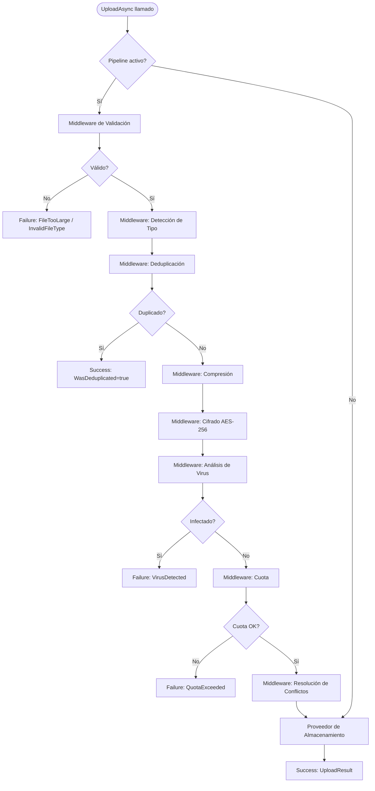

# Subida de Archivos

`UploadAsync` es la operación principal de escritura en ValiBlob. Esta guía cubre todos los campos de `UploadRequest`, el tipo de retorno `UploadResult`, el flujo completo a través del pipeline y patrones de uso comunes.

## Firma del método

```csharp
Task<StorageResult<UploadResult>> UploadAsync(
    UploadRequest request,
    CancellationToken ct = default);
```

## UploadRequest — todos los campos

```csharp
public class UploadRequest
{
    /// <summary>Ruta de destino en el almacenamiento. Requerido.</summary>
    public required string Path { get; set; }

    /// <summary>Stream con el contenido del archivo. Requerido.</summary>
    public required Stream Content { get; set; }

    /// <summary>Tipo MIME. Opcional si se usa ContentTypeDetectionMiddleware.</summary>
    public string? ContentType { get; set; }

    /// <summary>Metadatos adicionales como pares clave-valor.</summary>
    public Dictionary<string, string>? Metadata { get; set; }

    /// <summary>Sobreescribir si ya existe. Depende de la política de conflictos.</summary>
    public bool Overwrite { get; set; } = false;

    /// <summary>Tamaño conocido en bytes. Mejora el rendimiento si se conoce.</summary>
    public long? KnownSize { get; set; }

    /// <summary>Etiquetas para clasificación y búsqueda.</summary>
    public IReadOnlyList<string>? Tags { get; set; }

    /// <summary>Cifrar el archivo al subir (requiere EncryptionMiddleware).</summary>
    public bool Encrypt { get; set; } = false;

    /// <summary>Comprimir el archivo al subir (requiere CompressionMiddleware).</summary>
    public bool Compress { get; set; } = false;
}
```

### Descripción de campos

| Campo | Tipo | Requerido | Descripción |
|---|---|---|---|
| `Path` | `string` | Sí | Ruta destino. Construye con `StoragePath.From()` |
| `Content` | `Stream` | Sí | Stream de contenido. Se lee una sola vez |
| `ContentType` | `string?` | No | Tipo MIME. Se detecta automáticamente con `ContentTypeDetection` |
| `Metadata` | `Dictionary<string,string>?` | No | Pares clave-valor de metadatos personalizados |
| `Overwrite` | `bool` | No | Controla el comportamiento con archivos existentes |
| `KnownSize` | `long?` | No | Tamaño en bytes si se conoce — evita buffering innecesario |
| `Tags` | `IReadOnlyList<string>?` | No | Etiquetas para búsqueda y clasificación |
| `Encrypt` | `bool` | No | Activar cifrado AES-256 para este archivo |
| `Compress` | `bool` | No | Activar compresión GZip para este archivo |

## UploadResult

```csharp
public class UploadResult
{
    /// <summary>Ruta final del archivo (puede diferir si se renombró por conflicto).</summary>
    public required string Path { get; init; }

    /// <summary>URL pública del archivo, si el proveedor la genera.</summary>
    public string? Url { get; init; }

    /// <summary>Tamaño final en bytes (después de compresión o cifrado).</summary>
    public long SizeBytes { get; init; }

    /// <summary>ETag del archivo según el proveedor.</summary>
    public string? ETag { get; init; }

    /// <summary>Fecha y hora de creación.</summary>
    public DateTimeOffset CreatedAt { get; init; }

    /// <summary>true si el archivo ya existía y se retornó el existente (deduplicación).</summary>
    public bool WasDeduplicated { get; init; }

    /// <summary>Hash SHA-256 del contenido original (si la deduplicación está activa).</summary>
    public string? ContentHash { get; init; }
}
```

## Diagrama de flujo de una subida



## Ejemplos de uso

### Subida simple

```csharp
await using var stream = File.OpenRead("reporte.pdf");

var resultado = await storage.UploadAsync(new UploadRequest
{
    Path = "reportes/2024/reporte-anual.pdf",
    Content = stream,
    ContentType = "application/pdf"
}, ct);

if (resultado.IsSuccess)
{
    Console.WriteLine($"Subido en: {resultado.Value!.Path}");
    Console.WriteLine($"URL de acceso: {resultado.Value.Url}");
    Console.WriteLine($"Tamaño almacenado: {resultado.Value.SizeBytes:N0} bytes");
}
```

### Subida desde IFormFile (ASP.NET Core)

```csharp
app.MapPost("/api/documentos", async (
    IFormFile archivo,
    IStorageProvider storage,
    HttpContext http,
    CancellationToken ct) =>
{
    if (archivo.Length == 0)
        return Results.BadRequest("El archivo no puede estar vacío.");

    var extension = Path.GetExtension(archivo.FileName).ToLowerInvariant();
    var nombreSeguro = StoragePath.Sanitize(Path.GetFileNameWithoutExtension(archivo.FileName));
    var ruta = StoragePath.From("documentos", $"{nombreSeguro}{extension}").WithTimestampPrefix();

    await using var stream = archivo.OpenReadStream();

    var resultado = await storage.UploadAsync(new UploadRequest
    {
        Path = ruta,
        Content = stream,
        ContentType = archivo.ContentType,
        KnownSize = archivo.Length,
        Metadata = new Dictionary<string, string>
        {
            ["nombre-original"] = archivo.FileName,
            ["subido-por"] = http.User.Identity?.Name ?? "anónimo",
            ["ip-origen"] = http.Connection.RemoteIpAddress?.ToString() ?? "desconocida"
        }
    }, ct);

    return resultado.IsSuccess
        ? Results.Created($"/api/documentos/{Uri.EscapeDataString(resultado.Value!.Path)}",
            new { ruta = resultado.Value.Path, url = resultado.Value.Url })
        : Results.Problem(resultado.ErrorMessage, statusCode: resultado.ErrorCode switch
        {
            StorageErrorCode.FileTooLarge => 413,
            StorageErrorCode.InvalidFileType => 415,
            StorageErrorCode.QuotaExceeded => 507,
            _ => 500
        });
}).DisableAntiforgery();
```

### Subida con compresión y cifrado

```csharp
var resultado = await storage.UploadAsync(new UploadRequest
{
    Path = "backups/base-datos-2024-03.sql",
    Content = sqlDumpStream,
    ContentType = "application/sql",
    Compress = true,   // Comprimir con GZip antes de almacenar
    Encrypt = true,    // Cifrar con AES-256-CBC
    Metadata = new Dictionary<string, string>
    {
        ["tipo-backup"] = "completo",
        ["base-datos"] = "produccion",
        ["version-esquema"] = "142"
    }
}, ct);
```

### Subida con metadatos y etiquetas

```csharp
var resultado = await storage.UploadAsync(new UploadRequest
{
    Path = StoragePath.From("contratos", $"{contratoId}.pdf"),
    Content = pdfStream,
    ContentType = "application/pdf",
    Metadata = new Dictionary<string, string>
    {
        ["cliente-id"] = clienteId.ToString(),
        ["fecha-firma"] = DateTime.UtcNow.ToString("O"),
        ["version"] = "3",
        ["estado"] = "firmado"
    },
    Tags = ["contrato", "legal", "firmado", "2024"]
}, ct);
```

### Subida de múltiples archivos en paralelo con Task.WhenAll

```csharp
public async Task<IReadOnlyList<UploadResult>> SubirMultiplesArchivosAsync(
    IEnumerable<(Stream Contenido, string Nombre, string TipoMime)> archivos,
    string carpeta,
    CancellationToken ct)
{
    var tareas = archivos.Select(async archivo =>
    {
        var ruta = StoragePath.From(
            carpeta,
            StoragePath.Sanitize(archivo.Nombre)
        ).WithTimestampPrefix();

        var resultado = await storage.UploadAsync(new UploadRequest
        {
            Path = ruta,
            Content = archivo.Contenido,
            ContentType = archivo.TipoMime
        }, ct);

        return resultado.IsSuccess ? resultado.Value! : null;
    });

    var resultados = await Task.WhenAll(tareas);
    return resultados
        .Where(r => r is not null)
        .Cast<UploadResult>()
        .ToList()
        .AsReadOnly();
}
```

## Comportamiento del stream

`UploadAsync` lee el `Content` stream una sola vez. Si necesitas reutilizar el stream, rebobínalo antes de llamar a la operación:

```csharp
// Correcto: rebobinar antes de subir
memoryStream.Position = 0;
var resultado = await storage.UploadAsync(new UploadRequest
{
    Content = memoryStream,
    Path = "archivo.pdf"
}, ct);

// Alternativa: copiar a MemoryStream para permitir múltiples lecturas
var buffer = new MemoryStream();
await streamOriginal.CopyToAsync(buffer, ct);
buffer.Position = 0;
```

:::tip Consejo
Proporciona siempre `KnownSize` cuando el tamaño del archivo se conoce de antemano (como con `IFormFile.Length`). Esto permite a los proveedores como S3 y Azure optimizar la subida con transferencia directa sin buffering en memoria, especialmente importante para archivos grandes.
:::

:::warning Advertencia
Para archivos mayores a 100 MB, considera usar [Subidas Reanudables](../resumable/overview) en lugar de `UploadAsync` directo. Las subidas reanudables son resistentes a interrupciones de red y permiten reanudar desde el punto exacto de fallo, ahorrando tiempo y ancho de banda.
:::
