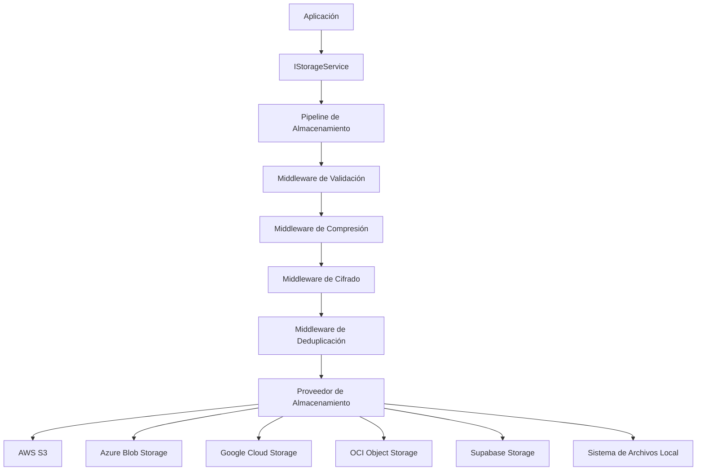

# Introducción a ValiBlob

ValiBlob es una librería de abstracción de almacenamiento en la nube para .NET que unifica el acceso a múltiples proveedores — AWS S3, Azure Blob Storage, Google Cloud Storage, Oracle Cloud Infrastructure, Supabase y el sistema de archivos local — bajo una interfaz común y componible.

Con ValiBlob, cambiar de proveedor de almacenamiento implica modificar una sola línea de configuración, sin tocar el código de negocio.

## ¿Por qué ValiBlob?

Construir integraciones de almacenamiento en la nube desde cero presenta desafíos recurrentes:

- Cada SDK de proveedor tiene su propia API, modelos de error y convenciones de autenticación.
- La lógica transversal (validación, compresión, cifrado, deduplicación) termina dispersa y duplicada.
- Cambiar de proveedor requiere reescribir grandes porciones de la aplicación.
- Las pruebas unitarias se complican cuando el código depende directamente de clientes de nube.

ValiBlob resuelve todos estos problemas mediante una arquitectura de pipeline extensible y un sistema de abstracción de proveedores que permite intercambiarlos sin fricciones.

## Arquitectura general

El pipeline procesa cada operación de escritura a través de una cadena de middlewares configurables antes de entregar los datos al proveedor subyacente. Las operaciones de lectura recorren el pipeline en sentido inverso aplicando descifrado y descompresión automáticamente.

## Los 12 paquetes de ValiBlob

ValiBlob está distribuido en paquetes NuGet modulares. Solo instala lo que necesitas.

| Paquete | Descripción |
|---|---|
| `ValiBlob.Core` | Interfaces, modelos y abstracciones base |
| `ValiBlob.Pipeline` | Middleware de validación, compresión, cifrado y más |
| `ValiBlob.AWS` | Proveedor para Amazon S3 |
| `ValiBlob.Azure` | Proveedor para Azure Blob Storage |
| `ValiBlob.GCP` | Proveedor para Google Cloud Storage |
| `ValiBlob.OCI` | Proveedor para Oracle Cloud Infrastructure |
| `ValiBlob.Supabase` | Proveedor para Supabase Storage |
| `ValiBlob.Local` | Proveedor para sistema de archivos local |
| `ValiBlob.Redis` | Almacén de sesiones reanudables con Redis |
| `ValiBlob.EFCore` | Almacén de sesiones reanudables con Entity Framework Core |
| `ValiBlob.ImageSharp` | Procesamiento de imágenes con SixLabors.ImageSharp |
| `ValiBlob.Testing` | Proveedor en memoria para pruebas unitarias |

## Características principales

### Abstracción de proveedores

Escribe código contra `IStorageService` y cambia el proveedor con una sola línea de configuración. Soporta múltiples proveedores simultáneos mediante instancias nombradas.

### Pipeline de middlewares

El sistema de pipeline permite encadenar comportamientos reutilizables en cualquier orden:

- **Validación**: tipo MIME, tamaño máximo, extensiones permitidas.
- **Compresión**: GZip transparente con metadato `x-vali-compressed`.
- **Cifrado**: AES-256-CBC con IV aleatorio por archivo almacenado en `x-vali-iv`.
- **Deduplicación**: SHA-256 para evitar almacenar el mismo contenido dos veces.
- **Detección de tipo**: magic bytes para identificar el tipo real del archivo.
- **Análisis de virus**: integración con ClamAV o VirusTotal.
- **Cuotas**: límites de almacenamiento por usuario o tenant.
- **Resolución de conflictos**: estrategias configurables para archivos duplicados.

### Subidas reanudables

API compatible con el protocolo TUS para subidas de archivos grandes que pueden interrumpirse y retomarse. Soporta almacenes de sesión en memoria, Redis y EF Core.

### URLs prefirmadas

Genera URLs temporales de descarga o subida directa desde el navegador, evitando que los datos pasen por el servidor de aplicaciones.

### Procesamiento de imágenes

Redimensionado, conversión de formato (WebP, JPEG, PNG, AVIF) y generación de miniaturas integrados en el pipeline.

### Observabilidad

Soporte nativo para OpenTelemetry con `ActivitySource` y `Meter` para trazas y métricas exportables a Jaeger, Zipkin, Prometheus y otros backends.

### Health Checks

Integración con `IHealthCheck` de ASP.NET Core para monitorear la disponibilidad de cada proveedor de almacenamiento.

### Resiliencia

Reintentos automáticos con Polly, circuit breaker y timeouts configurables por proveedor.

## Versión actual

ValiBlob **1.0.0** es compatible con **.NET 8** y **.NET 9**. Todos los paquetes se publican en NuGet con el mismo número de versión para garantizar compatibilidad entre ellos.

:::info Información
ValiBlob sigue versionado semántico (SemVer). Los cambios de ruptura solo ocurren en versiones mayores.
:::

## Próximos pasos

- Sigue con [Inicio Rápido](./quick-start) para tener tu primera subida funcionando en minutos.
- Revisa [Paquetes](./packages) para entender qué instalar según tu caso de uso.
- Explora [Arquitectura del Pipeline](./pipeline/overview) para sacar el máximo provecho del sistema de middlewares.
