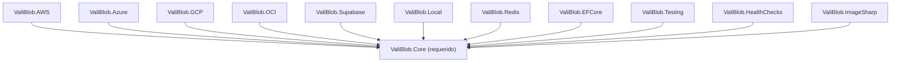

# Paquetes de ValiBlob

ValiBlob está distribuido en 12 paquetes NuGet independientes y modulares. Esta arquitectura permite instalar exclusivamente lo que tu proyecto necesita, evitando dependencias innecesarias.

## Diagrama de dependencias



Todos los paquetes dependen de `ValiBlob.Core`. Ningún paquete de proveedor depende de otro proveedor.

---

## Tabla completa de paquetes

| Paquete | Descripción | Frameworks | Cuándo usar |
|---|---|---|---|
| `ValiBlob.Core` | Interfaces, pipeline, DI, tipos base | net8.0, net9.0 | Siempre — es el núcleo |
| `ValiBlob.AWS` | Proveedor Amazon S3 y compatibles | net8.0, net9.0 | Infraestructura en AWS o MinIO |
| `ValiBlob.Azure` | Proveedor Azure Blob Storage | net8.0, net9.0 | Infraestructura en Azure |
| `ValiBlob.GCP` | Proveedor Google Cloud Storage | net8.0, net9.0 | Infraestructura en GCP |
| `ValiBlob.OCI` | Proveedor Oracle Cloud Infrastructure | net8.0, net9.0 | Infraestructura en OCI |
| `ValiBlob.Supabase` | Proveedor Supabase Storage | net8.0, net9.0 | Proyectos con Supabase como BaaS |
| `ValiBlob.Local` | Sistema de archivos local | net8.0, net9.0 | Desarrollo local y pruebas |
| `ValiBlob.Redis` | Sesiones reanudables con Redis | net8.0, net9.0 | Subidas reanudables en producción multi-instancia |
| `ValiBlob.EFCore` | Sesiones reanudables con EF Core | net8.0, net9.0 | Subidas reanudables con BD existente |
| `ValiBlob.Testing` | Proveedor en memoria | net8.0, net9.0 | Pruebas unitarias e integración |
| `ValiBlob.HealthChecks` | Health checks ASP.NET Core | net8.0, net9.0 | Monitoreo y probes de Kubernetes |
| `ValiBlob.ImageSharp` | Procesamiento de imágenes | net8.0, net9.0 | Resize, conversión de formato |

---

## ValiBlob.Core

El paquete central. **Siempre requerido** — todos los demás paquetes lo incluyen como dependencia transitiva.

```bash
dotnet add package ValiBlob.Core
```

Contiene las interfaces y tipos fundamentales:

| Tipo | Descripción |
|---|---|
| `IStorageProvider` | Interfaz principal de operaciones de almacenamiento |
| `StorageResult<T>` | Tipo de retorno universal que evita excepciones |
| `StoragePath` | Utilidades para construir y normalizar rutas |
| `StorageErrorCode` | Enumeración de todos los códigos de error |
| `UploadRequest` / `UploadResult` | Tipos de subida |
| `DownloadRequest` | Tipo de descarga |
| `FileMetadata` / `FileEntry` | Metadatos y listado |
| `StoragePipelineBuilder` | Constructor del pipeline |
| `IStorageEventHandler<T>` | Manejadores de eventos |
| `IResumableStorageProvider` | Interfaz de subidas reanudables |

**Dependencias externas:** `Microsoft.Extensions.DependencyInjection.Abstractions`, `Microsoft.Extensions.Options`, `Microsoft.Extensions.Logging.Abstractions`

---

## ValiBlob.AWS

Proveedor para Amazon S3 y servicios compatibles como MinIO y LocalStack.

```bash
dotnet add package ValiBlob.AWS
```

### Opciones de configuración (AWSS3Options)

| Propiedad | Tipo | Descripción |
|---|---|---|
| `BucketName` | `string` | Nombre del bucket de S3 |
| `Region` | `string` | Región de AWS (ej. `us-east-1`) |
| `AccessKey` | `string` | Clave de acceso IAM |
| `SecretKey` | `string` | Clave secreta IAM |
| `ServiceUrl` | `string?` | URL personalizada para MinIO o LocalStack |
| `ForcePathStyle` | `bool` | Requerido para MinIO y LocalStack |
| `SessionToken` | `string?` | Token de sesión temporal (STS) |

**Dependencias externas:** `AWSSDK.S3`

---

## ValiBlob.Azure

Proveedor para Azure Blob Storage con soporte para Managed Identity y tokens SAS.

```bash
dotnet add package ValiBlob.Azure
```

### Opciones de configuración (AzureBlobOptions)

| Propiedad | Tipo | Descripción |
|---|---|---|
| `ConnectionString` | `string` | Cadena de conexión de la cuenta de almacenamiento |
| `ContainerName` | `string` | Nombre del contenedor de blobs |
| `CreateContainerIfNotExists` | `bool` | Crear el contenedor automáticamente si no existe |
| `UseManagedIdentity` | `bool` | Usar Managed Identity en lugar de clave de acceso |
| `AccountName` | `string?` | Nombre de la cuenta (requerido con Managed Identity) |

**Dependencias externas:** `Azure.Storage.Blobs`

---

## ValiBlob.GCP

Proveedor para Google Cloud Storage.

```bash
dotnet add package ValiBlob.GCP
```

### Opciones de configuración (GCPStorageOptions)

| Propiedad | Tipo | Descripción |
|---|---|---|
| `ProjectId` | `string` | ID del proyecto de GCP |
| `BucketName` | `string` | Nombre del bucket de GCS |
| `JsonCredentials` | `string?` | JSON de cuenta de servicio. Null = credenciales de entorno |
| `JsonCredentialsPath` | `string?` | Ruta al archivo JSON de credenciales |

**Dependencias externas:** `Google.Cloud.Storage.V1`

---

## ValiBlob.OCI

Proveedor para Oracle Cloud Infrastructure Object Storage.

```bash
dotnet add package ValiBlob.OCI
```

### Opciones de configuración (OCIStorageOptions)

| Propiedad | Tipo | Descripción |
|---|---|---|
| `Namespace` | `string` | Namespace del Object Storage de OCI |
| `BucketName` | `string` | Nombre del bucket |
| `Region` | `string` | Región de OCI (ej. `us-phoenix-1`) |
| `TenancyId` | `string` | OCID del tenancy |
| `UserId` | `string` | OCID del usuario |
| `Fingerprint` | `string` | Huella digital de la clave API |
| `PrivateKey` | `string` | Clave privada RSA en formato PEM |

**Dependencias externas:** `OCI.DotNetSDK.Objectstorage`

---

## ValiBlob.Supabase

Proveedor para Supabase Storage con soporte para buckets públicos y privados.

```bash
dotnet add package ValiBlob.Supabase
```

### Opciones de configuración (SupabaseStorageOptions)

| Propiedad | Tipo | Descripción |
|---|---|---|
| `Url` | `string` | URL del proyecto Supabase (`https://xxx.supabase.co`) |
| `ServiceKey` | `string` | Service role key de Supabase |
| `BucketName` | `string` | Nombre del bucket de Supabase Storage |
| `IsPublic` | `bool` | Si el bucket es público |

**Dependencias externas:** `supabase-csharp`

---

## ValiBlob.Local

Proveedor de sistema de archivos local. Ideal para desarrollo sin dependencias de nube.

```bash
dotnet add package ValiBlob.Local
```

### Opciones de configuración (LocalStorageOptions)

| Propiedad | Tipo | Descripción |
|---|---|---|
| `BasePath` | `string` | Directorio raíz para almacenar archivos |
| `CreateIfNotExists` | `bool` | Crear el directorio si no existe |
| `PublicBaseUrl` | `string?` | URL base para generar URLs públicas |

Características especiales:
- Almacena metadatos en archivos sidecar `.meta.json` junto a cada archivo
- Soporta subidas reanudables usando subdirectorios de chunks temporales
- Compatible con `app.UseStaticFiles()` para servir archivos

---

## ValiBlob.Redis

Almacén de sesiones de subidas reanudables usando Redis.

```bash
dotnet add package ValiBlob.Redis
```

**Dependencias externas:** `StackExchange.Redis`

Cuándo usar: producción con múltiples instancias del servidor y Redis ya disponible en la infraestructura.

---

## ValiBlob.EFCore

Almacén de sesiones de subidas reanudables usando Entity Framework Core.

```bash
dotnet add package ValiBlob.EFCore
```

### Bases de datos soportadas

| Base de datos | Paquete adicional requerido |
|---|---|
| PostgreSQL | `Npgsql.EntityFrameworkCore.PostgreSQL` |
| MySQL / MariaDB | `Pomelo.EntityFrameworkCore.MySql` |
| SQL Server | `Microsoft.EntityFrameworkCore.SqlServer` |
| SQLite | `Microsoft.EntityFrameworkCore.Sqlite` |

**Dependencias externas:** `Microsoft.EntityFrameworkCore`

---

## ValiBlob.Testing

Proveedor en memoria para pruebas unitarias e integración.

```bash
dotnet add package ValiBlob.Testing
```

Características:
- `InMemoryStorageProvider`: almacena todo en un diccionario en memoria
- Sin dependencias externas ni servicios de nube
- Estado inspectable directamente en las pruebas con `.GetAllFiles()`
- Limpieza entre pruebas con `.Clear()`

---

## ValiBlob.HealthChecks

Integración con el sistema de health checks de ASP.NET Core.

```bash
dotnet add package ValiBlob.HealthChecks
```

**Dependencias externas:** `Microsoft.Extensions.Diagnostics.HealthChecks`

Requiere ASP.NET Core. Expone un endpoint de health check que verifica la conectividad con el proveedor de almacenamiento.

---

## ValiBlob.ImageSharp

Middleware de procesamiento de imágenes basado en SixLabors.ImageSharp.

```bash
dotnet add package ValiBlob.ImageSharp
```

Capacidades:
- Redimensionado (resize) con múltiples modos (Fill, Crop, Pad, Max)
- Conversión de formato: JPEG, PNG, WebP, AVIF
- Control de calidad de compresión por formato
- Generación de miniaturas automáticas al subir
- Rotación y volteo

**Dependencias externas:** `SixLabors.ImageSharp`

---

## Tabla de compatibilidad

| Paquete | .NET 8 | .NET 9 | Requiere ASP.NET Core |
|---|---|---|---|
| ValiBlob.Core | ✅ | ✅ | No |
| ValiBlob.AWS | ✅ | ✅ | No |
| ValiBlob.Azure | ✅ | ✅ | No |
| ValiBlob.GCP | ✅ | ✅ | No |
| ValiBlob.OCI | ✅ | ✅ | No |
| ValiBlob.Supabase | ✅ | ✅ | No |
| ValiBlob.Local | ✅ | ✅ | No |
| ValiBlob.Redis | ✅ | ✅ | No |
| ValiBlob.EFCore | ✅ | ✅ | No |
| ValiBlob.Testing | ✅ | ✅ | No |
| ValiBlob.HealthChecks | ✅ | ✅ | **Sí** |
| ValiBlob.ImageSharp | ✅ | ✅ | No |

:::tip Consejo
En un proyecto típico instalarás `ValiBlob.Core` + un proveedor de nube (ej. `ValiBlob.AWS`) + `ValiBlob.Testing` para pruebas. Agrega `ValiBlob.HealthChecks` si usas Kubernetes o monitoreo de disponibilidad. El resto depende de las funcionalidades específicas que necesites.
:::

:::info Información
Todos los paquetes de ValiBlob se publican con el mismo número de versión de forma sincronizada. Siempre instala la misma versión en todos los paquetes de ValiBlob para evitar incompatibilidades.
:::
