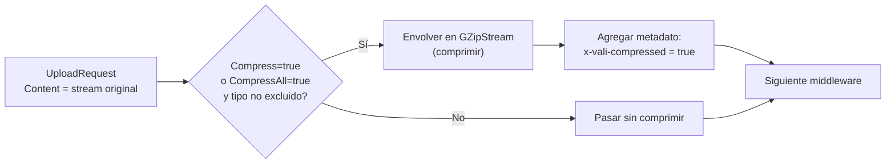
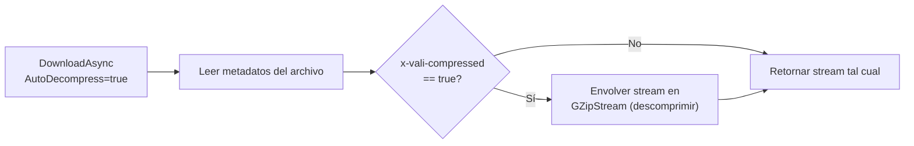

# Compresión

El `CompressionMiddleware` reduce el tamaño de los archivos antes de almacenarlos usando GZip. La descompresión se aplica automáticamente al descargar, de forma completamente transparente. El estado de compresión se registra en el metadato `x-vali-compressed`.

## Activación

```csharp
.WithPipeline(p => p
    .UseCompression(c =>
    {
        c.CompressionLevel = CompressionLevel.Optimal;
        c.MinSizeToCompress = 1024;           // No comprimir archivos menores a 1 KB
        c.SkipAlreadyCompressedTypes = true;  // No recomprimir tipos ya comprimidos
    })
)
```

## CompressionOptions

```csharp
public class CompressionOptions
{
    /// <summary>Nivel de compresión GZip. Por defecto: Optimal.</summary>
    public CompressionLevel CompressionLevel { get; set; } = CompressionLevel.Optimal;

    /// <summary>Tamaño mínimo en bytes para comprimir. Archivos menores se omiten.</summary>
    public long MinSizeToCompress { get; set; } = 1024; // 1 KB

    /// <summary>Omitir tipos de contenido que ya incluyen compresión (JPEG, PNG, ZIP, etc.).</summary>
    public bool SkipAlreadyCompressedTypes { get; set; } = true;

    /// <summary>Tipos MIME adicionales a excluir de la compresión.</summary>
    public IList<string> ExcludedContentTypes { get; set; } = [];

    /// <summary>Si true, comprime todos los archivos sin importar el campo Compress del request.</summary>
    public bool CompressAll { get; set; } = false;
}
```

### Tabla de opciones

| Opción | Por defecto | Descripción |
|---|---|---|
| `CompressionLevel` | `Optimal` | `Fastest` (rápido, menos compresión), `Optimal` (balance), `SmallestSize` (lento, mejor compresión) |
| `MinSizeToCompress` | `1024` | Archivos más pequeños no se comprimen (el overhead supera el beneficio) |
| `SkipAlreadyCompressedTypes` | `true` | Evita recomprimir formatos que ya incluyen compresión interna |
| `ExcludedContentTypes` | `[]` | Tipos MIME adicionales a excluir manualmente |
| `CompressAll` | `false` | Forzar compresión de todos los archivos ignorando el campo `Compress` del request |

## Tipos excluidos automáticamente

Cuando `SkipAlreadyCompressedTypes = true`, los siguientes tipos no se comprimen:

| Categoría | Tipos MIME excluidos |
|---|---|
| Imágenes | `image/jpeg`, `image/png`, `image/gif`, `image/webp`, `image/avif` |
| Video | `video/mp4`, `video/webm`, `video/avi`, `video/quicktime` |
| Audio | `audio/mpeg`, `audio/aac`, `audio/ogg`, `audio/flac` |
| Archivos comprimidos | `application/zip`, `application/gzip`, `application/x-7z-compressed`, `application/x-rar-compressed` |
| PDF | `application/pdf` (incluye compresión Flate internamente) |

## Cómo funciona

### En la subida



El middleware envuelve el stream en un `GZipStream` y agrega el metadato `x-vali-compressed: true` para que la descarga sepa que debe descomprimir.

### En la descarga



## Ejemplos de uso

### Comprimir al subir (opt-in por request)

```csharp
// Activar compresión solo para este archivo específico
var resultado = await storage.UploadAsync(new UploadRequest
{
    Path = "backups/volcado-bd-2024-03.sql",
    Content = sqlStream,
    ContentType = "application/sql",
    Compress = true  // Opt-in explícito
}, ct);
```

### Comprimir todos los archivos automáticamente

```csharp
.UseCompression(c =>
{
    c.CompressAll = true;                             // Comprimir todo
    c.CompressionLevel = CompressionLevel.SmallestSize; // Máxima compresión
    c.MinSizeToCompress = 512;                        // Incluso archivos pequeños
})
```

### Excluir tipos adicionales de la compresión

```csharp
.UseCompression(c =>
{
    c.SkipAlreadyCompressedTypes = true;
    c.ExcludedContentTypes =
    [
        "application/x-sqlite3",   // SQLite ya tiene su propio formato
        "application/octet-stream" // Datos binarios desconocidos
    ];
})
```

### Descargar sin descompresión automática

```csharp
// Obtener el archivo comprimido en bruto (para transferencia o inspección)
var resultado = await storage.DownloadAsync(new DownloadRequest
{
    Path = "backups/volcado-bd.sql",
    AutoDecompress = false // Obtener datos GZip sin descomprimir
}, ct);

// El stream contiene datos GZip — adecuado para guardar como .sql.gz
await using var archivoLocal = File.Create("volcado-bd.sql.gz");
await resultado.Value!.CopyToAsync(archivoLocal, ct);
```

### Verificar si un archivo está comprimido

```csharp
var meta = await storage.GetMetadataAsync("backups/volcado-bd.sql", ct);
if (meta.IsSuccess)
{
    // Propiedad directa de FileMetadata
    Console.WriteLine($"¿Comprimido? {meta.Value!.IsCompressed}");

    // También disponible en metadatos personalizados
    if (meta.Value.CustomMetadata.TryGetValue("x-vali-compressed", out var comprimido))
        Console.WriteLine($"Metadato directo: {comprimido}");
}
```

## Ahorro de espacio esperado por tipo de archivo

| Tipo de archivo | Reducción típica | ¿Vale la pena comprimir? |
|---|---|---|
| Texto plano / CSV | 60–80% | Sí |
| JSON / XML | 70–85% | Sí |
| SQL dumps | 70–80% | Sí |
| HTML / JavaScript / CSS | 60–75% | Sí |
| Microsoft Word (.docx) | 10–20% | Moderado |
| Imágenes JPEG / PNG | 0–5% | No |
| PDF | 5–15% | Poco beneficio |
| ZIP / RAR / 7z | 0–2% | No |
| Video MP4 | 0–3% | No |

## Cuándo usar y cuándo no usar compresión

**Usa compresión para:**
- Archivos de texto grandes: logs, CSV, JSON, SQL dumps.
- Backups de base de datos.
- Archivos que se almacenan por tiempo prolongado y no se acceden frecuentemente.
- Reducir costos de almacenamiento en proveedores que cobran por GB.

**No uses compresión para:**
- Imágenes (JPEG, PNG, WebP), video y audio — ya están comprimidos.
- Archivos que se acceden con alta frecuencia — el overhead de descompresión suma latencia.
- Archivos pequeños (menos de 1 KB) — el overhead de GZip supera el ahorro.

:::tip Consejo
Usa `CompressionLevel.Optimal` para la mayoría de los casos de uso. `SmallestSize` puede reducir el tamaño un 5–10% adicional, pero puede ser 3–5 veces más lento. Resérvalo para archivos que se almacenan por largos períodos como backups de archivo.
:::

:::warning Advertencia
La compresión debe ir **antes** del cifrado en el pipeline. Cifrar primero y luego intentar comprimir es ineficiente: los datos cifrados tienen alta entropía aleatoria y GZip prácticamente no los puede comprimir. El orden correcto en el pipeline es: `UseCompression()` seguido de `UseEncryption()`.
:::
