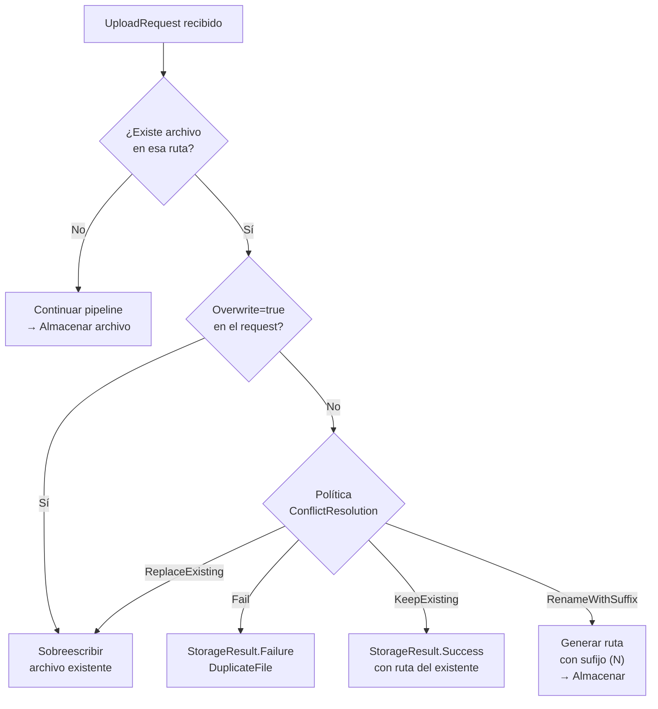

# Resolución de Conflictos

El `ConflictResolutionMiddleware` define qué ocurre cuando intentas subir un archivo a una ruta que ya existe en el almacenamiento. Hay cuatro estrategias disponibles a través del enum `ConflictResolution`.

## Activación

```csharp
.WithPipeline(p => p
    .UseConflictResolution(ConflictResolution.RenameWithSuffix)
)
```

## El enum ConflictResolution

```csharp
public enum ConflictResolution
{
    /// <summary>Rechazar la subida si el archivo ya existe. Retorna StorageErrorCode.DuplicateFile.</summary>
    Fail,

    /// <summary>Sobreescribir el archivo existente sin confirmación.</summary>
    ReplaceExisting,

    /// <summary>Ignorar la subida y retornar el archivo existente como exitoso.</summary>
    KeepExisting,

    /// <summary>Renombrar el nuevo archivo agregando un sufijo numérico único.</summary>
    RenameWithSuffix
}
```

## Comportamiento de cada estrategia

### Fail (rechazar si existe)

Si el archivo ya existe, la operación falla con `StorageErrorCode.DuplicateFile`.

```csharp
.UseConflictResolution(ConflictResolution.Fail)
```

```
Subida: "documentos/contrato.pdf"
→ ¿Existe? SÍ
→ Resultado: StorageResult.Failure(DuplicateFile)
```

**Cuándo usar:** Cuando se requiere confirmación explícita del usuario antes de reemplazar un archivo. Ideal para sistemas de gestión documental donde sobrescribir accidentalmente tiene consecuencias graves.

```csharp
var resultado = await storage.UploadAsync(request, ct);

if (resultado.ErrorCode == StorageErrorCode.DuplicateFile)
{
    return Results.Conflict(new
    {
        error = "ARCHIVO_EXISTENTE",
        mensaje = $"Ya existe un archivo en '{request.Path}'.",
        accion = "Envía la solicitud con Overwrite=true para reemplazarlo."
    });
}
```

### ReplaceExisting (sobreescribir)

Sobreescribe el archivo existente automáticamente.

```csharp
.UseConflictResolution(ConflictResolution.ReplaceExisting)
```

```
Subida: "avatares/usuario-123.jpg"
→ ¿Existe? SÍ
→ Acción: Reemplazar el archivo existente
→ Resultado: StorageResult.Success (archivo nuevo)
```

**Cuándo usar:** Archivos que se actualizan frecuentemente: avatares, thumbnails, archivos de configuración generados automáticamente, exports periódicos.

### KeepExisting (conservar el existente)

Retorna el archivo existente como si la subida hubiera sido exitosa. No almacena nada nuevo.

```csharp
.UseConflictResolution(ConflictResolution.KeepExisting)
```

```
Subida: "logos/empresa.svg"
→ ¿Existe? SÍ
→ Acción: No almacenar, retornar el existente
→ Resultado: StorageResult.Success (ruta del archivo existente)
```

**Cuándo usar:** Activos estáticos inmutables (logos, íconos), combinado con deduplicación para evitar doble procesamiento, o cuando el mismo contenido puede subirse múltiples veces y se desea la idempotencia.

```csharp
var resultado = await storage.UploadAsync(request, ct);
if (resultado.IsSuccess)
{
    var fueNuevo = !resultado.Value!.WasDeduplicated;
    logger.LogInformation("Archivo {Estado}: {Path}",
        fueNuevo ? "nuevo almacenado" : "existente reutilizado",
        resultado.Value.Path);
}
```

### RenameWithSuffix (renombrar automáticamente)

Agrega un sufijo numérico al nuevo archivo para evitar el conflicto, al estilo de los sistemas de archivos de Windows/macOS.

```csharp
.UseConflictResolution(ConflictResolution.RenameWithSuffix)
```

```
Subida: "documentos/reporte.pdf"
→ "documentos/reporte.pdf" existe → genera "documentos/reporte (1).pdf"
→ "documentos/reporte (1).pdf" existe → genera "documentos/reporte (2).pdf"
→ "documentos/reporte (2).pdf" NO existe → almacenar aquí
→ Resultado: StorageResult.Success
              Value.Path = "documentos/reporte (2).pdf"
```

**Cuándo usar:** Gestores de archivos donde el usuario espera conservar todas las versiones, dropzones de documentos, o cuando nunca debe perderse un archivo anterior.

```csharp
var resultado = await storage.UploadAsync(new UploadRequest
{
    Path = "descargas/informe.xlsx",
    Content = stream
}, ct);

if (resultado.IsSuccess)
{
    // La ruta final puede diferir de la solicitada
    Console.WriteLine($"Guardado en: {resultado.Value!.Path}");
    // Posible salida: "descargas/informe (3).xlsx"
}
```

## Comparación de estrategias

| Estrategia | ¿Sobreescribe? | ¿Cambia la ruta? | Error si existe | Uso típico |
|---|---|---|---|---|
| `Fail` | No | No | `DuplicateFile` | DMS, control explícito |
| `ReplaceExisting` | Sí | No | Nunca | Avatares, configs |
| `KeepExisting` | No | No | Nunca | Activos inmutables |
| `RenameWithSuffix` | No | Sí | Nunca | Gestor de archivos |

## Sobreescritura forzada desde el request

El campo `Overwrite = true` en `UploadRequest` puede forzar la sobreescritura independientemente de la política del middleware:

```csharp
// Forzar sobreescritura aunque la política sea ConflictResolution.Fail
var resultado = await storage.UploadAsync(new UploadRequest
{
    Path = "configs/ajustes.json",
    Content = stream,
    Overwrite = true  // Fuerza sobreescritura
}, ct);
```

## Flujo de decisión



## Política diferente por carpeta

```csharp
// Middleware personalizado antes de ConflictResolution
public class PoliticaConflictosPorCarpeta : IStorageMiddleware
{
    public async Task InvokeAsync(StoragePipelineContext context, StorageMiddlewareDelegate next, CancellationToken ct)
    {
        if (context.UploadRequest is { } req)
        {
            // Avatares siempre se reemplazan
            if (req.Path.StartsWith("avatares/"))
                req.Overwrite = true;
        }

        await next(context, ct);
    }
}

.WithPipeline(p => p
    .Use<PoliticaConflictosPorCarpeta>()
    .UseConflictResolution(ConflictResolution.Fail) // Política por defecto para el resto
)
```

:::tip Consejo
Para sistemas de gestión documental, usa `ConflictResolution.Fail` y expón el conflicto al usuario con un diálogo de confirmación en la UI. Para APIs REST, devuelve HTTP 409 Conflict con el detalle del archivo existente y permite al cliente reenviar con `Overwrite: true` en la cabecera o el cuerpo.
:::

:::note Nota
Con `RenameWithSuffix`, la ruta retornada en `UploadResult.Path` puede diferir de la ruta solicitada. Siempre usa `resultado.Value!.Path` (no la ruta original del request) para obtener la ubicación real del archivo almacenado.
:::
