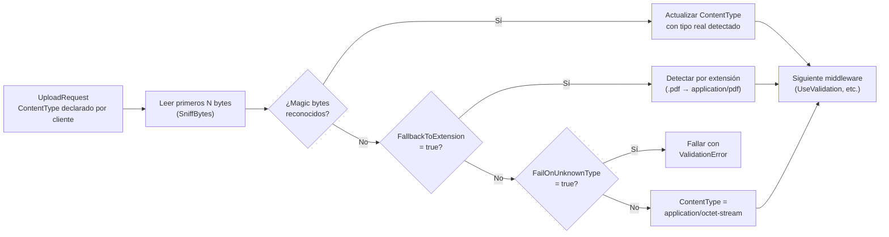

# Detección de Tipo de Contenido

El `ContentTypeDetectionMiddleware` analiza los primeros bytes del archivo (**magic bytes**) para determinar el tipo MIME real, independientemente de lo que el cliente haya declarado en `ContentType`. Esto es fundamental para la seguridad: un cliente puede declarar `image/jpeg` mientras sube un `.exe`, y este middleware lo detecta.

## Activación

```csharp
.WithPipeline(p => p
    .UseContentTypeDetection(c =>
    {
        c.OverrideClientContentType = true;  // Sobreescribir el tipo declarado por el cliente
        c.FallbackToExtension = true;        // Usar extensión si los magic bytes no son reconocidos
        c.FailOnUnknownType = false;         // No fallar si no se puede detectar el tipo
    })
    .UseValidation(v =>
    {
        v.AllowedContentTypes = ["image/jpeg", "image/png", "image/webp"];
    })
)
```

:::warning Advertencia
`UseContentTypeDetection` debe ir **antes** de `UseValidation` en el pipeline. De lo contrario, la validación de tipo MIME operará sobre el tipo declarado por el cliente (potencialmente falso) en lugar del tipo real detectado.
:::

## ContentTypeDetectionOptions

```csharp
public class ContentTypeDetectionOptions
{
    /// <summary>Si true, sobreescribe el ContentType del request con el tipo detectado. Por defecto: true.</summary>
    public bool OverrideClientContentType { get; set; } = true;

    /// <summary>Si true y los magic bytes no son reconocidos, intenta detectar el tipo por extensión del archivo. Por defecto: true.</summary>
    public bool FallbackToExtension { get; set; } = true;

    /// <summary>Si true, falla la subida cuando no se puede determinar el tipo. Por defecto: false.</summary>
    public bool FailOnUnknownType { get; set; } = false;

    /// <summary>Número de bytes a leer para la detección. Por defecto: 512 bytes (suficiente para la mayoría de formatos).</summary>
    public int SniffBytes { get; set; } = 512;
}
```

### Tabla de opciones

| Opción | Por defecto | Descripción |
|---|---|---|
| `OverrideClientContentType` | `true` | Sobreescribir el ContentType declarado con el tipo detectado |
| `FallbackToExtension` | `true` | Si los magic bytes no coinciden, usar la extensión del archivo |
| `FailOnUnknownType` | `false` | Rechazar archivos cuyo tipo no se puede determinar |
| `SniffBytes` | `512` | Bytes a leer para la detección (más bytes = más precisión, más latencia) |

## Cómo funciona



## Tipos MIME soportados

### Imágenes

| Magic Bytes | Tipo MIME | Extensiones |
|---|---|---|
| `FF D8 FF` | `image/jpeg` | `.jpg`, `.jpeg` |
| `89 50 4E 47` | `image/png` | `.png` |
| `47 49 46 38` | `image/gif` | `.gif` |
| `52 49 46 46 ... 57 45 42 50` | `image/webp` | `.webp` |
| `42 4D` | `image/bmp` | `.bmp` |
| `49 49 2A 00` o `4D 4D 00 2A` | `image/tiff` | `.tiff` |
| `00 00 00 XX 66 74 79 70 61 76 69 66` | `image/avif` | `.avif` |

### Documentos

| Magic Bytes | Tipo MIME | Extensiones |
|---|---|---|
| `25 50 44 46` | `application/pdf` | `.pdf` |
| `50 4B 03 04` (Office XML) | `application/vnd.openxmlformats-officedocument.*` | `.docx`, `.xlsx`, `.pptx` |
| `D0 CF 11 E0` | `application/msword` | `.doc`, `.xls`, `.ppt` |

### Archivos comprimidos

| Magic Bytes | Tipo MIME | Extensión |
|---|---|---|
| `50 4B 03 04` | `application/zip` | `.zip` |
| `1F 8B` | `application/gzip` | `.gz` |
| `42 5A 68` | `application/x-bzip2` | `.bz2` |
| `37 7A BC AF` | `application/x-7z-compressed` | `.7z` |
| `52 61 72 21` | `application/x-rar-compressed` | `.rar` |

### Audio y video

| Magic Bytes | Tipo MIME | Extensión |
|---|---|---|
| `49 44 33` o `FF FB` | `audio/mpeg` | `.mp3` |
| `66 74 79 70 69 73 6F 6D` | `video/mp4` | `.mp4` |
| `1A 45 DF A3` | `video/webm` | `.webm` |
| `52 49 46 46 ... 57 41 56 45` | `audio/wav` | `.wav` |

### Ejecutables (detectar para bloquear)

| Magic Bytes | Tipo MIME | Descripción |
|---|---|---|
| `4D 5A` | `application/x-msdownload` | Ejecutables Windows (.exe, .dll) |
| `7F 45 4C 46` | `application/x-elf` | ELF binarios Linux |
| `CA FE BA BE` | `application/java-archive` | Bytecode Java (.class) |

## Ejemplo: Bloquear ejecutables disfrazados

```csharp
.WithPipeline(p => p
    .UseContentTypeDetection(c =>
    {
        c.OverrideClientContentType = true;
        c.FallbackToExtension = false;  // No confiar en la extensión
    })
    .UseValidation(v =>
    {
        // Bloquear tipos peligrosos detectados por magic bytes
        v.BlockedContentTypes =
        [
            "application/x-msdownload",   // .exe, .dll
            "application/x-elf",          // ELF binarios
            "application/x-sh",           // Shell scripts
            "application/x-msdos-program" // Programas DOS
        ];
    })
)
```

## Configuración estricta (tipo desconocido = rechazo)

```csharp
.UseContentTypeDetection(c =>
{
    c.OverrideClientContentType = true;
    c.FallbackToExtension = false;   // No usar la extensión como fallback
    c.FailOnUnknownType = true;      // Rechazar archivos de tipo no reconocido
})
```

Con esta configuración, solo se aceptan archivos cuyo tipo MIME pueda detectarse por sus magic bytes. Archivos de tipo desconocido son rechazados con `StorageErrorCode.ValidationError`.

## Inspeccionar el tipo detectado

El tipo detectado queda registrado en los metadatos del archivo almacenado:

```csharp
var meta = await storage.GetMetadataAsync("uploads/imagen.jpg", ct);
if (meta.IsSuccess)
{
    Console.WriteLine($"Tipo detectado: {meta.Value!.ContentType}");
    // "image/jpeg" — aunque el cliente hubiera declarado "image/png"
}
```

## Posición en el pipeline recomendada


`UseContentTypeDetection` debe ser el primer (o uno de los primeros) middlewares del pipeline para que todos los que vengan después trabajen con información de tipo MIME confiable.

:::tip Consejo
Combina siempre `UseContentTypeDetection` con `UseValidation` usando `AllowedContentTypes` para validar el tipo MIME real del archivo. Usar solo la extensión para validar el tipo es inseguro: cualquiera puede renombrar un archivo para cambiar su extensión.
:::

:::info Información
La detección por magic bytes es robusta para formatos binarios con firmas distintivas (JPEG, PNG, PDF, ZIP, ejecutables), pero los archivos de texto plano (CSV, XML, HTML, JSON) no tienen magic bytes únicos y se identifican principalmente por extensión. Para estos tipos, el fallback por extensión es suficiente en la mayoría de los casos.
:::
