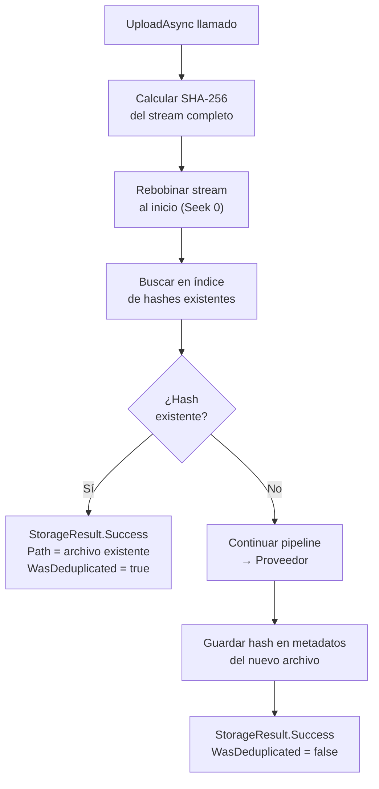

# Deduplicación

El `DeduplicationMiddleware` evita almacenar el mismo contenido dos veces. Calcula un hash SHA-256 del contenido del archivo y, si ya existe un archivo con el mismo hash, retorna el archivo existente en lugar de crear un duplicado. El campo `WasDeduplicated` en el resultado indica si se reutilizó un archivo existente.

## Activación

```csharp
.WithPipeline(p => p
    .UseDeduplication(d =>
    {
        d.HashAlgorithm = DeduplicationHashAlgorithm.SHA256;
        d.Scope = DeduplicationScope.Global; // Deduplicar en todo el almacenamiento
    })
)
```

## DeduplicationOptions

```csharp
public class DeduplicationOptions
{
    /// <summary>Algoritmo de hash para comparar contenidos. Por defecto: SHA256.</summary>
    public DeduplicationHashAlgorithm HashAlgorithm { get; set; } = DeduplicationHashAlgorithm.SHA256;

    /// <summary>
    /// Alcance de la búsqueda de duplicados.
    /// Global: en todo el almacenamiento.
    /// ByPrefix: solo dentro del mismo directorio del archivo.
    /// </summary>
    public DeduplicationScope Scope { get; set; } = DeduplicationScope.Global;

    /// <summary>Nombre del campo de metadatos donde se almacena el hash. Por defecto: "x-vali-content-hash".</summary>
    public string StorageHashMetadataKey { get; set; } = "x-vali-content-hash";
}

public enum DeduplicationHashAlgorithm { SHA256, SHA512, MD5 }
public enum DeduplicationScope { Global, ByPrefix }
```

### Tabla de opciones

| Opción | Por defecto | Descripción |
|---|---|---|
| `HashAlgorithm` | `SHA256` | Algoritmo para calcular el fingerprint del contenido |
| `Scope` | `Global` | Alcance de la búsqueda: `Global` (todo el storage) o `ByPrefix` (mismo directorio) |
| `StorageHashMetadataKey` | `x-vali-content-hash` | Clave de metadato donde se almacena el hash del archivo |

## Cómo funciona



El proceso detallado es:
1. Calcular SHA-256 del contenido del stream completo
2. Rebobinar el stream para que el siguiente middleware pueda leerlo
3. Buscar en el índice si ya existe un archivo con ese hash
4. Si existe: retornar el archivo existente sin almacenar nada nuevo
5. Si no existe: continuar el pipeline y guardar el hash en los metadatos del archivo nuevo

## Resultado de subida con deduplicación

```csharp
var resultado = await storage.UploadAsync(new UploadRequest
{
    Path = "documentos/informe-anual.pdf",
    Content = pdfStream
}, ct);

if (resultado.IsSuccess)
{
    if (resultado.Value!.WasDeduplicated)
    {
        // El archivo ya existía: se retorna la ruta del existente
        Console.WriteLine($"Archivo duplicado. Reutilizando: {resultado.Value.Path}");
        Console.WriteLine($"Hash SHA-256: {resultado.Value.ContentHash}");
    }
    else
    {
        // Archivo nuevo almacenado correctamente
        Console.WriteLine($"Nuevo archivo almacenado: {resultado.Value.Path}");
    }
}
```

## Índice de hashes

ValiBlob busca duplicados usando un `IDeduplicationIndex`. La implementación predeterminada usa los metadatos del proveedor, pero es O(n) y puede ser lenta con muchos archivos.

### Implementación personalizada con Redis

```csharp
public class RedisDeduplicationIndex(IConnectionMultiplexer redis) : IDeduplicationIndex
{
    private readonly IDatabase _db = redis.GetDatabase();
    private const string Prefijo = "valiblob:hash:";

    public async Task<string?> FindByHashAsync(string hash, CancellationToken ct)
    {
        var valor = await _db.StringGetAsync($"{Prefijo}{hash}");
        return valor.HasValue ? (string?)valor : null;
    }

    public async Task RegisterHashAsync(string hash, string path, CancellationToken ct)
    {
        // TTL de 1 año (ajustar según política de retención)
        await _db.StringSetAsync($"{Prefijo}{hash}", path, TimeSpan.FromDays(365));
    }

    public async Task RemoveHashAsync(string hash, CancellationToken ct)
    {
        await _db.KeyDeleteAsync($"{Prefijo}{hash}");
    }
}

// Registro en el contenedor de DI
builder.Services.AddSingleton<IDeduplicationIndex, RedisDeduplicationIndex>();
```

### Implementación con Entity Framework Core

```csharp
public class EFCoreDeduplicationIndex(AppDbContext db) : IDeduplicationIndex
{
    public async Task<string?> FindByHashAsync(string hash, CancellationToken ct)
    {
        return await db.HashesDeArchivo
            .Where(h => h.Hash == hash)
            .Select(h => h.Path)
            .FirstOrDefaultAsync(ct);
    }

    public async Task RegisterHashAsync(string hash, string path, CancellationToken ct)
    {
        db.HashesDeArchivo.Add(new HashDeArchivo
        {
            Hash = hash,
            Path = path,
            CreadoEn = DateTime.UtcNow
        });
        await db.SaveChangesAsync(ct);
    }

    public async Task RemoveHashAsync(string hash, CancellationToken ct)
    {
        await db.HashesDeArchivo
            .Where(h => h.Hash == hash)
            .ExecuteDeleteAsync(ct);
    }
}

// Modelo de entidad
public class HashDeArchivo
{
    public int Id { get; set; }
    public required string Hash { get; set; }  // Indexado en la base de datos
    public required string Path { get; set; }
    public DateTime CreadoEn { get; set; }
}
```

## Deduplicación por prefijo

Para limitar la búsqueda de duplicados al mismo directorio del archivo:

```csharp
.UseDeduplication(d =>
{
    d.Scope = DeduplicationScope.ByPrefix;
    // "uploads/usuario-123/foto.jpg" solo busca duplicados en "uploads/usuario-123/"
    // "backups/2024/dump.sql" solo busca en "backups/2024/"
})
```

Útil cuando diferentes tenants o usuarios pueden tener el mismo archivo y no se desea que compitan por el mismo espacio de almacenamiento.

## Impacto en rendimiento

| Operación | Costo | Notas |
|---|---|---|
| Cálculo de hash SHA-256 | ~50 ms por 100 MB | Procesado en streaming, memoria constante |
| Búsqueda en índice de metadatos | O(n) lineal | Lento para muchos archivos, sin IDeduplicationIndex |
| Búsqueda en Redis | O(1) | Recomendado para producción |
| Búsqueda en BD con índice en hash | O(log n) | Excelente opción con índice en columna Hash |
| Rebobinado del stream | ~0 ms | Solo si el stream soporta `CanSeek = true` |

## Verificar hash de un archivo almacenado

```csharp
var meta = await storage.GetMetadataAsync("documentos/informe-anual.pdf", ct);
if (meta.IsSuccess && meta.Value!.CustomMetadata.TryGetValue("x-vali-content-hash", out var hash))
{
    Console.WriteLine($"Hash SHA-256: {hash}");
    // "e3b0c44298fc1c149afbf4c8996fb92427ae41e4649b934ca495991b7852b855"
}
```

El hash también está disponible como propiedad directa de `FileMetadata`:

```csharp
Console.WriteLine(meta.Value!.ContentHash);
```

:::warning Advertencia
La deduplicación requiere que el stream soporte `Seek` (`CanSeek = true`) para rebobinarlo después del cálculo del hash. Si el stream no admite posicionamiento (como un stream de red puro), ValiBlob lo copia a un `MemoryStream` interno antes de calcular el hash, lo que puede ser costoso para archivos de varios GB. Proporciona siempre `KnownSize` en `UploadRequest` para ayudar a pre-asignar el buffer.
:::

:::tip Consejo
La deduplicación es especialmente valiosa cuando los usuarios suben frecuentemente los mismos archivos (catálogos de productos, materiales de referencia, plantillas). Para documentos únicos por usuario, el overhead puede no justificarse. Mide el porcentaje de duplicados reales en tu sistema antes de activarla en producción.
:::

:::info Información
El hash SHA-256 produce una huella digital de 256 bits. La probabilidad de colisión (dos archivos diferentes con el mismo hash) es criptográficamente despreciable: aproximadamente 1 en 2^128. SHA-256 es la opción recomendada. MD5 está disponible pero es criptográficamente débil; úsalo solo si necesitas compatibilidad con sistemas existentes.
:::
