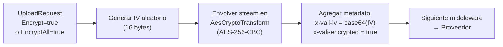
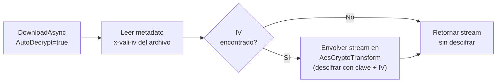

# Cifrado

El `EncryptionMiddleware` cifra los archivos con **AES-256-CBC** antes de almacenarlos. El descifrado se aplica automáticamente al descargar, de forma completamente transparente para el consumidor. Cada archivo usa un **IV (vector de inicialización) aleatorio único** de 128 bits, almacenado en el metadato `x-vali-iv`.

## Activación

```csharp
.WithPipeline(p => p
    .UseEncryption(e =>
    {
        e.Key = Convert.FromBase64String(
            builder.Configuration["Storage:EncryptionKey"]!);
        e.EncryptAll = false; // Solo cifrar cuando Encrypt=true en el request
    })
)
```

## EncryptionOptions

```csharp
public class EncryptionOptions
{
    /// <summary>Clave AES-256 de exactamente 32 bytes. Requerida.</summary>
    public required byte[] Key { get; set; }

    /// <summary>Si true, cifra todos los archivos sin importar el campo Encrypt del request.</summary>
    public bool EncryptAll { get; set; } = false;
}
```

### Tabla de opciones

| Opción | Por defecto | Descripción |
|---|---|---|
| `Key` | — | Clave AES-256 de exactamente 32 bytes (256 bits). Requerida. |
| `EncryptAll` | `false` | Forzar cifrado de todos los archivos, ignorando el campo `Encrypt` del request |

## Generar una clave segura

```csharp
// Generar clave de 256 bits (32 bytes) criptográficamente segura
using var rng = RandomNumberGenerator.Create();
var key = new byte[32];
rng.GetBytes(key);
Console.WriteLine(Convert.ToBase64String(key));
// Ejemplo de salida: "K7gNU3sdo+OL0wNhqoVWhr3g6s1xYv72ol/pe/Unols="
```

Ejecuta este fragmento una vez en tu entorno y guarda el resultado en tu sistema de gestión de secretos. **Nunca lo incluyas en el código fuente.**

## Cómo funciona

### En la subida



### En la descarga



El IV se lee de los metadatos del archivo en cada descarga. La clave nunca se almacena: debe estar disponible en la configuración del servicio tanto para cifrar como para descifrar.

## Ejemplos de uso

### Cifrar al subir (opt-in por request)

```csharp
var resultado = await storage.UploadAsync(new UploadRequest
{
    Path = "contratos/confidencial/acuerdo-2024.pdf",
    Content = pdfStream,
    ContentType = "application/pdf",
    Encrypt = true  // Opt-in explícito
}, ct);
```

### Cifrar todos los archivos automáticamente

```csharp
.UseEncryption(e =>
{
    e.Key = Convert.FromBase64String(config["Storage:EncryptionKey"]!);
    e.EncryptAll = true;  // Todo se cifra, sin excepción
})
```

### Descifrado automático en descarga

```csharp
// AutoDecrypt=true por defecto: descifrado completamente transparente
var resultado = await storage.DownloadAsync(new DownloadRequest
{
    Path = "contratos/confidencial/acuerdo-2024.pdf"
    // AutoDecrypt = true (valor por defecto)
}, ct);

// El stream ya está descifrado, no se requiere ninguna acción adicional
return Results.Stream(resultado.Value!, "application/pdf");
```

### Descargar sin descifrar

```csharp
// Obtener el archivo tal como está almacenado (cifrado AES)
var resultado = await storage.DownloadAsync(new DownloadRequest
{
    Path = "contratos/confidencial/acuerdo-2024.pdf",
    AutoDecrypt = false  // Obtener bytes AES sin descifrar
}, ct);

await using var archivoLocal = File.Create("backup-cifrado.pdf.enc");
await resultado.Value!.CopyToAsync(archivoLocal, ct);
```

### Verificar si un archivo está cifrado

```csharp
var meta = await storage.GetMetadataAsync("contratos/acuerdo-2024.pdf", ct);
if (meta.IsSuccess)
{
    // Propiedad directa de FileMetadata
    Console.WriteLine($"¿Cifrado? {meta.Value!.IsEncrypted}");

    // El IV también está disponible en los metadatos personalizados
    if (meta.Value.CustomMetadata.TryGetValue("x-vali-iv", out var iv))
        Console.WriteLine($"IV (base64): {iv}");
}
```

## Configuración segura de la clave

### Con User Secrets (desarrollo)

```bash
dotnet user-secrets set "Storage:EncryptionKey" "K7gNU3sdo+OL0wNhqoVWhr3g6s1xYv72ol/pe/Unols="
```

```csharp
.UseEncryption(e =>
{
    var keyBase64 = builder.Configuration["Storage:EncryptionKey"]
        ?? throw new InvalidOperationException("Clave de cifrado no configurada.");
    e.Key = Convert.FromBase64String(keyBase64);
})
```

### Con Azure Key Vault

```csharp
builder.Configuration.AddAzureKeyVault(
    new Uri($"https://{builder.Configuration["KeyVault:Name"]}.vault.azure.net/"),
    new DefaultAzureCredential());

.UseEncryption(e =>
{
    e.Key = Convert.FromBase64String(
        builder.Configuration["storage-encryption-key"]
            ?? throw new InvalidOperationException("Clave no encontrada en Key Vault."));
})
```

### Con AWS Secrets Manager

```csharp
builder.Configuration.AddSecretsManager(region: RegionEndpoint.SAEast1, configurator: opts =>
{
    opts.SecretFilter = entry => entry.Name.StartsWith("miapp/storage");
    opts.KeyGenerator = (entry, key) => key.Replace("miapp/storage/", "Storage:");
});

.UseEncryption(e =>
{
    e.Key = Convert.FromBase64String(builder.Configuration["Storage:EncryptionKey"]!);
})
```

## Rotación de clave

La rotación de clave requiere descifrar con la clave antigua y re-cifrar con la clave nueva:

```csharp
public async Task RotarClaveAsync(
    IStorageProvider storageAntigua,    // Pipeline configurado con clave antigua
    IStorageProvider storagaNueva,      // Pipeline configurado con clave nueva
    IEnumerable<string> rutas,
    CancellationToken ct)
{
    foreach (var ruta in rutas)
    {
        // 1. Descifrar con clave antigua
        var descarga = await storageAntigua.DownloadAsync(new DownloadRequest
        {
            Path = ruta,
            AutoDecrypt = true
        }, ct);

        if (!descarga.IsSuccess) continue;

        var meta = await storageAntigua.GetMetadataAsync(ruta, ct);

        // 2. Re-cifrar con clave nueva (usando el segundo proveedor)
        var buffer = new MemoryStream();
        await descarga.Value!.CopyToAsync(buffer, ct);
        buffer.Position = 0;

        await storagaNueva.UploadAsync(new UploadRequest
        {
            Path = ruta,
            Content = buffer,
            ContentType = meta.Value?.ContentType ?? "application/octet-stream",
            Encrypt = true,
            Metadata = meta.Value?.CustomMetadata
        }, ct);
    }
}
```

## Consideraciones de seguridad

| Aspecto | Implementación |
|---|---|
| Algoritmo | AES-256-CBC (estándar NIST) |
| Tamaño de clave | 256 bits (32 bytes) |
| IV por archivo | 128 bits (16 bytes), generado con `RandomNumberGenerator` |
| Almacenamiento del IV | Metadatos del archivo (`x-vali-iv`, en base64) |
| Padding | PKCS7 |
| Tipo de cifrado | Client-side (el proveedor nunca ve datos en claro) |

## Orden en el pipeline

La compresión debe ir **antes** del cifrado. Los datos cifrados tienen alta entropía aleatoria y GZip no puede comprimirlos:

```csharp
.WithPipeline(p => p
    .UseValidation(...)
    .UseContentTypeDetection()
    .UseCompression()    // Primero comprimir
    .UseEncryption(...)  // Luego cifrar
)
```

:::warning Advertencia
Si pierdes la clave de cifrado (`Key`), **los archivos cifrados son irrecuperables**. No existe ningún mecanismo de recuperación sin la clave original. Almacena siempre la clave en un gestor de secretos con respaldo (Azure Key Vault, AWS KMS, HashiCorp Vault) y define procedimientos claros para la rotación periódica de claves.
:::

:::tip Consejo
Para cumplimiento normativo (GDPR, HIPAA, PCI-DSS), el cifrado del lado del cliente de ValiBlob es más robusto que el cifrado del servidor del proveedor, ya que el proveedor de nube nunca tiene acceso a tus claves ni a tus datos en claro. Documenta el algoritmo, tamaño de clave y política de rotación en tu registro de tratamiento de datos.
:::

:::info Información
El cifrado a nivel de middleware es complementario al cifrado del proveedor de nube (SSE — Server-Side Encryption). Usar ambos niveles proporciona defensa en profundidad: incluso si alguien obtiene acceso directo al bucket del proveedor, los datos permanecen cifrados con tu clave privada.
:::
