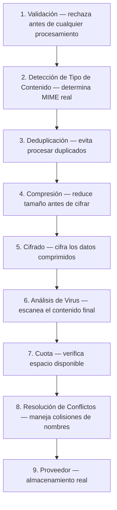

# Arquitectura del Pipeline

El pipeline de ValiBlob es una cadena de middlewares que se aplican automáticamente a las operaciones de almacenamiento. Está inspirado en el middleware de ASP.NET Core: cada componente recibe el contexto de la operación, puede transformarlo o rechazarlo, y decide si pasa la solicitud al siguiente eslabón.

## Diagrama de la cadena de middlewares


El pipeline es unidireccional para escrituras. Las lecturas (descargas) aplican el proceso inverso solo para descifrado y descompresión automáticos.

## Configuración con StoragePipelineBuilder

```csharp
builder.Services
    .AddValiBlob(o => o.DefaultProvider = "aws")
    .AddProvider<AWSS3Provider>("aws", opts => { /* ... */ })
    .WithPipeline(p => p
        .UseValidation(v =>
        {
            v.MaxFileSizeBytes = 100_000_000; // 100 MB
            v.AllowedExtensions = [".pdf", ".jpg", ".png", ".docx"];
        })
        .UseContentTypeDetection()
        .UseDeduplication()
        .UseCompression()
        .UseEncryption(e => e.Key = config["Storage:EncryptionKey"]!)
        .UseVirusScan()
        .UseQuota(q => q.MaxTotalBytes = 10L * 1024 * 1024 * 1024) // 10 GB
        .UseConflictResolution(ConflictResolution.RenameWithSuffix)
    );
```

## StoragePipelineBuilder — API completa

```csharp
public class StoragePipelineBuilder
{
    // Middlewares integrados
    public StoragePipelineBuilder UseValidation(Action<ValidationOptions>? configure = null);
    public StoragePipelineBuilder UseContentTypeDetection(
        Action<ContentTypeDetectionOptions>? configure = null);
    public StoragePipelineBuilder UseDeduplication(
        Action<DeduplicationOptions>? configure = null);
    public StoragePipelineBuilder UseCompression(Action<CompressionOptions>? configure = null);
    public StoragePipelineBuilder UseEncryption(Action<EncryptionOptions> configure);
    public StoragePipelineBuilder UseVirusScan(Action<VirusScanOptions>? configure = null);
    public StoragePipelineBuilder UseQuota(Action<QuotaOptions> configure);
    public StoragePipelineBuilder UseConflictResolution(
        ConflictResolution resolution = ConflictResolution.Fail);

    // Middlewares personalizados
    public StoragePipelineBuilder Use<TMiddleware>()
        where TMiddleware : IStorageMiddleware;
    public StoragePipelineBuilder Use(IStorageMiddleware middleware);
    public StoragePipelineBuilder Use(
        Func<StoragePipelineContext, Func<Task>, Task> middlewareLambda);
}
```

## Interfaz de middleware

```csharp
public interface IStorageMiddleware
{
    Task InvokeAsync(
        StoragePipelineContext context,
        StorageMiddlewareDelegate next,
        CancellationToken ct = default);
}
```

## StoragePipelineContext

El contexto fluye a través de toda la cadena y puede ser modificado por cada middleware:

```csharp
public class StoragePipelineContext
{
    /// <summary>La solicitud de subida en curso (null en descargas).</summary>
    public UploadRequest? UploadRequest { get; set; }

    /// <summary>La solicitud de descarga en curso (null en subidas).</summary>
    public DownloadRequest? DownloadRequest { get; set; }

    /// <summary>Tipo de operación en curso.</summary>
    public StorageOperation Operation { get; set; }

    /// <summary>Resultado de la operación (disponible en el pipeline de retorno).</summary>
    public object? Result { get; set; }

    /// <summary>Si se establece, la operación se cortocircuita con este resultado.</summary>
    public StorageResult<object>? ShortCircuitResult { get; set; }

    /// <summary>Datos que los middlewares pueden compartir entre sí en la misma solicitud.</summary>
    public IDictionary<string, object> Items { get; } = new Dictionary<string, object>();
}
```

## Escribir un middleware personalizado

### Ejemplo: Middleware de marca de agua en imágenes

```csharp
public class MarcaDeAguaMiddleware(IMarcaDeAguaService marcaDeAgua) : IStorageMiddleware
{
    public async Task InvokeAsync(
        StoragePipelineContext context,
        StorageMiddlewareDelegate next,
        CancellationToken ct)
    {
        // Solo aplica en subidas de imágenes
        if (context.Operation == StorageOperation.Upload &&
            context.UploadRequest?.ContentType?.StartsWith("image/") == true)
        {
            var request = context.UploadRequest!;
            var streamConMarca = await marcaDeAgua.AplicarAsync(request.Content, ct);
            request.Content = streamConMarca;
        }

        // Pasar al siguiente middleware en la cadena
        await next();
    }
}
```

### Ejemplo: Middleware de logging de rendimiento

```csharp
public class LoggingRendimientoMiddleware(ILogger<LoggingRendimientoMiddleware> logger)
    : IStorageMiddleware
{
    public async Task InvokeAsync(
        StoragePipelineContext context,
        StorageMiddlewareDelegate next,
        CancellationToken ct)
    {
        var cronometro = Stopwatch.StartNew();
        var operacion = context.Operation;
        var ruta = context.UploadRequest?.Path ?? context.DownloadRequest?.Path ?? "desconocida";

        try
        {
            await next();
            cronometro.Stop();

            logger.LogInformation(
                "Operación {Operacion} completada en {Ms}ms. Path={Path}",
                operacion, cronometro.ElapsedMilliseconds, ruta);
        }
        catch (Exception ex)
        {
            cronometro.Stop();
            logger.LogError(ex,
                "Operación {Operacion} falló en {Ms}ms. Path={Path}",
                operacion, cronometro.ElapsedMilliseconds, ruta);
            throw;
        }
    }
}
```

### Ejemplo: Middleware con cortocircuito

Un middleware puede abortar la operación sin llegar al proveedor estableciendo `ShortCircuitResult`:

```csharp
public class RestriccionHorarioMiddleware : IStorageMiddleware
{
    public async Task InvokeAsync(
        StoragePipelineContext context,
        StorageMiddlewareDelegate next,
        CancellationToken ct)
    {
        var ahora = DateTime.UtcNow;
        var esHorarioLaboral = ahora.DayOfWeek is >= DayOfWeek.Monday and <= DayOfWeek.Friday
                            && ahora.Hour >= 8 && ahora.Hour < 18;

        if (!esHorarioLaboral && context.Operation == StorageOperation.Upload)
        {
            // Cortocircuitar — la operación no llega al proveedor
            context.ShortCircuitResult = StorageResult<object>.Failure(
                StorageErrorCode.PermissionDenied,
                "Las subidas solo están permitidas en horario laboral (L-V 08:00-18:00 UTC).");
            return; // No llamar a next()
        }

        await next();
    }
}
```

### Registro de middlewares personalizados

```csharp
// Por tipo — se resuelve desde el contenedor de DI
.WithPipeline(p => p
    .UseValidation()
    .Use<MarcaDeAguaMiddleware>()
    .Use<LoggingRendimientoMiddleware>()
    .Use<RestriccionHorarioMiddleware>()
)

// Por instancia directa
.WithPipeline(p => p
    .Use(new MarcaDeAguaMiddleware(servicioMarca))
)

// Lambda inline para lógica simple
.WithPipeline(p => p
    .Use(async (context, next) =>
    {
        // Agregar metadato de ambiente
        if (context.Operation == StorageOperation.Upload && context.UploadRequest is not null)
            context.UploadRequest.Metadata ??= new Dictionary<string, string>();

        context.UploadRequest?.Metadata?.TryAdd("ambiente", "produccion");
        await next();
    })
)
```

## Orden de ejecución recomendado



:::warning Advertencia
El orden del pipeline tiene impacto directo en el comportamiento:
- La **compresión** debe ir **antes** del **cifrado** (datos cifrados tienen alta entropía y no se comprimen bien).
- La **detección de tipo** debe ir **antes** de la **validación de tipo** (para detectar el MIME real del archivo, no el declarado por el cliente).
- La **deduplicación** debe ir **antes** de la **compresión y cifrado** (para comparar el contenido original sin transformar).
:::

## Pipelines por proveedor

Puedes configurar pipelines distintos para cada proveedor registrado:

```csharp
builder.Services
    .AddValiBlob(o => o.DefaultProvider = "aws")
    .AddProvider<AWSS3Provider>("aws", opts => { /* ... */ })
        .WithPipeline(p => p
            .UseValidation(v => v.MaxFileSizeBytes = 5_000_000_000L) // 5 GB para S3
            .UseCompression()
            .UseEncryption(e => e.Key = config["AWS:EncryptionKey"]!)
        )
    .AddProvider<LocalStorageProvider>("local", opts => { /* ... */ })
        .WithPipeline(p => p
            .UseValidation(v => v.MaxFileSizeBytes = 10_000_000) // 10 MB para local
            .UseContentTypeDetection()
        );
```

:::tip Consejo
No es necesario usar todos los middlewares. Un pipeline mínimo de producción típico incluye: `UseValidation` + `UseContentTypeDetection` + `UseConflictResolution`. Agrega los demás según los requisitos específicos de seguridad, costos y rendimiento de tu aplicación.
:::
