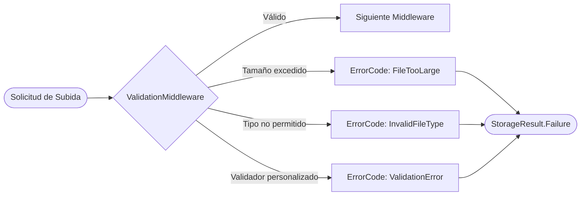

# Validación

El `ValidationMiddleware` es el primer guardián del pipeline. Verifica que los archivos cumplan con los requisitos de tipo, tamaño y extensión antes de que cualquier otro procesamiento ocurra, rechazando las solicitudes inválidas de forma temprana y eficiente.

## Configuración

```csharp
.WithPipeline(p => p
    .UseValidation(v =>
    {
        v.MaxFileSizeBytes = 50_000_000;                // 50 MB máximo
        v.MinFileSizeBytes = 1;                         // Sin archivos vacíos
        v.AllowedExtensions = [".jpg", ".jpeg", ".png", ".pdf", ".docx", ".xlsx"];
        v.BlockedExtensions = [".exe", ".bat", ".sh", ".ps1", ".vbs", ".dll"];
        v.AllowedContentTypes = ["image/jpeg", "image/png", "application/pdf"];
        v.MaxFileNameLength = 255;
        v.AllowEmptyFiles = false;
    })
)
```

## ValidationOptions — todos los campos

```csharp
public class ValidationOptions
{
    /// <summary>Tamaño máximo del archivo en bytes. null = sin límite.</summary>
    public long? MaxFileSizeBytes { get; set; }

    /// <summary>Tamaño mínimo del archivo en bytes.</summary>
    public long MinFileSizeBytes { get; set; } = 0;

    /// <summary>Extensiones permitidas (con punto, ej: ".pdf"). null = todas.</summary>
    public IReadOnlyList<string>? AllowedExtensions { get; set; }

    /// <summary>Extensiones bloqueadas. Tiene prioridad sobre AllowedExtensions.</summary>
    public IReadOnlyList<string>? BlockedExtensions { get; set; }

    /// <summary>Tipos MIME permitidos. null = todos.</summary>
    public IReadOnlyList<string>? AllowedContentTypes { get; set; }

    /// <summary>Tipos MIME bloqueados.</summary>
    public IReadOnlyList<string>? BlockedContentTypes { get; set; }

    /// <summary>Longitud máxima del nombre de archivo.</summary>
    public int MaxFileNameLength { get; set; } = 1024;

    /// <summary>¿Permitir archivos de 0 bytes?</summary>
    public bool AllowEmptyFiles { get; set; } = false;

    /// <summary>Validadores personalizados adicionales.</summary>
    public IList<IFileValidator> CustomValidators { get; set; } = [];
}
```

### Tabla de opciones

| Opción | Tipo | Por defecto | Descripción |
|---|---|---|---|
| `MaxFileSizeBytes` | `long?` | `null` | Tamaño máximo. Superar retorna `FileTooLarge` |
| `MinFileSizeBytes` | `long` | `0` | Tamaño mínimo. Archivo menor retorna `ValidationError` |
| `AllowedExtensions` | `IReadOnlyList<string>?` | `null` | Lista blanca. `null` permite todas las extensiones |
| `BlockedExtensions` | `IReadOnlyList<string>?` | `null` | Lista negra. Bloquea incluso si está en `AllowedExtensions` |
| `AllowedContentTypes` | `IReadOnlyList<string>?` | `null` | Lista blanca de tipos MIME |
| `BlockedContentTypes` | `IReadOnlyList<string>?` | `null` | Lista negra de tipos MIME |
| `MaxFileNameLength` | `int` | `1024` | Longitud máxima del nombre de archivo |
| `AllowEmptyFiles` | `bool` | `false` | Permitir archivos de 0 bytes |
| `CustomValidators` | `IList<IFileValidator>` | `[]` | Validadores personalizados |

## Códigos de error retornados

| Condición | ErrorCode |
|---|---|
| Archivo supera `MaxFileSizeBytes` | `FileTooLarge` |
| Archivo menor que `MinFileSizeBytes` | `ValidationError` |
| Extensión no en `AllowedExtensions` | `InvalidFileType` |
| Extensión en `BlockedExtensions` | `InvalidFileType` |
| Tipo MIME no en `AllowedContentTypes` | `InvalidFileType` |
| Tipo MIME en `BlockedContentTypes` | `InvalidFileType` |
| Nombre de archivo supera `MaxFileNameLength` | `InvalidPath` |
| Archivo vacío con `AllowEmptyFiles=false` | `ValidationError` |
| Falla un `IFileValidator` personalizado | `ValidationError` (u otro código que defina el validador) |

## Configuraciones de ejemplo

### Solo imágenes pequeñas (avatares)

```csharp
.UseValidation(v =>
{
    v.MaxFileSizeBytes = 5_000_000; // 5 MB
    v.AllowedExtensions = [".jpg", ".jpeg", ".png", ".gif", ".webp"];
    v.AllowedContentTypes = ["image/jpeg", "image/png", "image/gif", "image/webp"];
    v.AllowEmptyFiles = false;
})
```

### Documentos empresariales

```csharp
.UseValidation(v =>
{
    v.MaxFileSizeBytes = 100_000_000; // 100 MB
    v.AllowedExtensions =
    [
        ".pdf", ".docx", ".doc", ".xlsx", ".xls",
        ".pptx", ".ppt", ".txt", ".csv", ".odt", ".ods"
    ];
    v.BlockedContentTypes =
    [
        "application/x-executable",
        "application/x-msdownload",
        "application/x-sh"
    ];
})
```

### Archivos de respaldo grandes con lista negra de ejecutables

```csharp
.UseValidation(v =>
{
    v.MaxFileSizeBytes = 10_000_000_000L; // 10 GB
    v.BlockedExtensions =
    [
        ".exe", ".bat", ".cmd", ".com", ".msi",
        ".sh", ".bash", ".ps1", ".psm1",
        ".vbs", ".js", ".jse", ".wsf",
        ".dll", ".scr", ".hta", ".pif"
    ];
})
```

## IFileValidator personalizado

Para lógica de validación que no cubre `ValidationOptions`, implementa `IFileValidator`:

```csharp
public interface IFileValidator
{
    Task<FileValidationResult> ValidateAsync(
        UploadRequest request,
        CancellationToken ct = default);
}

public record FileValidationResult(
    bool IsValid,
    StorageErrorCode? ErrorCode = null,
    string? ErrorMessage = null)
{
    public static FileValidationResult Success() => new(true);

    public static FileValidationResult Failure(StorageErrorCode code, string message)
        => new(false, code, message);
}
```

### Ejemplo: Validar dimensiones de imagen

```csharp
public class ValidadorDimensionesImagen : IFileValidator
{
    private readonly int _anchoMaximo;
    private readonly int _altoMaximo;

    public ValidadorDimensionesImagen(int anchoMaximo = 4096, int altoMaximo = 4096)
    {
        _anchoMaximo = anchoMaximo;
        _altoMaximo = altoMaximo;
    }

    public async Task<FileValidationResult> ValidateAsync(UploadRequest request, CancellationToken ct)
    {
        if (request.ContentType?.StartsWith("image/") != true)
            return FileValidationResult.Success(); // No aplica a no-imágenes

        if (!request.Content.CanSeek)
            return FileValidationResult.Success(); // No se puede validar sin seek

        var posicionOriginal = request.Content.Position;

        try
        {
            using var imagen = await Image.LoadAsync(request.Content, ct);

            if (imagen.Width > _anchoMaximo || imagen.Height > _altoMaximo)
            {
                return FileValidationResult.Failure(
                    StorageErrorCode.ValidationError,
                    $"La imagen supera las dimensiones máximas ({_anchoMaximo}x{_altoMaximo}px). " +
                    $"Dimensiones recibidas: {imagen.Width}x{imagen.Height}px.");
            }

            return FileValidationResult.Success();
        }
        finally
        {
            request.Content.Position = posicionOriginal; // Rebobinar stream
        }
    }
}
```

### Registro del validador personalizado

```csharp
.UseValidation(v =>
{
    v.MaxFileSizeBytes = 20_000_000;
    v.AllowedContentTypes = ["image/jpeg", "image/png", "image/webp"];
    v.CustomValidators.Add(new ValidadorDimensionesImagen(
        anchoMaximo: 3840,
        altoMaximo: 2160));
})
```

## Qué sucede al fallar la validación



Cuando la validación falla:
1. El pipeline se **cortocircuita** — ningún middleware posterior se ejecuta.
2. Se publica un evento `FileUploadFailedEvent` con el código de error correspondiente.
3. `UploadAsync` retorna `StorageResult.Failure` con el código apropiado.
4. El archivo **no se almacena** ni se procesa por el proveedor.

:::tip Consejo
Combina siempre `UseValidation` con `UseContentTypeDetection` para validar el tipo MIME real del archivo en lugar del tipo declarado por el cliente. Coloca `UseContentTypeDetection` **antes** de `UseValidation` en el pipeline para que la detección ocurra primero.
:::

:::warning Advertencia
Las extensiones de archivo son fácilmente falsificables — renombrar `malware.exe` a `documento.pdf` engaña la validación por extensión. Usa siempre `UseContentTypeDetection` junto con validación de tipos MIME permitidos, y considera agregar `UseVirusScan` para archivos críticos de negocio.
:::
