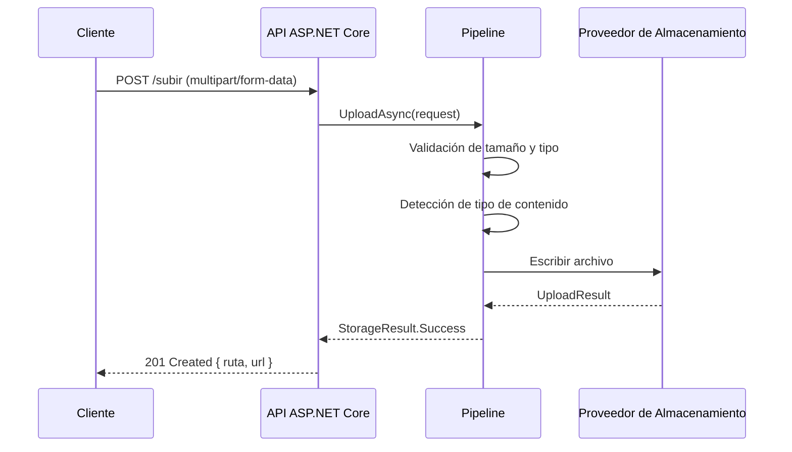

# Inicio Rápido

Esta guía te lleva desde cero hasta una API completamente funcional con ValiBlob en menos de 10 minutos. Usaremos el proveedor local para el desarrollo y mostraremos cómo migrar a AWS S3 para producción con un solo cambio.

## 1. Instalar los paquetes

Para este ejemplo de inicio rápido usaremos el proveedor local, ideal para desarrollo sin dependencias externas.

```bash
dotnet add package ValiBlob.Core
dotnet add package ValiBlob.Local
```

Para producción con Amazon S3, reemplaza `ValiBlob.Local` por el proveedor correspondiente:

```bash
dotnet add package ValiBlob.AWS
```

## 2. Configurar la inyección de dependencias

### Con proveedor local (desarrollo)

```csharp
using ValiBlob.Core.Extensions;
using ValiBlob.Local;

var builder = WebApplication.CreateBuilder(args);

builder.Services
    .AddValiBlob(options =>
    {
        options.DefaultProvider = "local";
    })
    .AddProvider<LocalStorageProvider>("local", opts =>
    {
        opts.BasePath = "./storage";
        opts.CreateIfNotExists = true;
        opts.PublicBaseUrl = "https://localhost:5001/archivos";
    });

var app = builder.Build();
```

### Con Amazon S3 (producción)

```csharp
using ValiBlob.Core.Extensions;
using ValiBlob.AWS;

builder.Services
    .AddValiBlob(options =>
    {
        options.DefaultProvider = "s3";
    })
    .AddProvider<AWSS3Provider>("s3", opts =>
    {
        opts.BucketName = builder.Configuration["AWS:BucketName"]!;
        opts.Region = builder.Configuration["AWS:Region"]!;
        opts.AccessKey = builder.Configuration["AWS:AccessKey"]!;
        opts.SecretKey = builder.Configuration["AWS:SecretKey"]!;
    });
```

### Con pipeline completo (recomendado para producción)

```csharp
builder.Services
    .AddValiBlob(options => { options.DefaultProvider = "s3"; })
    .AddProvider<AWSS3Provider>("s3", opts =>
    {
        opts.BucketName = "mi-bucket-produccion";
        opts.Region = "us-east-1";
    })
    .WithPipeline(p => p
        .UseValidation(v =>
        {
            v.MaxFileSizeBytes = 50_000_000; // 50 MB
            v.AllowedExtensions = [".jpg", ".jpeg", ".png", ".pdf", ".docx", ".xlsx"];
        })
        .UseContentTypeDetection()
        .UseDeduplication()
        .UseConflictResolution(ConflictResolution.RenameWithSuffix)
    );
```

## 3. Subir un archivo

### En una Minimal API de ASP.NET Core

```csharp
app.MapPost("/subir", async (
    IFormFile archivo,
    IStorageProvider storage,
    CancellationToken ct) =>
{
    if (archivo.Length == 0)
        return Results.BadRequest("El archivo no puede estar vacío.");

    await using var stream = archivo.OpenReadStream();

    var resultado = await storage.UploadAsync(new UploadRequest
    {
        Path = StoragePath.From("subidas", StoragePath.Sanitize(archivo.FileName))
                          .WithTimestampPrefix(),
        Content = stream,
        ContentType = archivo.ContentType,
        KnownSize = archivo.Length,
        Metadata = new Dictionary<string, string>
        {
            ["nombre-original"] = archivo.FileName,
            ["subido-en"] = DateTimeOffset.UtcNow.ToString("O")
        }
    }, ct);

    if (!resultado.IsSuccess)
    {
        return resultado.ErrorCode switch
        {
            StorageErrorCode.FileTooLarge =>
                Results.Problem("El archivo es demasiado grande.", statusCode: 413),
            StorageErrorCode.InvalidFileType =>
                Results.Problem("El tipo de archivo no está permitido.", statusCode: 415),
            _ =>
                Results.Problem(resultado.ErrorMessage, statusCode: 500)
        };
    }

    return Results.Created($"/archivos/{Uri.EscapeDataString(resultado.Value!.Path)}", new
    {
        ruta = resultado.Value.Path,
        url = resultado.Value.Url,
        tamanoBytes = resultado.Value.SizeBytes
    });
})
.DisableAntiforgery();
```

## 4. Descargar un archivo

```csharp
app.MapGet("/archivos/{*ruta}", async (
    string ruta,
    IStorageProvider storage,
    CancellationToken ct) =>
{
    var descarga = await storage.DownloadAsync(new DownloadRequest
    {
        Path = Uri.UnescapeDataString(ruta)
    }, ct);

    if (!descarga.IsSuccess)
    {
        return descarga.ErrorCode == StorageErrorCode.NotFound
            ? Results.NotFound()
            : Results.StatusCode(500);
    }

    var meta = await storage.GetMetadataAsync(ruta, ct);
    var tipoContenido = meta.Value?.ContentType ?? "application/octet-stream";
    var nombreArchivo = StoragePath.GetFileName(ruta);

    return Results.Stream(descarga.Value!, tipoContenido, nombreArchivo);
});
```

## 5. Eliminar y verificar existencia

```csharp
// Eliminar un archivo
app.MapDelete("/archivos/{*ruta}", async (
    string ruta,
    IStorageProvider storage,
    CancellationToken ct) =>
{
    var resultado = await storage.DeleteAsync(Uri.UnescapeDataString(ruta), ct);
    return resultado.IsSuccess ? Results.NoContent() : Results.NotFound();
});

// Verificar si un archivo existe
app.MapGet("/archivos/{*ruta}/existe", async (
    string ruta,
    IStorageProvider storage,
    CancellationToken ct) =>
{
    var resultado = await storage.ExistsAsync(Uri.UnescapeDataString(ruta), ct);
    return resultado.IsSuccess
        ? Results.Ok(new { existe = resultado.Value })
        : Results.StatusCode(500);
});
```

## 6. Manejo correcto de errores

ValiBlob nunca lanza excepciones inesperadas. Todos los resultados se devuelven como `StorageResult`:

```csharp
var resultado = await storage.UploadAsync(request, ct);

switch (resultado.ErrorCode)
{
    case null when resultado.IsSuccess:
        logger.LogInformation("Archivo subido: {Path}", resultado.Value!.Path);
        break;

    case StorageErrorCode.FileTooLarge:
        return Results.Problem("El archivo supera el límite de tamaño.", statusCode: 413);

    case StorageErrorCode.InvalidFileType:
        return Results.Problem("El tipo de archivo no está permitido.", statusCode: 415);

    case StorageErrorCode.QuotaExceeded:
        return Results.Problem("Se ha superado la cuota de almacenamiento.", statusCode: 507);

    case StorageErrorCode.VirusDetected:
        logger.LogWarning("Archivo infectado bloqueado: {Mensaje}", resultado.ErrorMessage);
        return Results.Problem("El archivo contiene contenido malicioso.", statusCode: 422);

    case StorageErrorCode.ProviderError:
    case StorageErrorCode.NetworkError:
        logger.LogError(resultado.Exception, "Error de infraestructura");
        return Results.Problem("Servicio de almacenamiento no disponible.", statusCode: 503);

    default:
        logger.LogError("Error no manejado: {Codigo}", resultado.ErrorCode);
        return Results.Problem("Error interno.", statusCode: 500);
}
```

## Ejemplo completo: Minimal API funcional

```csharp
using ValiBlob.Core;
using ValiBlob.Core.Extensions;
using ValiBlob.Local;

var builder = WebApplication.CreateBuilder(args);

builder.Services
    .AddValiBlob(o => o.DefaultProvider = "local")
    .AddProvider<LocalStorageProvider>("local", o =>
    {
        o.BasePath = "./storage";
        o.CreateIfNotExists = true;
        o.PublicBaseUrl = "http://localhost:5000/archivos";
    })
    .WithPipeline(p => p
        .UseValidation(v => v.MaxFileSizeBytes = 10_000_000) // 10 MB
        .UseContentTypeDetection()
    );

var app = builder.Build();
app.UseStaticFiles(); // Para servir archivos del proveedor local

// Subir archivo
app.MapPost("/subir", async (IFormFile archivo, IStorageProvider storage, CancellationToken ct) =>
{
    await using var stream = archivo.OpenReadStream();
    var resultado = await storage.UploadAsync(new UploadRequest
    {
        Path = StoragePath.From("subidas", StoragePath.Sanitize(archivo.FileName))
                          .WithTimestampPrefix(),
        Content = stream,
        ContentType = archivo.ContentType
    }, ct);

    return resultado.IsSuccess
        ? Results.Ok(new { ruta = resultado.Value!.Path, url = resultado.Value.Url })
        : Results.BadRequest(new { error = resultado.ErrorCode?.ToString(), mensaje = resultado.ErrorMessage });
}).DisableAntiforgery();

// Descargar archivo
app.MapGet("/archivos/{*ruta}", async (string ruta, IStorageProvider storage, CancellationToken ct) =>
{
    var descarga = await storage.DownloadAsync(new DownloadRequest { Path = ruta }, ct);
    if (!descarga.IsSuccess) return Results.NotFound();

    var meta = await storage.GetMetadataAsync(ruta, ct);
    var tipo = meta.Value?.ContentType ?? "application/octet-stream";
    return Results.Stream(descarga.Value!, tipo);
});

app.Run();
```

## Diagrama del flujo de subida



:::tip Consejo
Comienza siempre con `ValiBlob.Local` en desarrollo. La interfaz es 100% idéntica a los proveedores de nube, por lo que migrar a producción solo requiere cambiar la configuración del proveedor en `Program.cs`.
:::

:::warning Advertencia
No uses `LocalStorageProvider` en producción con múltiples instancias de servidor (escalado horizontal), ya que el sistema de archivos local no es compartido entre instancias. Para entornos con múltiples nodos, usa un proveedor de nube como AWS S3 o Azure Blob Storage.
:::

## Próximos pasos

- Revisa el [catálogo completo de paquetes](./packages) para seleccionar el proveedor adecuado.
- Aprende sobre la [arquitectura del pipeline](./pipeline/overview) para agregar compresión, cifrado y más.
- Configura [subidas reanudables](./resumable/overview) para archivos grandes.
