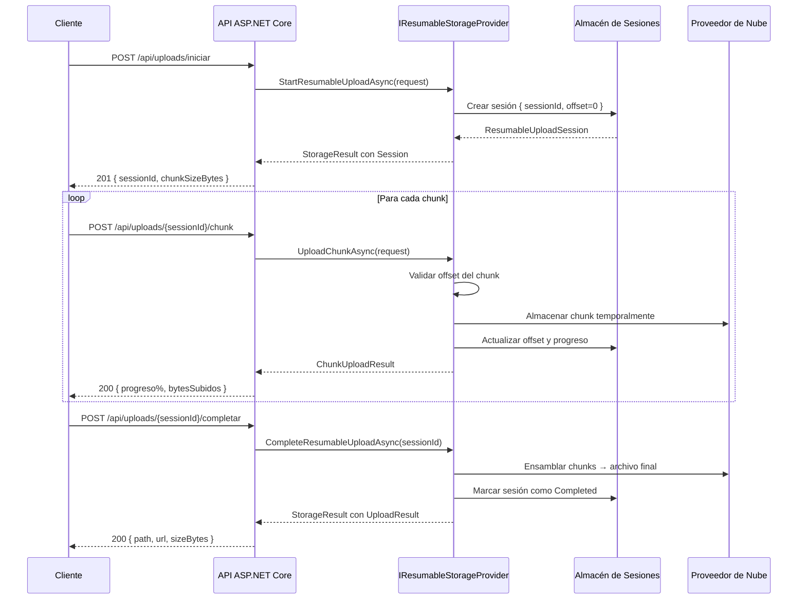

# Subidas Reanudables

Las subidas reanudables permiten transferir archivos grandes en fragmentos (chunks) que pueden interrumpirse y retomarse exactamente desde donde quedaron. Son el mecanismo recomendado para archivos mayores a 50 MB, conexiones inestables o usuarios en dispositivos móviles.

## ¿Cuándo usar subidas reanudables?

| Situación | Recomendación |
|---|---|
| Archivos menores a 10 MB | `UploadAsync` directo |
| Archivos entre 10 y 100 MB | Cualquiera de los dos |
| Archivos mayores a 100 MB | **Subidas reanudables** |
| Conexión móvil o inestable | **Subidas reanudables** |
| Barra de progreso en tiempo real | **Subidas reanudables** |
| Necesidad de reanudar interrupciones | **Subidas reanudables** |

## La interfaz IResumableStorageProvider

```csharp
public interface IResumableStorageProvider : IStorageProvider
{
    // 1. Iniciar una sesión de subida
    Task<StorageResult<ResumableUploadSession>> StartResumableUploadAsync(
        StartResumableUploadRequest request,
        CancellationToken ct = default);

    // 2. Subir un chunk
    Task<StorageResult<ChunkUploadResult>> UploadChunkAsync(
        UploadChunkRequest request,
        CancellationToken ct = default);

    // 3. Completar la subida
    Task<StorageResult<UploadResult>> CompleteResumableUploadAsync(
        string sessionId,
        CancellationToken ct = default);

    // 4. Abortar la subida
    Task<StorageResult> AbortResumableUploadAsync(
        string sessionId,
        CancellationToken ct = default);

    // Consultar estado de la sesión
    Task<StorageResult<ResumableUploadSession>> GetResumableUploadSessionAsync(
        string sessionId,
        CancellationToken ct = default);
}
```

## Tipos de datos principales

```csharp
public class StartResumableUploadRequest
{
    public required string Path { get; set; }
    public required long TotalSizeBytes { get; set; }
    public string? ContentType { get; set; }
    public Dictionary<string, string>? Metadata { get; set; }
    public int ChunkSizeBytes { get; set; } = 5 * 1024 * 1024; // 5 MB por defecto
    public TimeSpan SessionExpiry { get; set; } = TimeSpan.FromHours(24);
}

public class ResumableUploadSession
{
    public required string SessionId { get; init; }
    public required string Path { get; init; }
    public required long TotalSizeBytes { get; init; }
    public required long UploadedBytes { get; init; }
    public required int NextChunkIndex { get; init; }
    public required long NextChunkOffset { get; init; }
    public required ResumableUploadStatus Status { get; init; }
    public required DateTimeOffset ExpiresAt { get; init; }
    public required DateTimeOffset CreatedAt { get; init; }
}

public class ChunkUploadResult
{
    public required string SessionId { get; init; }
    public required long UploadedBytes { get; init; }
    public required long TotalBytes { get; init; }
    public required int ChunksUploaded { get; init; }
    public required int TotalChunks { get; init; }
    public double ProgressPercent => TotalBytes > 0
        ? Math.Round((double)UploadedBytes / TotalBytes * 100, 1) : 0;
    public bool IsComplete => UploadedBytes >= TotalBytes;
}

public enum ResumableUploadStatus { Active, Completed, Aborted, Expired }
```

## Flujo completo de una subida reanudable



## Implementación en el servidor

```csharp
// Program.cs — Configuración
builder.Services
    .AddValiBlob(o => o.DefaultProvider = "aws")
    .AddProvider<AWSS3Provider>("aws", opts =>
    {
        opts.BucketName = builder.Configuration["AWS:BucketName"]!;
        opts.Region = "us-east-1";
    });

builder.Services.Configure<FormOptions>(o =>
{
    o.MultipartBodyLengthLimit = 6 * 1024 * 1024; // 6 MB máximo por chunk
});
```

```csharp
// 1. Iniciar sesión de subida
app.MapPost("/api/uploads/iniciar", async (
    [FromBody] IniciarSubidaRequest req,
    IResumableStorageProvider storage,
    CancellationToken ct) =>
{
    var sesion = await storage.StartResumableUploadAsync(new StartResumableUploadRequest
    {
        Path = StoragePath.From("uploads", StoragePath.Sanitize(req.NombreArchivo)),
        TotalSizeBytes = req.TamanoBytes,
        ContentType = req.TipoContenido,
        ChunkSizeBytes = 5 * 1024 * 1024,
        SessionExpiry = TimeSpan.FromHours(48),
        Metadata = new Dictionary<string, string>
        {
            ["nombre-original"] = req.NombreArchivo
        }
    }, ct);

    if (!sesion.IsSuccess)
        return Results.BadRequest(sesion.ErrorMessage);

    var totalChunks = (int)Math.Ceiling((double)req.TamanoBytes / (5 * 1024 * 1024));

    return Results.Created($"/api/uploads/{sesion.Value!.SessionId}", new
    {
        sessionId = sesion.Value.SessionId,
        chunkSizeBytes = 5 * 1024 * 1024,
        totalChunks,
        expiraEn = sesion.Value.ExpiresAt
    });
});

// 2. Subir un chunk
app.MapPost("/api/uploads/{sessionId}/chunk", async (
    string sessionId,
    [FromHeader(Name = "X-Chunk-Offset")] long offset,
    [FromHeader(Name = "X-Chunk-Index")] int chunkIndex,
    HttpRequest httpReq,
    IResumableStorageProvider storage,
    CancellationToken ct) =>
{
    var resultado = await storage.UploadChunkAsync(new UploadChunkRequest
    {
        SessionId = sessionId,
        ChunkContent = httpReq.Body,
        Offset = offset,
        ChunkIndex = chunkIndex,
        ChunkSizeBytes = httpReq.ContentLength ?? 0
    }, ct);

    if (!resultado.IsSuccess)
    {
        return resultado.ErrorCode switch
        {
            StorageErrorCode.ResumableSessionNotFound => Results.NotFound("Sesión no encontrada."),
            StorageErrorCode.InvalidChunkOffset => Results.BadRequest("Offset de chunk inválido."),
            _ => Results.StatusCode(500)
        };
    }

    return Results.Ok(new
    {
        bytesSubidos = resultado.Value!.UploadedBytes,
        bytesTotales = resultado.Value.TotalBytes,
        progreso = resultado.Value.ProgressPercent,
        chunksSubidos = resultado.Value.ChunksUploaded,
        completado = resultado.Value.IsComplete
    });
});

// 3. Completar la subida
app.MapPost("/api/uploads/{sessionId}/completar", async (
    string sessionId,
    IResumableStorageProvider storage,
    CancellationToken ct) =>
{
    var resultado = await storage.CompleteResumableUploadAsync(sessionId, ct);

    return resultado.IsSuccess
        ? Results.Ok(new
        {
            ruta = resultado.Value!.Path,
            url = resultado.Value.Url,
            tamanoBytes = resultado.Value.SizeBytes
        })
        : Results.BadRequest(resultado.ErrorMessage);
});

// 4. Abortar la subida (libera todos los chunks temporales)
app.MapDelete("/api/uploads/{sessionId}", async (
    string sessionId,
    IResumableStorageProvider storage,
    CancellationToken ct) =>
{
    var resultado = await storage.AbortResumableUploadAsync(sessionId, ct);
    return resultado.IsSuccess ? Results.NoContent() : Results.NotFound();
});

// 5. Consultar estado (para reanudar)
app.MapGet("/api/uploads/{sessionId}", async (
    string sessionId,
    IResumableStorageProvider storage,
    CancellationToken ct) =>
{
    var resultado = await storage.GetResumableUploadSessionAsync(sessionId, ct);

    if (!resultado.IsSuccess) return Results.NotFound();

    var sesion = resultado.Value!;
    return Results.Ok(new
    {
        sessionId = sesion.SessionId,
        ruta = sesion.Path,
        bytesSubidos = sesion.UploadedBytes,
        bytesTotales = sesion.TotalSizeBytes,
        progreso = sesion.TotalSizeBytes > 0
            ? Math.Round((double)sesion.UploadedBytes / sesion.TotalSizeBytes * 100, 1) : 0,
        estado = sesion.Status.ToString(),
        expiraEn = sesion.ExpiresAt
    });
});
```

## Cliente JavaScript con soporte de reanudación

```javascript
async function subirArchivoGrande(archivo, sessionIdExistente = null) {
    const CHUNK_SIZE = 5 * 1024 * 1024; // 5 MB

    let sessionId = sessionIdExistente;
    let offsetInicial = 0;

    // Si hay una sesión existente, consultar el progreso para reanudar
    if (sessionId) {
        const estadoResp = await fetch(`/api/uploads/${sessionId}`);
        const estado = await estadoResp.json();
        offsetInicial = estado.bytesSubidos;
        console.log(`Reanudando desde ${(offsetInicial / 1024 / 1024).toFixed(1)} MB`);
    } else {
        // Iniciar nueva sesión
        const inicioResp = await fetch('/api/uploads/iniciar', {
            method: 'POST',
            headers: { 'Content-Type': 'application/json' },
            body: JSON.stringify({
                nombreArchivo: archivo.name,
                tamanoBytes: archivo.size,
                tipoContenido: archivo.type
            })
        });
        ({ sessionId } = await inicioResp.json());
        localStorage.setItem('uploadSessionId', sessionId);
    }

    // Subir chunks desde el offset actual
    let offset = offsetInicial;
    while (offset < archivo.size) {
        const fin = Math.min(offset + CHUNK_SIZE, archivo.size);
        const chunk = archivo.slice(offset, fin);
        const chunkIndex = Math.floor(offset / CHUNK_SIZE);

        const respChunk = await fetch(`/api/uploads/${sessionId}/chunk`, {
            method: 'POST',
            headers: {
                'Content-Type': 'application/octet-stream',
                'X-Chunk-Offset': offset.toString(),
                'X-Chunk-Index': chunkIndex.toString()
            },
            body: chunk
        });

        const { progreso } = await respChunk.json();
        actualizarBarraProgreso(progreso);
        offset = fin;
    }

    // Completar la subida
    const completarResp = await fetch(`/api/uploads/${sessionId}/completar`, {
        method: 'POST'
    });
    localStorage.removeItem('uploadSessionId');
    return await completarResp.json();
}
```

:::tip Consejo
Para reanudar una subida interrumpida, guarda el `sessionId` en `localStorage` del navegador. Al recargar la página, consulta el estado de la sesión con `GET /api/uploads/{sessionId}` para obtener `bytesSubidos` y retomar desde ese offset. El servidor rechazará chunks con offset incorrecto.
:::

:::warning Advertencia
Las sesiones de subida reanudable tienen un TTL de expiración. Configura `SessionExpiry` en función del tamaño típico de los archivos y la velocidad de conexión de tus usuarios. Una sesión expirada no se puede completar: el usuario debe reiniciar la subida desde cero.
:::
