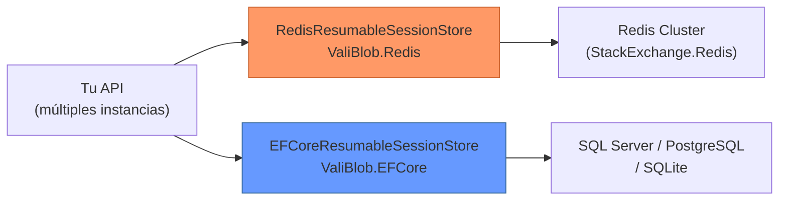

# Almacenes de Sesión

Un almacén de sesión persiste el estado de las subidas reanudables entre requests HTTP. Registra qué chunks han sido recibidos, el offset actual, los metadatos de la sesión y su estado (activa, completada, abortada o expirada).

## IResumableSessionStore

```csharp
public interface IResumableSessionStore
{
    Task<ResumableUploadSession> CreateSessionAsync(
        CreateSessionRequest request,
        CancellationToken ct = default);

    Task<ResumableUploadSession?> GetSessionAsync(
        string sessionId,
        CancellationToken ct = default);

    Task UpdateSessionAsync(
        string sessionId,
        long newOffset,
        int chunksUploaded,
        CancellationToken ct = default);

    Task CompleteSessionAsync(
        string sessionId,
        CancellationToken ct = default);

    Task AbortSessionAsync(
        string sessionId,
        CancellationToken ct = default);

    Task<IReadOnlyList<ResumableUploadSession>> GetExpiredSessionsAsync(
        CancellationToken ct = default);
}
```

## Almacenes disponibles

| Almacén | Paquete | Persistencia | Multi-instancia | Cuándo usar |
|---|---|---|---|---|
| `InMemoryResumableSessionStore` | ValiBlob.Core (incluido) | No | No | Desarrollo, pruebas |
| `RedisResumableSessionStore` | ValiBlob.Redis | Sí (TTL automático) | Sí | Producción con Redis |
| `EFCoreResumableSessionStore` | ValiBlob.EFCore | Sí (permanente) | Sí | Producción con BD existente |

## InMemoryResumableSessionStore (por defecto)

Se registra automáticamente al no especificar otro almacén. No requiere configuración adicional.

```csharp
// Configuración mínima — el almacén en memoria se registra automáticamente
builder.Services
    .AddValiBlob(o => o.DefaultProvider = "local")
    .AddProvider<LocalStorageProvider>("local", opts => { opts.BasePath = "./storage"; });
```

### Limitaciones del almacén en memoria

- Los datos se **pierden al reiniciar** la aplicación
- No funciona con múltiples instancias del servidor (sin sticky sessions)
- Solo para: desarrollo local, pruebas unitarias, demos

## Limpieza de sesiones expiradas

Independientemente del almacén, debes limpiar periódicamente las sesiones expiradas y sus chunks temporales:

```csharp
public class LimpiezaSesionesExpiradas(
    IResumableSessionStore almacenSesiones,
    IResumableStorageProvider storage,
    ILogger<LimpiezaSesionesExpiradas> logger) : BackgroundService
{
    protected override async Task ExecuteAsync(CancellationToken ct)
    {
        using var timer = new PeriodicTimer(TimeSpan.FromHours(1));

        while (await timer.WaitForNextTickAsync(ct))
        {
            try
            {
                var expiradas = await almacenSesiones.GetExpiredSessionsAsync(ct);

                foreach (var sesion in expiradas)
                {
                    logger.LogInformation(
                        "Limpiando sesión expirada {SessionId} → {Path}",
                        sesion.SessionId, sesion.Path);

                    await storage.AbortResumableUploadAsync(sesion.SessionId, ct);
                }

                if (expiradas.Count > 0)
                    logger.LogInformation("Limpiadas {Count} sesiones expiradas", expiradas.Count);
            }
            catch (Exception ex)
            {
                logger.LogError(ex, "Error durante la limpieza de sesiones expiradas");
            }
        }
    }
}

// Registro
builder.Services.AddHostedService<LimpiezaSesionesExpiradas>();
```

## Implementación personalizada (MongoDB ejemplo)

Para almacenes no incluidos, implementa `IResumableSessionStore`:

```csharp
public class MongoSessionStore(IMongoDatabase db) : IResumableSessionStore
{
    private readonly IMongoCollection<SesionDocumento> _col =
        db.GetCollection<SesionDocumento>("sesiones_subida");

    public async Task<ResumableUploadSession> CreateSessionAsync(
        CreateSessionRequest request, CancellationToken ct)
    {
        var doc = new SesionDocumento
        {
            Id = Guid.NewGuid().ToString("N"),
            Path = request.Path,
            TotalSizeBytes = request.TotalSizeBytes,
            UploadedBytes = 0,
            ChunksSubidos = 0,
            Estado = ResumableUploadStatus.Active,
            CreadoEn = DateTimeOffset.UtcNow,
            ExpiraEn = DateTimeOffset.UtcNow.Add(request.SessionExpiry),
            Metadatos = request.Metadata ?? new Dictionary<string, string>()
        };

        await _col.InsertOneAsync(doc, cancellationToken: ct);
        return MapearSesion(doc);
    }

    public async Task<ResumableUploadSession?> GetSessionAsync(string sessionId, CancellationToken ct)
    {
        var doc = await _col.Find(d => d.Id == sessionId).FirstOrDefaultAsync(ct);
        return doc is null ? null : MapearSesion(doc);
    }

    public async Task UpdateSessionAsync(string sessionId, long newOffset, int chunksSubidos, CancellationToken ct)
    {
        await _col.UpdateOneAsync(
            d => d.Id == sessionId,
            Builders<SesionDocumento>.Update
                .Set(d => d.UploadedBytes, newOffset)
                .Set(d => d.ChunksSubidos, chunksSubidos),
            cancellationToken: ct);
    }

    public async Task CompleteSessionAsync(string sessionId, CancellationToken ct)
    {
        await _col.UpdateOneAsync(
            d => d.Id == sessionId,
            Builders<SesionDocumento>.Update.Set(d => d.Estado, ResumableUploadStatus.Completed),
            cancellationToken: ct);
    }

    public async Task AbortSessionAsync(string sessionId, CancellationToken ct)
    {
        await _col.DeleteOneAsync(d => d.Id == sessionId, ct);
    }

    public async Task<IReadOnlyList<ResumableUploadSession>> GetExpiredSessionsAsync(CancellationToken ct)
    {
        var ahora = DateTimeOffset.UtcNow;
        var expiradas = await _col
            .Find(d => d.ExpiraEn < ahora && d.Estado == ResumableUploadStatus.Active)
            .ToListAsync(ct);

        return expiradas.Select(MapearSesion).ToList();
    }

    private static ResumableUploadSession MapearSesion(SesionDocumento doc) => new()
    {
        SessionId = doc.Id,
        Path = doc.Path,
        TotalSizeBytes = doc.TotalSizeBytes,
        UploadedBytes = doc.UploadedBytes,
        NextChunkIndex = doc.ChunksSubidos,
        NextChunkOffset = doc.UploadedBytes,
        Status = doc.Estado,
        CreatedAt = doc.CreadoEn,
        ExpiresAt = doc.ExpiraEn
    };
}

// Registro en DI
builder.Services.AddSingleton<IResumableSessionStore, MongoSessionStore>();
```

## Comparación de almacenes en producción



:::tip Consejo
Para la mayoría de las aplicaciones en producción, `ValiBlob.Redis` es la mejor opción por su rendimiento, soporte nativo de TTL y simplicidad de configuración. Usa `ValiBlob.EFCore` si tu infraestructura no incluye Redis o si necesitas auditar las sesiones con consultas SQL y reportes.
:::

:::info Información
El almacén de sesiones solo guarda el **estado** de la subida (offset, chunks recibidos, metadatos). Los datos binarios de los chunks se almacenan directamente en el proveedor de almacenamiento (S3, Azure, local) como archivos temporales que se ensamblan al completar la sesión.
:::

:::warning Advertencia
Si cambias de almacén de sesiones (por ejemplo, de InMemory a Redis) en una aplicación con subidas en curso, las sesiones activas del almacén anterior serán inaccesibles. Planifica la migración en ventanas de mantenimiento o espera a que todas las sesiones activas expiren antes de cambiar el almacén.
:::
